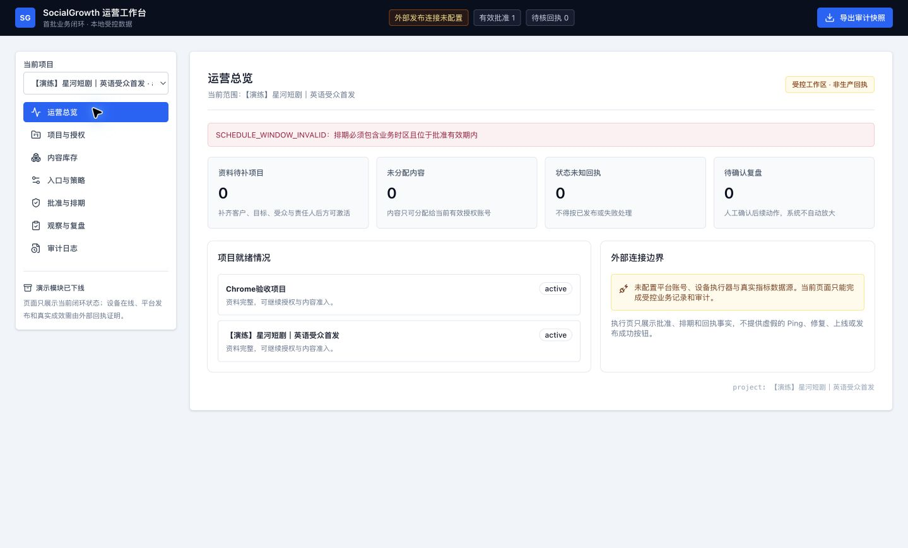
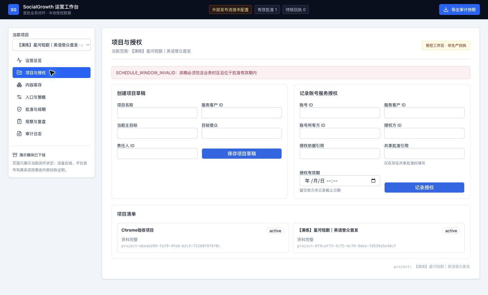
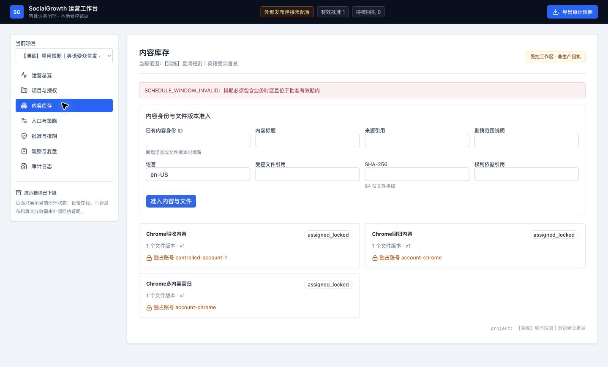
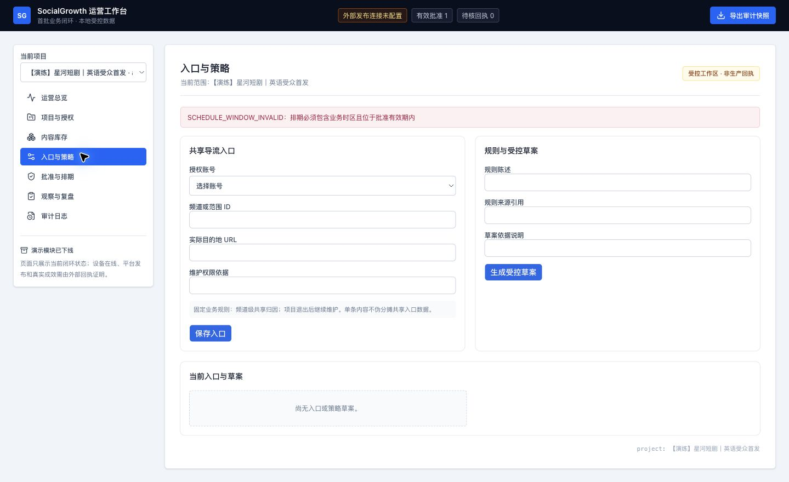
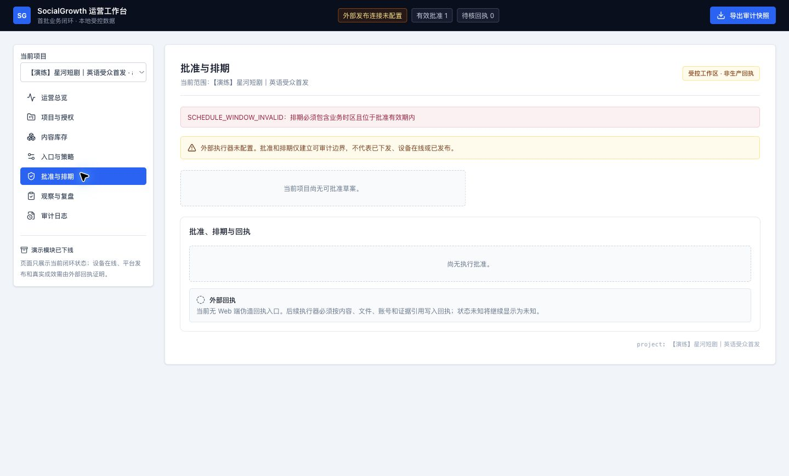
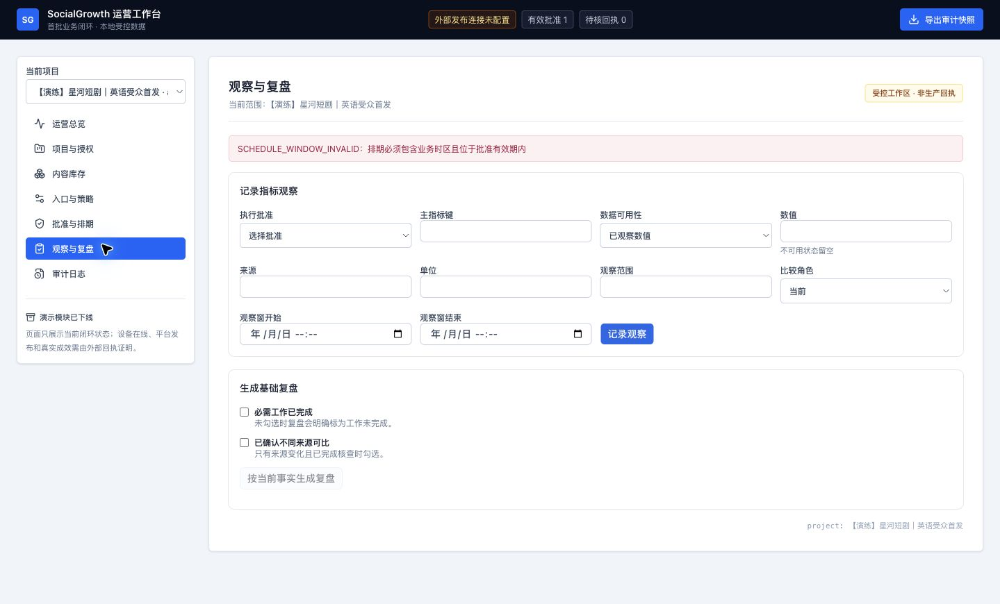
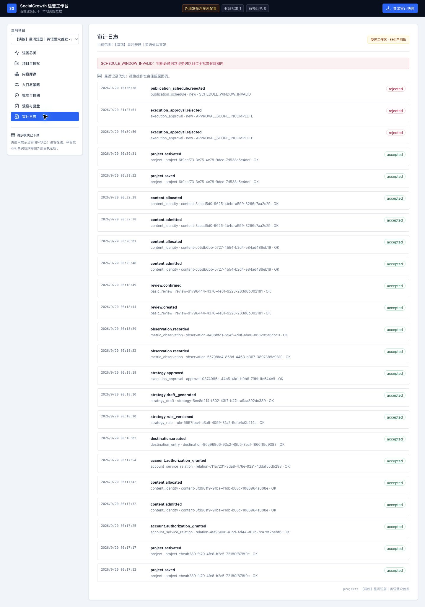

# 菜单与页面职责审计

日期：2026-09-20。依据：本轮 Chrome 现场截图、DOM、当前 page.tsx / first-loop-view.tsx 与既有首条闭环产品规格。仅审查入口、职责、列表与操作的可发现性；没有执行真实发布或完整业务验收。当前为演练项目，部分页面没有关联数据；不能从空态推断全部领域能力缺失。建议结构待讨论，未改应用代码。

## 当前菜单逐项结论

| 步骤 | 当前菜单 | 可取之处 | 已确认缺口 | 结论 |
| --- | --- | --- | --- | --- |
| 1 | 运营总览 | 有缺口和待处理计数 | 数字缺少直达待办的入口；当前范围标单项目但项目清单展示全部；旧排期错误仍显示 | 部分具备，未达到日常工作入口要求 |
| 2 | 项目与授权 | 项目、授权字段已有标签 | 创建表单优先，无账号授权关系列表、到期视图或清楚的变更入口；需手输主体 ID | 可录入，管理不足 |
| 3 | 内容库存 | 已显示文件版本数量与独占账号 | 录入表单优先，无搜索、预览、权利详情；单项目标题与全局内容列表并存 | 可登记，选材审核不足 |
| 4 | 入口与策略 | 提示共享归因边界 | 两种独立任务并列，规则录入与生成绑在一起；退出继续维护被写为固定规则 | 职责混杂，需拆分 |
| 5 | 批准与排期 | 明示外部执行未接入 | 当前范围空态无直达补充路径；无可用的任务执行、unknown 核对与恢复工作区 | 部分具备，执行管理不足 |
| 6 | 观察与复盘 | 零、缺失等可用性与确认项分开 | 无批准时仍展示大量录入控件；缺少观察列表和面向目标的结果概览 | 可补录，分析不足 |
| 7 | 审计日志 | 时间顺序及拒绝原因可见 | 无检索、对象跳转和中文操作解释；全局日志与单项目范围标题不一致 | 可追踪，使用不便 |

共同问题：侧栏没有二级菜单；客户项目不应成为全站强制筛选；菜单切换没有独立 URL（源码 useState 切换）；排期错误跨页面残留；英文状态、UUID 与小字号增加阅读负担。可访问性仅核对了可见呈现和 DOM，未完成键盘、屏幕阅读器及对比度合规验收。前次测试通过只证明当时覆盖的本地功能，不能作为这些运营体验项通过的依据。

## 建议菜单及职责（待确认）

| 一级菜单 | 二级菜单 | 首屏与主要操作 | 达标任务 |
| --- | --- | --- | --- |
| 工作台 | 无；页内按待办类型切换 | 全部有权限业务中的待审、异常、到期、缺口；进入具体处理页 | 无需逐个选项目即可找到应处理事项 |
| 账号管理 | 首期无；详情内用标签页 | 按平台显示账号、所有方、服务客户、权限有效性、定位、设备绑定和异常；接入、核验、变更 | 明白哪些账号能做什么、不能做什么及原因 |
| 内容资产 | 首期无；待审核、可用、占用、已发为列表视图 | 可检索内容列表、预览、版本、权利、归属、使用历史；导入、核对、分配 | 能选出适用素材并解释不可用原因 |
| 策略管理 | 策略草案、规则库 | 草案依据、假设、账号内容入口、观察及停止条件；生成、编辑、审阅、批准或退回 | 能理解本次安排及影响范围后作决定 |
| 发布执行 | 发布计划、执行记录、异常处理 | 排期与时区、授权范围、执行事实及证据；暂停、取消、核对、条件满足后恢复 | 能区分待发、已发、明确失败和未知，并找到处理动作 |
| 导流管理 | 首期无；版本与访问记录在详情 | 账号展示位置、目的地、关联内容、可用性证据、维护责任；建立、检查、变更入口 | 知道受众去哪里，变更会影响什么 |
| 数据与复盘 | 数据表现、复盘记录 | 按目标展示指标、来源、时间窗、基线和缺失；查看、补录、核对、确认下一步 | 能判断证据是否足够及下一步做什么 |
| 客户服务 | 首期无；服务目标、约定、变更退出在详情 | 客户及其服务范围、目标、关联账号、责任、期限和待办；建档、变更、退出 | 一次维护服务信息，其他业务可正确引用 |
| 系统管理（侧栏底部） | 接入配置、操作审计 | 连接与数据源状态、设备技术详情和日志；配置、排查、检索、导出 | 能定位未接入原因并追溯操作 |

不增加客户门户、财务结算或生成工作室。设备绑定与业务异常在账号及任务可见，底层诊断放系统管理。后续托管、深度实验等按已批准阶段补充，不以空菜单冒充完成。

二级菜单只用于独立且频繁的任务；状态用筛选/页内标签，对象用详情，客户与项目用可选的页面筛选；不按项目数量生成菜单。每个对象只设一个主维护入口，其他菜单通过关联跳转。首屏先展示对象、状态、问题和下一步，新建/编辑再打开表单。列表返回保留筛选和位置，路由可刷新、回退和直接定位。

## 本轮现场截图

### 1 运营总览：部分具备

### 2 项目与授权：管理不足

### 3 内容库存：审核不足

### 4 入口与策略：职责混杂

### 5 批准与排期：执行管理不足

### 6 观察与复盘：分析不足

### 7 审计日志：检索解释不足

