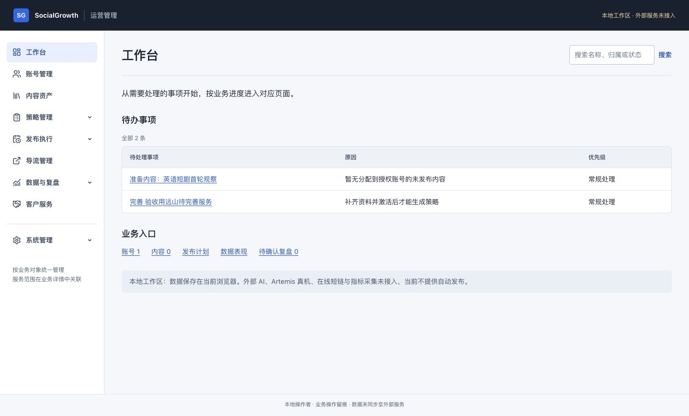
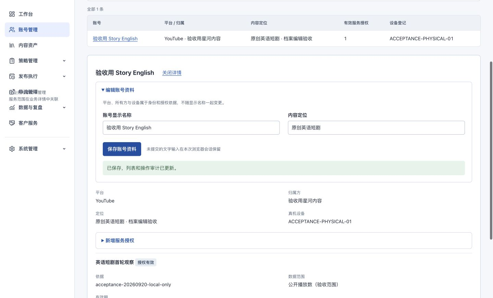
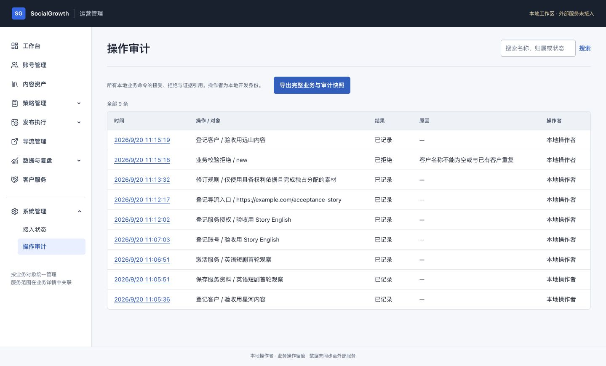
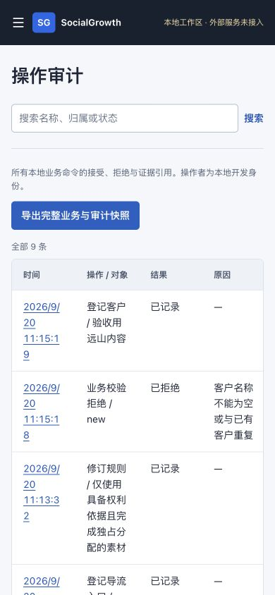

# 运营整体重构验收证据

日期：2026-09-20。地址：`http://127.0.0.1:3000/`。浏览器：Chrome。所有客户/账号名称带“验收用”，没有真实平台发布。

权威状态及菜单职责：[重构台账](../../../docs/handoff/2026-09-20-operations-refactor.md)。原始菜单问题见[重构前截图](../2026-09-20-menu-audit/README.md)。

| 证据 | 结果 |
| --- | --- |
| `web-tests.txt` | 28/28 领域与状态测试通过 |
| `integration-tests.txt` | 3/3 跨服务本地集成通过 |
| `artemis-tests.txt` | 5/5 控制器测试通过，不代表真机接入 |
| `build.txt`、`web-final-build.txt` | 所有 workspace 构建及最终 Web 构建通过 |
| `typecheck.txt`、`changed-lint.txt` | 退出码 0；成功时无正文输出 |
| `full-lint.txt` | 全量 lint 失败，仅剩原有通用 UI 模板与 hook 问题；没有忽略或冒充全量通过 |
| `chrome-page-checks.json` | 14 页面桌面宽度、无页面级横向溢出、无未标记表单控件 |
| `chrome-narrow-checks.json` | 14 页面 390 px 窄屏宽度均无页面级溢出 |
| `*.dom.txt` / `*.png` | 当前页面、缺项激活拒绝、重复客户拒绝、输入恢复、账号详情及中文审计 |
| `chrome-command-logs.json` | Chrome 实际操作产生的 13 条结构化日志，含成功、拒绝、对象与关联编号 |
| `chrome-exported-state.json` | 从 Chrome 下载文件取得的实际业务快照；2 客户、2 服务、1 账号、1 授权、1 入口、1 规则、13 条审计。没有素材/策略/批准/排期/观察记录 |
| `chrome-final-errors.json` | 最终独立页面应用错误 0；1 条来自沉浸式翻译扩展 |
| `acceptance-fixture.mp4` | ffmpeg 自制 1 秒纯色视频，仅供素材上传验收；Chrome 文件选择被扩展拒绝，因此未计为上传成功 |

结论：已验证页面重构及可执行的部分业务操作，未完成素材起点之后的完整浏览器流程。不得据此宣称整站运营验收通过、真实发布成功、平台指标可用或外部服务已连接。
