# Chrome 运营体验审计：截图与逐步证据

日期：2026-09-20。源码基线：`9951400`。地址：`http://127.0.0.1:3000/`。桌面 Chrome；截图为实际视口，原始文件未经重绘或替换。已逐张读取保存的 PNG 并检查。

完整问题、优先级、源码定位和演练矩阵见[本轮 handoff 审计](../../../docs/handoff/2026-09-20-web-operations-ux-audit.md)。本报告只做分析与标注，未实施整改。用户确认暂无真实运营环境；本轮数据为本地测试/演练，不能计作真实发布或真实经营结果。

## 步骤 1：检查现有项目、内容和入口 — 不通过

项目卡片与内容卡片可读，但没有项目工作区选择；账号只显示 ID，入口显示 URL 字符串。现有技术对象可追溯，缺少可供日常运营使用的详情和下一步导航。对应 UX-05/06/11。

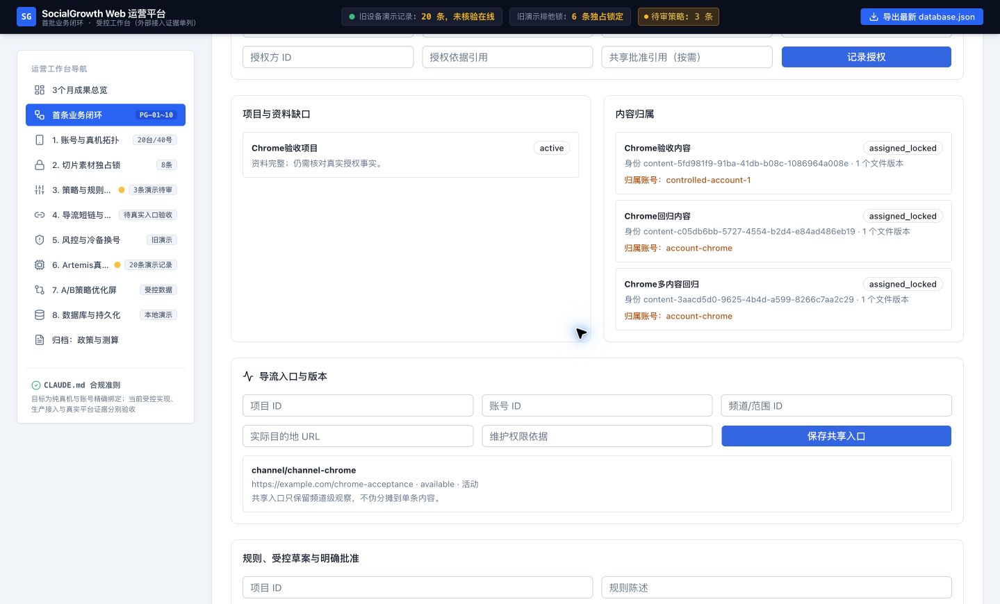

## 步骤 2：查看新建、素材和观察表单 — 需整改

保存草稿与受控说明是可保留的基础。表单堆在长页面；观察出现在授权和批准之前；大量字段依赖 placeholder、ID 和校验值。42 个输入/选择控件中，39 个无关联 label/aria-label，详见 [DOM 标签核查](field-labels.json)。这不是完整屏幕阅读器或 WCAG 合规测试。对应 UX-06/07/15。

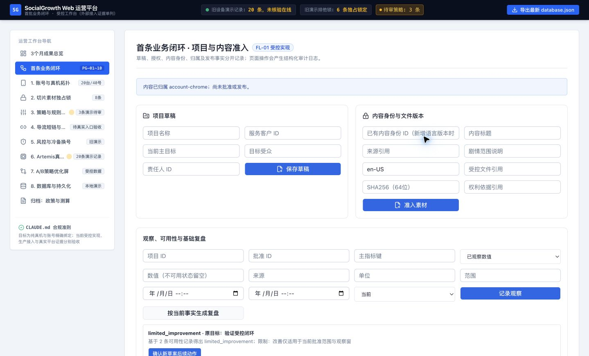

## 步骤 3：新建并激活业务演练项目 — 局部成功，后续路径不通过

现场创建 `【演练】星河短剧｜英语受众首发`，客户为 sandbox-client-xinghe，责任人 sandbox-operator-lin。草稿和激活有效，新增项目保留在当前 Chrome 本地存储。授权表单仍为空，要求手填项目 ID；新项目卡片没有提供选择/详情入口。普通运营若不阅读底部日志就不能方便地继续。对应 UX-05/12。

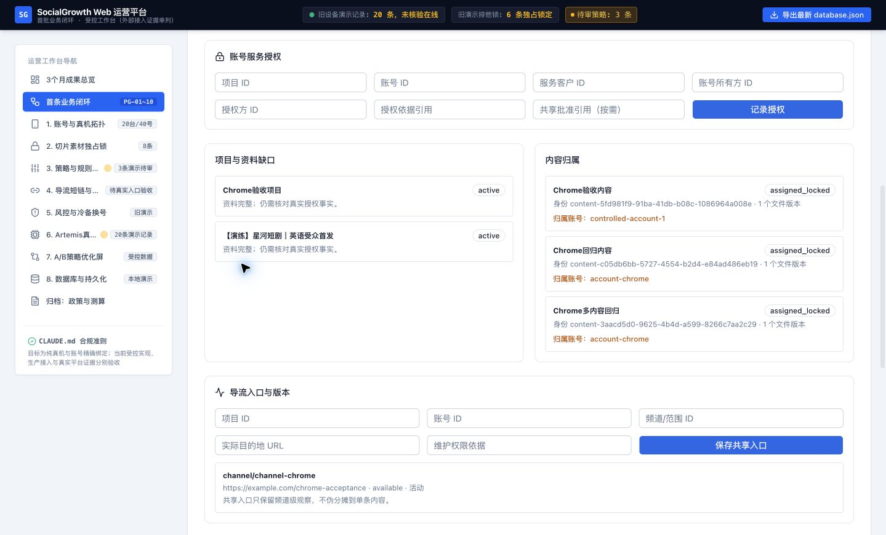

## 步骤 4：提交缺少数量/截止时间的批准 — 拒绝有效，反馈不通过

当前页面中唯一已存在的草案，留空数量和截止时间后点击批准。DOM 状态为 `APPROVAL_SCOPE_INCOMPLETE`，没有生成有效批准。错误提示写在页面顶端，当前视口却只有未标错的输入框和底部技术日志。批准界面也没有完整范围摘要和可编辑停止/观察条件。对应 UX-08/10。

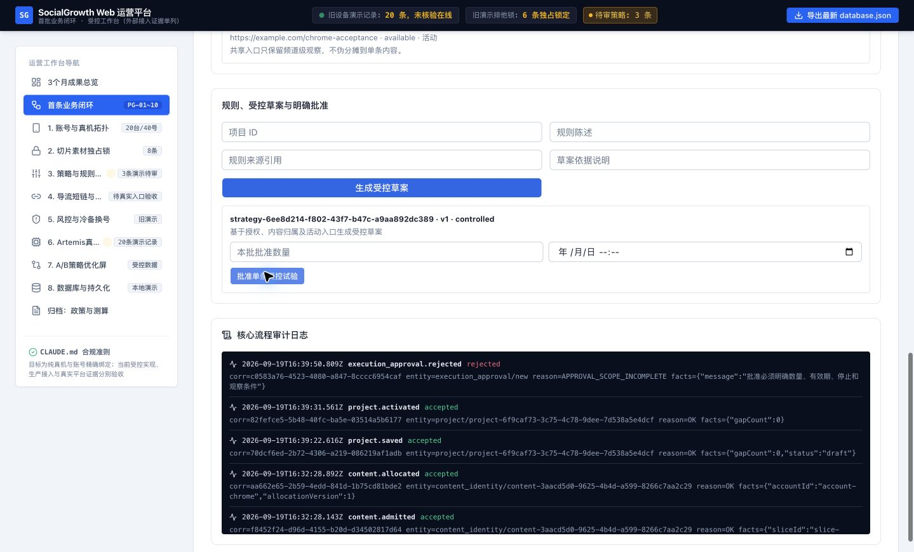

## 步骤 5：进入素材库并搜索新闭环内容 — 不通过

旧素材库有列表、搜索和状态筛选，可改造复用。但展示 8 条明细的同时固定显示 3,420 储备、3,078 有效发布；没有该口径与明细的可解释联系。搜索当前新工作台中存在的“Chrome回归内容”，结果为 0，确认两套数据没有贯通；空表没有解释或恢复操作。对应 UX-01/07。

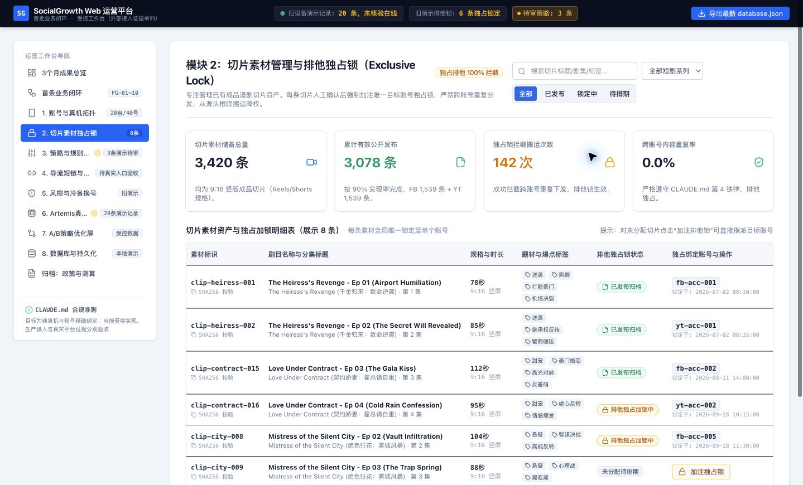

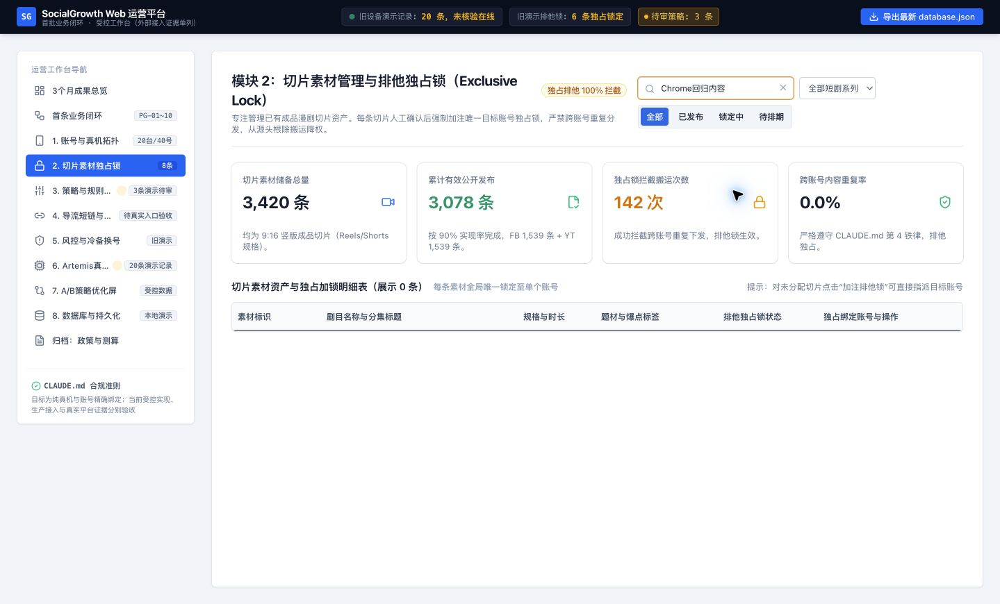

## 步骤 6：查看执行工作台并点击演示 Ping — 不通过

设备与绑定卡片可以复用，但日志区为写死样例。点击“巡检 Ping”立即提示“物理巡检心跳回执正常 / 42ms / ADB OK”，而源码只修改本地 React 数据。侧栏的“演示记录”不能使这个操作结果可信。截图同时显示设备卡延迟 43ms 与通知 42ms，来自不同演示计算。没有可核对的真实任务/尝试/响应证据。对应 UX-02/09。

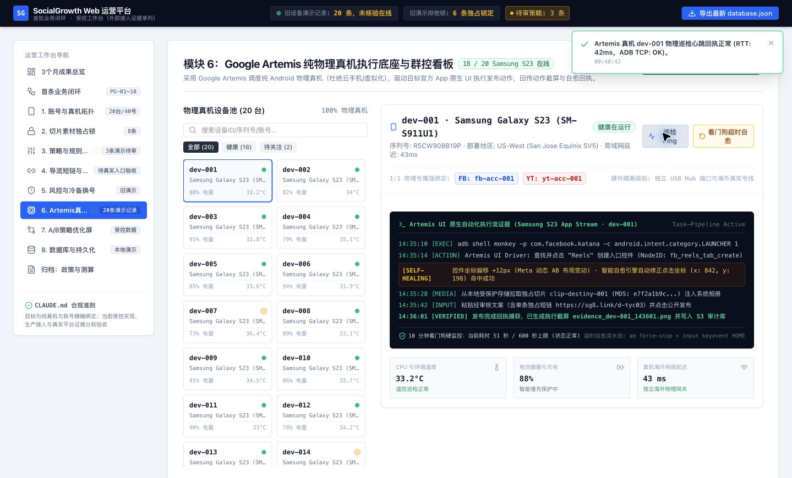

## 步骤 7：查看效果复盘 — 不通过

页面视觉上分列基线和实验组，可保留比较布局；但固定公式、15% 阈值、无缝替代指标和“全量晋级”仍是旧业务语义。新闭环的复盘又固定声明必需工作完成。页面正常渲染不等于决策可信。对应 UX-03/04/13。

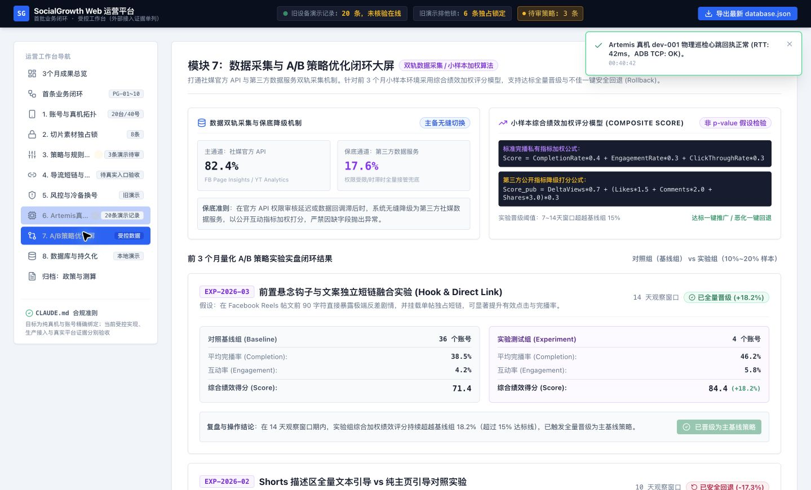

## 步骤 8：查看导流入口与点击指标 — 不通过

界面已区分 FB 帖文与 YT 频道归因，这是保留项；但把过滤后请求称“真实交互”，把 302 响应称“到达目标页”，不能作为真实到达验收。域名状态、短链统计与新闭环入口也未贯通。页面需要目的地版本、来源时窗、权限和旧链接维护入口。对应 UX-01/11/12。

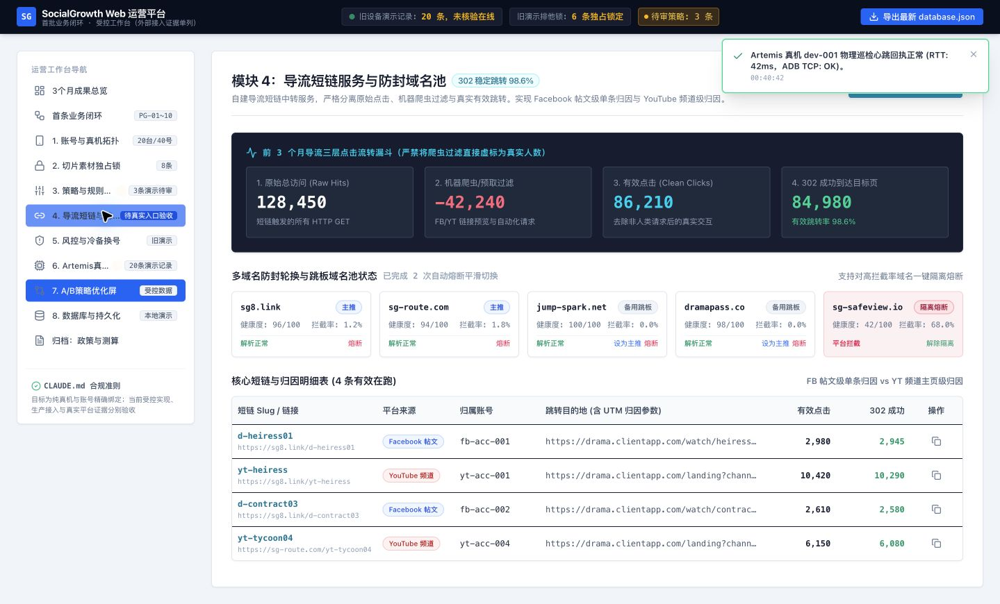

## 步骤 9：返回首页 — 历史标识有效，运营首页不通过

首页已明确“历史演示数据”，不能再将首页本身认定为未做声明。但默认入口仍主要用于展示三个月样例；任务计数来自旧库，不服务当前项目的待办和阻塞。顶部设备通知跨页面持续存在，容易与当前操作混淆。对应 UX-14/01/02。

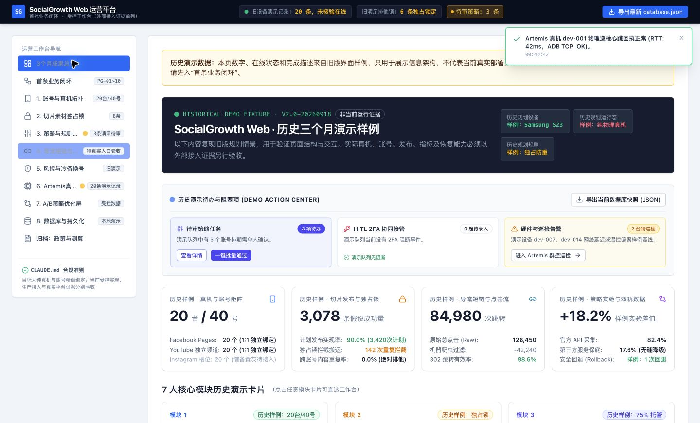

## 步骤 10：未保存输入后切页再返回 — 不通过

在项目名称填写 `【演练】未保存草稿-切换检查`，未点击保存；切到首页后返回。没有离开确认，文本已消失，已保存的星河演练项目仍在。这里只证明未保存输入丢失，没有声称已保存数据丢失。对应 UX-10。

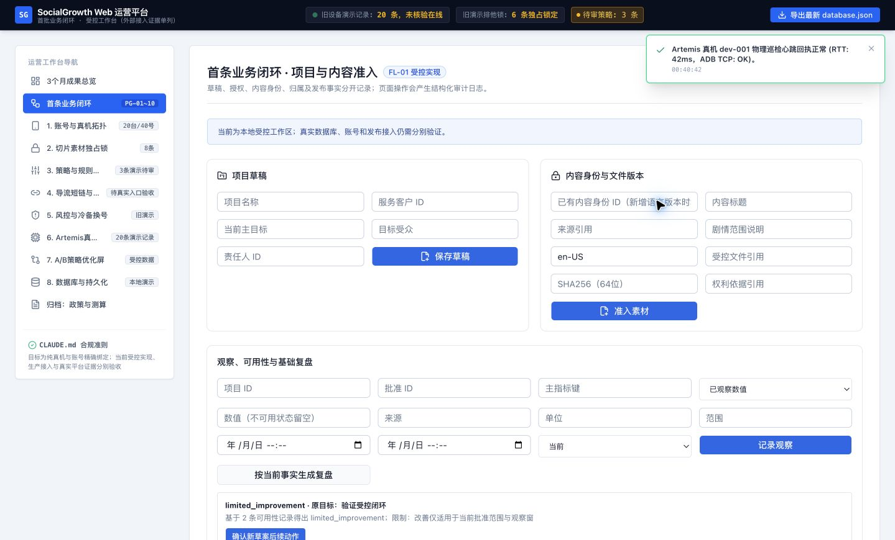

## 可复验材料与边界

- 同目录 `*.dom.txt` 保留关键页面内容与交互后的状态，`field-labels.json` 保留表单标签检查。
- 当前 Chrome 新增演练项目 ID：`project-6f9caf73-3c75-4c78-9dee-7d538a5e4dcf`；未新增真实账号或媒体，没有发帖。
- 审批拒绝 correlationId：`c0583a76-4523-4080-a847-8cccc6954caf`。新增项目保存 correlationId：`70dcf6ed-2b72-4306-a219-086219af1adb`。
- 未跑多用户、真实权限、实际媒体预览、移动端/缩放、真实设备、供应商指标或负载测试；这些不记作通过。
- 新演练项目、拒绝日志保留；旧设备 Ping 修改只发生在旧演示内存状态。本轮没有对原有测试资料做删除。

后续应把“浏览器操作已完成”和“业务验收已通过”分开记录。本次结果为：**发现并核实运营阻塞，形成整改依据；全站运营验收未通过。**
