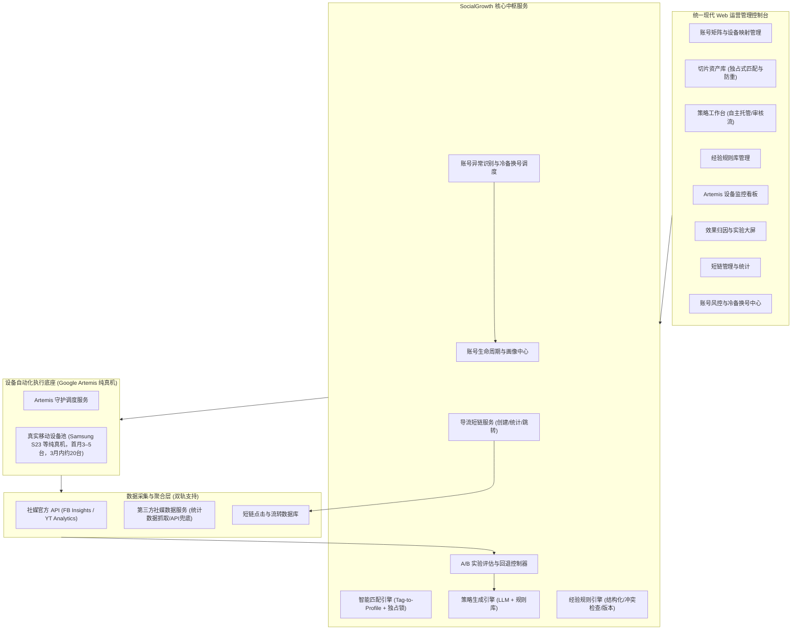

# SocialGrowth 核心交付模块与内容规格规划书

本文档记录了基于最新业务规划及讨论对齐后，SocialGrowth 系统在**前 3 个月演进周期**中需交付的核心模块、系统架构、业务边界与功能规格。**前期平台聚焦于 Facebook 与 YouTube 双平台**，首月以 3–5 台纯真机启动验证最小闭环，前 3 个月内扩展至约 20 台真机（承载约 40 个账号）；**Instagram 作为后续储备平台，待 FB+YT 运营稳定后再行接入**。

---

## 一、 系统架构与交互拓扑

---

## 二、 平台差异化处理总览 (前期聚焦 FB + YT，INS 稳定后接入)

系统前期集中力量攻透 **Facebook 与 YouTube** 两个平台。所有平台的内容发布**均统一由 Google Artemis 驱动真机上的原生 App 落实 UI 自动化发布，不采用官方发布 API**；数据采集采用“官方 API + 第三方数据服务”双轨兜底。Instagram 保留技术接口与数据规范预留，待双平台稳定后扩展。

| 维度 | Facebook (前期核心) | YouTube (前期核心) | Instagram (待稳定后接入) |
| --- | --- | --- | --- |
| **账号类型** | Page（专业模式） | Brand Account（独立频道） | Professional Account（创作者/商务） |
| **主要内容格式** | Reels（竖版 9:16）、长视频、图文帖 | Shorts（竖版 9:16、≤3min）、长视频 | Reels（竖版 9:16）、Feed 视频帖、Stories |
| **执行底座与发布方式** | **Google Artemis 纯真机 UI 自动化**（FB App 原生操作，不走 API 发布） | **Google Artemis 纯真机 UI 自动化**（YouTube App/Studio 原生操作，不走 API 发布） | 预留 Artemis UI 自动化发布脚本 |
| **数据采集接口** | Page Insights / Video Insights（官方 API 受限时由第三方数据服务兜底） | YouTube Data/Analytics API（官方 API 延迟或受限时由第三方数据服务兜底） | 预留 Instagram Insights API 及第三方抓取接口 |
| **设备与账号绑定关系** | **1 机 1 号**：单台真机同一时期仅登录 1 个 Page，绝不同机切换多账号；封号后走冷备置换 | **1 机 1 号**：单台真机同一时期仅登录 1 个 Google/YT 账号，严禁同机切换；封号后走冷备置换 | 待接入后同样遵循 1 机 1 号独立绑定规则 |
| **可点击导流入口** | 帖文文案、评论中的短链均可点击（支持单条归因） | 频道主页链接可点击；Shorts 描述与评论中链接不可点击（支持频道级归因） | 仅 Bio 个人主页链接可点击 |
| **内容分发约束** | **切片独占分发**：人工确认后单独账号发送，同一切片严禁跨账号分发 | **切片独占分发**：人工确认后单独账号发送，同一切片严禁跨账号分发 | 待接入后同样遵循独占分发原则 |
| **网络与运行环境** | 假设真机设备已在海外物理分散部署，天然具备当地独立网络环境 | 假设真机设备已在海外物理分散部署，天然具备当地独立网络环境 | 假设真机设备已在海外物理分散部署，天然具备当地独立网络环境 |

---

## 三、 核心交付模块与规格

### 模块 1：账号资产与定位管理模块 (Account & Matrix Management)

- **交付目标**：支撑首月 **3–5 台真机对应 6–10 个账号**（FB 与 YT 各 3–5 个），在第 3 个月内平滑扩展至 **约 20 台真机对应约 40 个账号**（FB 20 个 + YT 20 个），建立完整的账号定位画像、设备-账号 1:1 映射与生命周期记录。
- **核心功能**：
  1. **账号矩阵总览**：双平台（前期 FB + YT）、多阶段（冷启动、持续运营、异常处理）账号卡片视图，展示账号绑定的真机设备标识与健康度评分。
  2. **设备-账号专属拓扑（1机1平台1号）**：每台真机物理设备同一时期在 Facebook 与 YouTube 各自**严格只登录并绑定 1 个账号**（单机承载 1 FB + 1 YT），全局杜绝同机切换多账号，彻底规避关联风控。
  3. **AI 定位生成与人工校准**：输入业务题材与目标地区，AI 自动生成账号受众画像（地区、语言、年龄、垂直领域标签），支持运营人员人工锁定或修正。
  4. **生命周期流转追踪**：真实记录新账号初始冷启动、受限警告、异常退出与重新达标历史证据。
  5. **冷备账号池（Cold-spare Pool）**：系统统一维护未激活的备用账号池，与设备解耦管理；当某设备上的账号出现封禁异常时，支持一键调用冷备账号进行置换绑定。
  6. **定位版本管理**：记录每次定位变更的原因、生效时间和变更前后的定位快照；定位调整需人工确认后生效，AI 不自动改变已确认定位。

- **平台差异化处理**：

| 处理项 | Facebook (前期核心) | YouTube (前期核心) | Instagram (待稳定后接入) |
| --- | --- | --- | --- |
| 账号创建与类型 | Page 创建，开启专业模式（真机 App 登录对应主账号） | 创建 Brand Account 下的独立频道，真机 App 登录 | 转换为 Professional Account，真机 App 登录 |
| 设备拓扑 | 1 台真机仅登录 1 个 Facebook 账号/Page，不切换账号 | 1 台真机仅登录 1 个 Google 账号/频道，不切换账号 | 1 台真机仅登录 1 个 IG 账号 |
| 功能检查 | 专业面板、变现意向入口、发布工具 | 电话验证状态、高级功能、频道ID/视频验证 | Professional Dashboard、Bio 链接编辑 |
| 验证资源 | 无特殊限制 | 同一手机号每年最多验证 2 个频道 | 需关联 Page，受 Page 权限约束 |

---

### 模块 2：已有切片素材管理与智能匹配模块 (Content & Tag Matching)

- **交付目标**：专注管理甲方已有漫剧成品切片资产，基于多维标签实现与账号定位的独占式匹配分发（前 3 个月不涉及音视频剪辑渲染管线和视频生成，保证内容绝对不重复）。
- **核心功能**：
  1. **切片素材资产库**：统一管理漫剧切片，包含剧目名、分集、时长、原片规格及视频预览。
  2. **多维特征打标**：提取题材类型（甜宠/逆袭/悬疑等）、受众偏好、语言及核心爆点标签。
  3. **匹配度计算与分发计划**：根据切片标签与矩阵账号画像计算匹配权重（Match Score），自动输出排期分发清单。
  4. **切片独占排他分发机制（Exclusive Distribution Lock）**：
     - 每条漫剧切片经人工确认后，**仅绑定唯一的一个目标账号进行单独发送**。
     - 一旦切片被分发排期，系统全局标记为“独占锁定（Exclusively Assigned）”，禁止被其他任何账号重复调用或再次排期。
     - 彻底杜绝同一切片在矩阵不同账号间重复发布，从源头根除被平台算法判定为“非原创/重复搬运（Reused/Unoriginal Content）”的降权风险。
  5. **素材权利与版本记录**：记录每条切片的内容来源、授权状态、独占绑定账号与发布时间。

- **平台差异化处理**：

| 处理项 | Facebook | Instagram | YouTube |
| --- | --- | --- | --- |
| 支持内容格式 | Reels（竖版 9:16 优先）、视频帖 | Reels（竖版 9:16 优先）、Feed 视频帖 | Shorts（竖版 9:16、≤3min） |
| 视频规格适配 | 竖版 9:16 优先；原片切片直接适配 App 上传 | 竖版 9:16 优先；原片切片直接适配 App 上传 | Shorts 竖版 9:16；原片切片直接适配 App 上传 |
| 文案与描述 | 帖文文案，可直接放置短链 | 帖文文案，短链不可点击，文案引导"点击主页 Bio 链接" | 视频标题（100字符）+ 描述；引导"点击频道主页链接" |
| 排期分发规则 | 独占切片，单账号每日分散排期发布（Artemis 真机驱动） | 独占切片，单账号每日分散排期发布（Artemis 真机驱动） | 独占切片，单账号每日分散排期发布，避开通知集中时段 |

---

### 模块 3：策略引擎与单人辅助工作台 (Strategy Engine & Workbench)

- **交付目标**：支持自然语言经验规则导入与结构化管理，结合"策略级自主托管开关"，实现从人工审核到全自动下发的自由配置。
- **核心功能**：

#### 3.1 经验规则库管理

  1. **自然语言经验录入**：运营人员以自然语言描述运营方法，AI 自动结构化为可执行规则并交由人员确认，避免遗漏前提或将模糊描述直接下发执行。
  2. **规则元数据管理**：每条规则记录以下属性：
     - 来源与录入时间
     - 适用平台（FB / IG / YT，可多选）
     - 适用账号阶段（冷启动 / 持续运营 / 全部）
     - 适用地区、受众与题材范围
     - 触发条件与操作内容
     - 预期目标与例外情况
     - 规则性质标记：**约束**（必须遵守的内部规则）或**建议**（可调整的经验参考）
     - 验证状态（未验证 / 验证中 / 已验证有效 / 已验证无效）
  3. **规则冲突检查**：新增或修改规则时，自动检查与平台官方规则及已有其他规则的冲突，冲突项须人工确认后方可生效。
  4. **版本追溯与启停控制**：规则支持新增、修改、停用，保留完整版本历史及各版本参与的策略与验证结果。
  5. **空规则场景处理**：首期尚未录入人工经验时，AI 仅引用已核实的平台规则、明确的业务目标和账号定位提出待验证方案，不编造经验依据；生成的策略标记为"无经验依据，待验证"。

#### 3.2 平台规则库

  1. **三级规则分类管理**：分别管理平台官方规则、内部运营规则和待验证策略假设。
  2. **规则核验记录**：每条规则记录来源 URL、核验日期、适用平台与账号类型；AI 根据规则拟定策略，实验效果不能自动推翻平台约束。

#### 3.3 AI 策略生成

  1. **策略生成流程**：账号定位 + 经验规则 + 平台规则 + 可用历史数据 → AI 拟定策略 → 标注引用的规则版本、调整原因和测试假设。
  2. **策略内容**：拟定发布周期、文案、短链挂载方式及交互评论策略。
  3. **平台差异化策略**：
     - **Facebook**：文案可含可点击短链；评论互动策略。
     - **Instagram**：文案中短链不可点击，需引导关注 Bio 链接；Stories 链接贴纸（符合条件时）；Reels 互动策略侧重引导评论和分享。
     - **YouTube**：Shorts 描述链接不可点击，引导至频道主页链接或长视频描述区；评论策略需遵守垃圾内容政策，避免重复性推广评论。
  4. **策略版本管理**：每次策略重新生成视为新版本，明确旧版本确认是否失效以及待执行任务如何处理。

#### 3.4 "自主托管"开关与审核流水线

  1. **托管模式**：运营人员可为已成熟账号/策略开启"自主托管"，策略自动按期下发至设备执行。
  2. **人工审查模式**：对于新起号或高风险账号，策略进入待办列表，由单人运营人员审核确认、修改或驳回调整。
  3. **操作记录**：保留策略确认、规则修改、任务暂停等全部操作记录，便于复盘。

---

### 模块 4：导流短链服务 (Short Link & Attribution Service)

- **交付目标**：自建导流短链服务，完成短链创建、事件统计、跳转处理和来源归因，支撑效果评估闭环。
- **核心功能**：
  1. **短链创建与管理**：
     - 支持批量创建短链，关联来源信息（社媒平台、账号、切片、发布任务、策略版本、验证批次）。
     - 管理导流目的地（甲方提供的平台入口或指定页面），多个来源短链可指向同一目的地，各自保留来源统计。
  2. **跳转处理与事件记录**：
     - 用户访问短链时先记录事件，再 302 跳转至目的地。
     - 记录原始访问量、按规则过滤后的有效点击量及跳转处理结果，三者分别存储。
     - 无效访问过滤：识别链接预览（爬虫/社媒预取）、自动请求和明确的机器流量，过滤规则和准确性需持续校验。
  3. **统计维度**：
     - 按来源平台、来源账号、内容切片、发布任务、时间维度聚合统计。
     - 记录点击来源地域与设备分布。
     - 重复访问保留原始记录，去重口径单独定义，不将过滤后点击宣称为已确认真实人数。
  4. **归因边界**：
     - 短链统计仅证明点击事件发生和跳转处理结果，不证明目标页面成功到达或后续转化。
     - 单条短链可归因到具体发布任务时，按任务维度统计；多条内容共用账号主页链接时，按可识别的来源范围统计，不推定单条内容归因。

- **平台差异化处理**：

| 导流入口 | Facebook | Instagram | YouTube |
| --- | --- | --- | --- |
| 可点击位置 | 帖文文案、评论 | Bio 链接（固定）；Stories 链接贴纸（需资格）；帖文/Reels 文案不可点击 | 频道主页链接；长视频描述；Shorts 描述与评论不可点击 |
| 短链挂载方式 | 每条内容可在文案中直接放置独立短链 | Bio 统一短链 + 文案引导"链接在主页"；符合条件时 Stories 贴纸放置 | 频道主页统一短链 + Shorts 引导；长视频描述放独立短链 |
| 归因精度 | 单条归因（每帖独立短链） | Bio 链接仅可归因到账号级，无法精确到单条 Reels | Shorts 仅归因到频道级；长视频可单条归因 |

---

### 模块 5：账号异常与风控管理模块 (Account Risk & Anomaly Management)

- **交付目标**：建立账号异常识别、任务暂停、异常通知、冷备账号置换与证据保留机制，确保首批 30 个初始账号的全部结果（含受限账号）可追溯。
- **核心功能**：
  1. **异常识别与分类**：

| 异常类型 | 识别依据 | 系统处理 |
| --- | --- | --- |
| 账号封禁或功能受限 | 平台明确通知、账号状态变更、可核对的操作反馈 | 暂停受影响设备的该平台待执行任务，保留证据及原因，通知运营人员，触发冷备置换工单 |
| 有明确推荐或分发限制提示 | 平台可取得的明确提示信息 | 按提示检查内容及策略，记录影响范围，不仅依据低播放量作判断 |
| 流量异常、原因未知 | 同口径数据表现与历史或同批参考存在显著偏离 | 标记为"待分析"，排查采集完整性、观察窗口、内容和受众匹配，不直接标为已证实限流 |
| 任务执行失败 | Artemis 回执中的失败状态或超时 | 记录失败原因和证据，按重试策略处理或升级为人工处理 |

  2. **任务暂停与冷备账号置换流水线 (Cold-spare Rebind SOP)**：
     - 当识别到某设备上的某平台账号出现封禁或功能受限，系统立即自动熔断暂停该设备该平台的后续任务。
     - 系统从冷备账号池调取对应平台的新账号，向运营人员推送置换确认工单。
     - 人工确认后，Artemis 在该设备上执行对应 App 的缓存与数据重置，安全登录新账号，完成重新绑定并恢复排期发布。
  3. **异常通知**：异常发生时通过工作台待办和消息通知运营人员，通知内容包括受影响设备、账号、任务范围和建议处理方式。
  4. **证据与复盘记录**：
     - 保留每个初始试点账号的完整结果，包括受限和退出的账号，新增或置换账号单独记录，不覆盖原有结果。
     - 持续可用账号数与初始纳入账号数分别统计。
     - 异常被正确记录不自动等于该平台已完成闭环验收。

- **平台差异化处理**：

| 处理项 | Facebook | Instagram | YouTube |
| --- | --- | --- | --- |
| 封禁/限制入口 | Page 质量面板、发布限制通知、变现资格状态 | Professional Dashboard 通知、内容移除通知、账号状态 | 频道违规警示、版权申诉、社区准则警告 |
| 冷备置换方式 | 退出旧 Page/账号，清除 FB App 缓存，登录新冷备账号 | 清除 IG App 存储数据与缓存，登录新冷备账号 | 清除 YouTube App 缓存，切换登录新冷备 Google 账号 |
| 数据异常基线 | 同期同类 Page 的 Reels 播放与互动中位数 | 同期同类 IG 账号的 Reels Reach 与互动中位数 | 同期同频道类型的 Shorts 观看与订阅增量 |
| 特殊限制 | 非原创内容降权属于平台规则，不作为异常处理 | 与 FB 共享部分违规体系但处罚独立执行 | 通知暂停（短时间>3条发布）属于正常限制，记录但不作为异常升级 |

---

### 模块 6：Artemis 纯真机设备自动化执行与调度模块 (Artemis Pure Physical Device Subsystem)

- **交付目标**：以 Google Artemis 作为设备执行底座，承载所有纯 Android 真机（彻底排除模拟器）的任务调度与端到端 UI 自动化执行。
- **核心功能**：
  1. **标准化任务分发协议**：中台将策略指令（目标平台、包名、独占素材路径、文案内容、点击交互逻辑）通过标准 API/MCP 下发给 Artemis 调度器。
  2. **纯真机设备池端到端自动化执行**：
     - 对接真实 Android 移动设备池（如 Samsung Galaxy S23 等纯真机），假设设备已在海外物理分散部署。
     - 驱动目标原生应用（Facebook App、Instagram App、YouTube App/Studio）落实打开应用、导航、粘贴文案、上传切片等真实 UI 动作，不走官方发布 API。
  3. **1 机 1 平台 1 号专属约束**：单台真机在同一时期各平台 App 内仅登录 1 个有效账号，绝不在同一 App 内频繁切换多账号，保障设备环境纯净。
  4. **执行证据与自愈回执捕获**：实时收集每一步的截屏证据、动作坐标修正自愈日志（Self-healing Logs）以及 Logcat 运行回执。
  5. **任务状态流转**：任务经历"待执行 → 已下发 → 执行中 → 已完成/失败"状态流转，每个状态转换记录时间戳和证据。
  6. **任务控制**：支持待执行任务的取消与暂停、过期任务处理、重复下发识别，以及执行结果未知时的人工介入确认机制。

- **平台差异化处理**：

| 执行项 | Facebook | Instagram | YouTube |
| --- | --- | --- | --- |
| 目标应用 | Facebook App 原生 UI 发布流程 | Instagram App 原生 Reels/Feed 发布流程 | YouTube App/Studio 原生 Shorts/视频上传流程 |
| 发布流程差异 | 打开 FB → 进入对应 Page → 上传视频 → 填写文案（含短链）→ 发布 | 打开 IG → 进入创建页 → 上传切片 → 填写 caption（引导 Bio）→ 发布 | 打开 YT → 进入上传 Shorts → 填写标题（引导主页）→ 设为公开 → 发布 |
| 评论操作差异 | 以已登录 Page 身份在发布内容下发布引导评论 | 以已登录 IG 身份在发布内容下发布引导评论 | 以频道身份发布互动评论；遵守防垃圾评论限制 |
| 设备与账号绑定 | **1 机 1 号**：设备唯一绑定 1 个 Page，不切换其他 FB 账号 | **1 机 1 号**：设备唯一绑定 1 个 IG 账号，严禁同机切换多账号 | **1 机 1 号**：设备唯一绑定 1 个频道，不切换其他 Google 账号 |

---

### 模块 7：数据采集与 A/B 策略优化闭环模块 (Attribution & Strategy Loop)

- **交付目标**：打通自有短链数据、社媒官方 API 与第三方社媒数据服务，通过量化 A/B 实验驱动策略的演进与安全回退。
- **核心功能**：
  1. **双轨数据采集看板**：
     - **自有短链数据**：来自模块 4 的短链点击统计，FB 提供单条发布归因，IG/YT 提供账号/频道级点击归因。
     - **社媒表现数据（双轨采集机制）**：
       - **主通道**：社媒官方 API（Facebook Insights / Instagram Insights / YouTube Analytics）。
       - **兜底/替代通道**：**第三方社媒数据服务**（Third-party Analytics/Scraper API）。在官方 API 权限审核受限（如 Meta App Review 周期长）或数据延迟较大时，全量由第三方数据服务提供视频播放量、完播率、点赞、评论、分享及关注增长等指标，确保闭环数据链不断裂。
  2. **量化 A/B 策略实验**：
     - 划分基线策略组与候选实验组（10%~20% 账号小批次试点），设置 7~14 天观察窗口。
     - 针对平台特性进行差异化效果评估：
       - **Facebook**：综合对比完播率、互动率与帖文单条短链点击转化率。
       - **Instagram / YouTube**：以视频完播率、互动率及主页访问增量（Profile Views）为核心优化目标，结合频道级短链表现综合评估。
  3. **实验晋级与一键回退 (Rollback)**：
     - **达标晋级**：效果显著提升的策略一键推广并替换原基线策略。
     - **未达标回退**：转化衰退或触发异常的策略一键回退至上一稳定版本，并生成完整复盘日志。

- **三平台数据采集与字段规范（官方 API / 第三方数据服务通用）**：

| 采集项 | Facebook | Instagram | YouTube |
| --- | --- | --- | --- |
| **播放/观看** | `blue_reels_play_count` / `fb_reels_total_plays` | `plays`（Reels 播放）；`reach`（触达人数） | `viewCount` / `engagedViews` |
| **观看时长/完播** | `post_video_avg_time_watched` / 留存曲线 | Reels 观看时长与完播率 | `averageViewPercentage` / 观看时长 |
| **互动** | 点赞、评论、分享 | Likes、Comments、Shares、Saves | LikeCount、CommentCount、Shares |
| **主页与关注增长** | 关注增量 | `profile_views`（主页访问）、`follows`（关注） | `subscribersGained`（订阅增量） |
| **数据源保障** | 官方 Page Insights 或第三方数据服务抓取 | 官方 IG Insights 或第三方数据服务抓取 | 官方 YouTube Data API 或第三方数据服务抓取 |

---

## 四、 前 3 个月演进交付路线图

| 周期 | 核心交付成果 | 验收要点 |
| --- | --- | --- |
| **第 1 个月** | **FB 与 YT 双平台真实最小运营闭环跑通** | - 覆盖 **3–5 台纯真机**（Samsung S23 等）承载 FB 与 YT 各 3–5 个初始账号（共 6–10 个账号），两平台分别验收。 - 跑通：独占切片匹配 → 策略生成 → 工作台人工确认 → Artemis 真机 App UI 执行 → 短链统计与社媒数据采集（官方/第三方）全流程。 - 导流短链服务上线并产生真实点击统计数据。 - 账号异常识别、任务自动暂停与冷备置换机制可用。 - 经验规则库支持运营人员录入首批经验并参与策略生成。 |
| **第 2 个月** | **稳定运行与设备平滑爬坡** | - 真机规模稳步扩展至 8–10 台（承载 FB 与 YT 共 16–20 个账号），严格维持 1 机 1 平台 1 号绑定。 - 对已验证常规账号开启"自主托管开关"，AI 自动决策与自动化真机下发，异常抛出人工告警。 - 首批账号异常与风控记录完整保留，验证冷备置换 SOP。 - 经验规则库积累首月运营经验，形成可追溯的规则版本。 |
| **第 3 个月** | **约 20 台真机规模化与可验证策略优化闭环** | - 扩展至 **约 20 台纯真机**（承载 FB 20 个 + YT 20 个，共约 40 个账号资产）。 - 上线小批次 A/B 策略实验管理体系，两平台分别提供量化效果对照报告（同一时间窗口内的基线组与实验组数据，结合第三方/官方数据源）。 - 达标策略全量晋级与不佳策略的一键安全回退机制可用。 - 完成双平台成熟稳定运行验证，为后续引入 Instagram 做好技术与运营准备。 |

---

## 五、 验收材料清单

1. **统一 Web 管理控制台**（开箱即用的前端交互界面，具备全部模块导航与操作入口）。
2. **账号矩阵与设备映射记录**（首月 3–5 台至第 3 个月约 20 台真机对应 6–10 个至约 40 个账号的定位画像、生命周期状态与冷备换号证据，预留 INS 扩展槽位）。
3. **经验规则库与策略版本记录**（规则录入、结构化、冲突检查和版本追溯的完整操作记录）。
4. **导流短链服务运行记录**（短链创建、点击统计、跳转处理和来源归因的真实数据）。
5. **Artemis 纯真机自动化执行证据**（包含 Samsung S23 等真实手机在 Facebook 与 YouTube 官方 App 上的 UI 执行录屏与截屏轨迹，无模拟器）。
6. **首月真实运营闭环数据报告**（FB 与 YT 分别提供策略确认、真实执行与数据反馈记录，含短链点击事件与社媒表现 API / 第三方数据服务原始聚合数据）。
7. **账号异常与冷备换号处理报告**（异常识别、任务暂停、冷备新号置换与恢复的完整证据链）。
8. **第 3 个月 A/B 策略版本对照复盘报告及回退演练记录**。

---

## 六、 研发交付与审计整改衔接

针对代码实现层（调度器精确路由、切片独占锁、Watchdog 自愈、2FA 人机接管）与衍生交付物（测算模型、CEO Word 汇报）的详细研发整改任务及当前完成状态，请查阅配套交接目录：
- **[研发交接台账与状态看板 (Handoff Tracker)](handoff/README.md)**
- **[2026-09-18 研发交接与审计整改任务书](handoff/2026-09-18-developer-handoff.md)**

