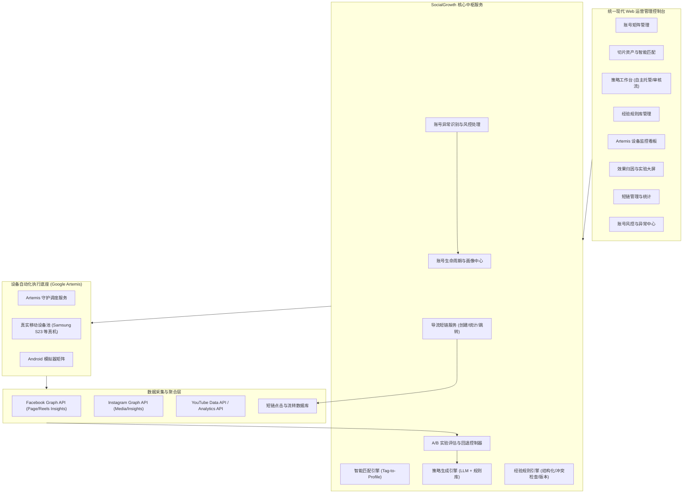

# SocialGrowth 核心交付模块与内容规格规划书

本文档记录了基于最新业务规划及讨论对齐后，SocialGrowth 系统在**前 3 个月演进周期**中需交付的核心模块、系统架构、业务边界与功能规格。

---

## 一、 系统架构与交互拓扑

---

## 二、 三平台差异化处理总览

三个平台在账号类型、内容格式、发布方式、数据接口和导流入口方面存在实质差异，各模块需按平台分别处理。以下为全局差异概览，各模块内进一步细化。

| 维度 | Facebook | Instagram | YouTube |
| --- | --- | --- | --- |
| **账号类型** | Page（专业模式） | Professional Account（创作者/商务） | Brand Account（频道） |
| **主要内容格式** | Reels（3–90s API）、长视频、图文帖 | Reels（最长15min）、Stories（24h）、Feed 帖、轮播图 | Shorts（≤3min）、长视频、直播 |
| **发布接口** | Graph API `video_reels` 端点；单 Page 滚动24h最多30条 | Instagram Content Publishing API；需 Business/Creator 账号及应用审核 | YouTube Data API `videos.insert`；默认项目100次/日 |
| **数据采集接口** | Page Insights / Video Insights (v26.0+) | Instagram Insights API（`GET /{media-id}/insights`） | Data API + Analytics API（延迟48–72h） |
| **可点击导流入口** | 帖文文案、评论中的链接均可点击 | Bio 链接；Stories 链接贴纸（需满足条件）；Reels/Feed 帖文案中链接**不可点击** | 频道主页链接、长视频描述链接可点击；Shorts 描述与评论中链接**不可点击** |
| **变现路径** | Content Monetization（邀请制） | 创作者奖金/品牌合作（无统一播放分成机制） | YPP（订阅+观看门槛） |
| **关键限制** | 优先分发原创内容；低价值改动可能降权 | 同 Meta 生态但规则不等同于 FB；API 审核独立 | 垃圾内容政策覆盖重复评论、虚假互动、自动化批量相似内容 |

> Instagram 虽与 Facebook 同属 Meta 生态，但 API 体系（Instagram Graph API vs. Facebook Graph API）、应用审核、权限模型和数据字段均独立，不能将 Facebook 的接入方案直接套用。

---

## 三、 核心交付模块与规格

### 模块 1：账号资产与定位管理模块 (Account & Matrix Management)

- **交付目标**：支撑从首月 30 个账号（FB / IG / YT 各 10 个）平滑扩展至第 2 个月的 90 个账号（各增 20 个），建立完整的账号定位画像与生命周期记录。
- **核心功能**：
  1. **账号矩阵总览**：多平台、多阶段（冷启动、持续运营、异常处理）账号卡片视图，展示账号绑定的设备标识与健康度评分。
  2. **AI 定位生成与人工校准**：输入业务题材与目标地区，AI 自动生成账号受众画像（地区、语言、年龄、垂直领域标签），支持运营人员人工锁定或修正。
  3. **生命周期流转追踪**：真实记录新账号初始冷启动、受限警告、异常退出与重新达标历史证据。
  4. **定位版本管理**：记录每次定位变更的原因、生效时间和变更前后的定位快照；定位调整需人工确认后生效，AI 不自动改变已确认定位。

- **平台差异化处理**：

| 处理项 | Facebook | Instagram | YouTube |
| --- | --- | --- | --- |
| 账号创建与类型 | Page 创建，开启专业模式 | 转换为 Professional Account（创作者或商务），关联 Facebook Page | 创建 Brand Account 下的独立频道 |
| 权限与角色 | Page 任务权限（通过 Meta Business Suite 分配） | 通过关联 Page 管理；Instagram API 权限需独立申请 | 频道角色（所有者/管理员/编辑）；无需共享密码 |
| 功能检查 | 专业面板、变现意向入口、发布工具 | Professional Dashboard、Insights 可用性、Stories 链接贴纸资格 | 电话验证状态、高级功能、频道ID/视频验证 |
| 验证资源 | 无特殊限制 | 需关联 Page，受 Page 权限约束 | 同一手机号每年最多验证 2 个频道 |

---

### 模块 2：已有切片素材管理与智能匹配模块 (Content & Tag Matching)

- **交付目标**：专注管理甲方已有漫剧成品切片资产，基于多维标签实现与账号定位的匹配分发（前 3 个月不涉及音视频剪辑渲染管线和视频生成）。
- **核心功能**：
  1. **切片素材资产库**：统一管理漫剧切片，包含剧目名、分集、时长、原片规格及视频预览。
  2. **多维特征打标**：提取题材类型（甜宠/逆袭/悬疑等）、受众偏好、语言及核心爆点标签。
  3. **匹配度计算与分发计划**：根据切片标签与矩阵账号画像计算匹配权重（Match Score），自动输出排期分发清单，杜绝无差别粗放分发。
  4. **素材权利与版本记录**：记录每条切片的内容来源、授权状态、素材版本，关联已发布的平台记录。

- **平台差异化处理**：

| 处理项 | Facebook | Instagram | YouTube |
| --- | --- | --- | --- |
| 支持内容格式 | Reels（API 限3–90s）、视频帖 | Reels（App最长15min）、Feed 视频帖、轮播图帖 | Shorts（≤3min）、长视频 |
| 视频规格适配 | 竖版 9:16 优先；API 规格与 App 端不同 | 竖版 9:16 优先；封面图与 Feed 预览需额外处理 | Shorts 竖版 9:16；长视频 16:9；缩略图单独上传 |
| 文案与描述 | 帖文文案，可含链接 | 帖文 caption，链接不可点击，需引导至 Bio | 视频标题（100字符）+ 描述；Shorts 描述链接不可点击 |
| 排期差异 | 按滚动24h API 发布限制排期 | 需通过 Content Publishing API 排期，受应用审核状态约束 | 按项目每日上传额度统一排期；通知限制需分散发布 |

---

### 模块 3：策略引擎与单人辅助工作台 (Strategy Engine & Workbench)

- **交付目标**：支持自然语言经验规则导入与结构化管理，结合"策略级自主托管开关"，实现从人工审核到全自动下发的自由配置。
- **核心功能**：

#### 3.1 经验规则库管理

  1. **自然语言经验录入**：运营人员以自然语言描述运营方法，AI 自动结构化为可执行规则并交由人员确认，避免遗漏前提或将模糊描述直接下发执行。
  2. **规则元数据管理**：每条规则记录以下属性：
     - 来源与录入时间
     - 适用平台（FB / IG / YT，可多选）
     - 适用账号阶段（冷启动 / 持续运营 / 全部）
     - 适用地区、受众与题材范围
     - 触发条件与操作内容
     - 预期目标与例外情况
     - 规则性质标记：**约束**（必须遵守的内部规则）或**建议**（可调整的经验参考）
     - 验证状态（未验证 / 验证中 / 已验证有效 / 已验证无效）
  3. **规则冲突检查**：新增或修改规则时，自动检查与平台官方规则及已有其他规则的冲突，冲突项须人工确认后方可生效。
  4. **版本追溯与启停控制**：规则支持新增、修改、停用，保留完整版本历史及各版本参与的策略与验证结果。
  5. **空规则场景处理**：首期尚未录入人工经验时，AI 仅引用已核实的平台规则、明确的业务目标和账号定位提出待验证方案，不编造经验依据；生成的策略标记为"无经验依据，待验证"。

#### 3.2 平台规则库

  1. **三级规则分类管理**：分别管理平台官方规则、内部运营规则和待验证策略假设。
  2. **规则核验记录**：每条规则记录来源 URL、核验日期、适用平台与账号类型；AI 根据规则拟定策略，实验效果不能自动推翻平台约束。

#### 3.3 AI 策略生成

  1. **策略生成流程**：账号定位 + 经验规则 + 平台规则 + 可用历史数据 → AI 拟定策略 → 标注引用的规则版本、调整原因和测试假设。
  2. **策略内容**：拟定发布周期、文案、短链挂载方式及交互评论策略。
  3. **平台差异化策略**：
     - **Facebook**：文案可含可点击短链；评论互动策略。
     - **Instagram**：文案中短链不可点击，需引导关注 Bio 链接；Stories 链接贴纸（符合条件时）；Reels 互动策略侧重引导评论和分享。
     - **YouTube**：Shorts 描述链接不可点击，引导至频道主页链接或长视频描述区；评论策略需遵守垃圾内容政策，避免重复性推广评论。
  4. **策略版本管理**：每次策略重新生成视为新版本，明确旧版本确认是否失效以及待执行任务如何处理。

#### 3.4 "自主托管"开关与审核流水线

  1. **托管模式**：运营人员可为已成熟账号/策略开启"自主托管"，策略自动按期下发至设备执行。
  2. **人工审查模式**：对于新起号或高风险账号，策略进入待办列表，由单人运营人员审核确认、修改或驳回调整。
  3. **操作记录**：保留策略确认、规则修改、任务暂停等全部操作记录，便于复盘。

---

### 模块 4：导流短链服务 (Short Link & Attribution Service)

- **交付目标**：自建导流短链服务，完成短链创建、事件统计、跳转处理和来源归因，支撑效果评估闭环。
- **核心功能**：
  1. **短链创建与管理**：
     - 支持批量创建短链，关联来源信息（社媒平台、账号、切片、发布任务、策略版本、验证批次）。
     - 管理导流目的地（甲方提供的平台入口或指定页面），多个来源短链可指向同一目的地，各自保留来源统计。
  2. **跳转处理与事件记录**：
     - 用户访问短链时先记录事件，再 302 跳转至目的地。
     - 记录原始访问量、按规则过滤后的有效点击量及跳转处理结果，三者分别存储。
     - 无效访问过滤：识别链接预览（爬虫/社媒预取）、自动请求和明确的机器流量，过滤规则和准确性需持续校验。
  3. **统计维度**：
     - 按来源平台、来源账号、内容切片、发布任务、时间维度聚合统计。
     - 记录点击来源地域与设备分布。
     - 重复访问保留原始记录，去重口径单独定义，不将过滤后点击宣称为已确认真实人数。
  4. **归因边界**：
     - 短链统计仅证明点击事件发生和跳转处理结果，不证明目标页面成功到达或后续转化。
     - 单条短链可归因到具体发布任务时，按任务维度统计；多条内容共用账号主页链接时，按可识别的来源范围统计，不推定单条内容归因。

- **平台差异化处理**：

| 导流入口 | Facebook | Instagram | YouTube |
| --- | --- | --- | --- |
| 可点击位置 | 帖文文案、评论 | Bio 链接（固定）；Stories 链接贴纸（需资格）；帖文/Reels 文案不可点击 | 频道主页链接；长视频描述；Shorts 描述与评论不可点击 |
| 短链挂载方式 | 每条内容可在文案中直接放置独立短链 | Bio 统一短链 + 文案引导"链接在主页"；符合条件时 Stories 贴纸放置 | 频道主页统一短链 + Shorts 引导；长视频描述放独立短链 |
| 归因精度 | 单条归因（每帖独立短链） | Bio 链接仅可归因到账号级，无法精确到单条 Reels | Shorts 仅归因到频道级；长视频可单条归因 |

---

### 模块 5：账号异常与风控管理模块 (Account Risk & Anomaly Management)

- **交付目标**：建立账号异常识别、任务暂停、异常通知和证据保留机制，确保首批 30 个初始账号的全部结果（含受限账号）可追溯。
- **核心功能**：
  1. **异常识别与分类**：

| 异常类型 | 识别依据 | 系统处理 |
| --- | --- | --- |
| 账号封禁或功能受限 | 平台明确通知、账号状态变更、可核对的操作反馈 | 暂停受影响的全部待执行任务，保留证据及原因，通知运营人员，记录后续处理（申诉/恢复）进展 |
| 有明确推荐或分发限制提示 | 平台可取得的明确提示信息 | 按提示检查内容及策略，记录影响范围，不仅依据低播放量作判断 |
| 流量异常、原因未知 | 同口径数据表现与历史或同批参考存在显著偏离 | 标记为"待分析"，先排查采集完整性、观察窗口、内容和受众匹配，不直接标为已证实限流 |
| 任务执行失败 | Artemis 回执中的失败状态或超时 | 记录失败原因和证据，按重试策略处理或升级为人工处理 |

  2. **任务暂停与恢复**：异常账号的待执行和排期任务自动暂停；恢复前需重新核验账号状态，人工确认后恢复。
  3. **异常通知**：异常发生时通过工作台待办和消息通知运营人员，通知内容包括受影响账号、任务范围和建议处理方式。
  4. **证据与复盘记录**：
     - 保留每个初始试点账号的完整结果，包括受限和退出的账号，新增账号单独记录，不覆盖原有结果。
     - 持续可用账号数与初始纳入账号数分别统计。
     - 异常被正确记录不自动等于该平台已完成闭环验收。

- **平台差异化处理**：

| 处理项 | Facebook | Instagram | YouTube |
| --- | --- | --- | --- |
| 封禁/限制入口 | Page 质量面板、发布限制通知、变现资格状态 | Professional Dashboard 通知、内容移除通知、账号状态 | 频道违规警示、版权申诉、社区准则警告 |
| 数据异常基线 | 同期同类 Page 的 Reels 播放与互动中位数 | 同期同类 IG 账号的 Reels Reach 与互动中位数 | 同期同频道类型的 Shorts 观看与订阅增量 |
| 特殊限制 | 非原创内容降权属于平台规则，不作为异常处理 | 与 FB 共享部分违规体系但处罚独立执行 | 通知暂停（短时间>3条发布）属于正常限制，记录但不作为异常升级 |

---

### 模块 6：Artemis 设备自动化执行与调度模块 (Artemis Execution Subsystem)

- **交付目标**：以 Google Artemis 作为设备执行底座，承载所有真机与模拟器的任务调度与端到端 UI 自动化执行。
- **核心功能**：
  1. **标准化任务分发协议**：中台将策略指令（包名、发布素材、输入文本、点击逻辑）通过标准 API/MCP 下发给 Artemis 调度器。
  2. **真机与模拟器协同执行**：
     - 对接已连接的 Android 真机（如 Samsung Galaxy S23）与多实例模拟器。
     - 驱动目标应用（Facebook、Instagram、YouTube）落实打开应用、导航、粘贴文案、上传切片等真实 UI 动作。
  3. **执行证据与回执捕获**：实时收集每一步的截屏证据、动作坐标修正自愈日志（Self-healing Logs）以及 Logcat 运行回执。
  4. **任务状态流转**：任务经历"待执行 → 已下发 → 执行中 → 已完成/失败"状态流转，每个状态转换记录时间戳和证据。
  5. **任务控制**：支持待执行任务的取消与暂停、过期任务处理、重复下发识别，以及执行结果未知时的确认方式。

- **平台差异化处理**：

| 执行项 | Facebook | Instagram | YouTube |
| --- | --- | --- | --- |
| 目标应用 | Facebook App → Page 身份切换 → Reels 发布流程 | Instagram App → 切换至 Professional Account → Reels/Feed/Stories 发布流程 | YouTube App/Studio → 频道切换 → Shorts/视频上传流程 |
| 发布流程差异 | 上传视频 → 填写文案（含短链）→ 选择 Page → 发布 | 上传视频 → 填写 caption → 选择封面 → 选择分享到 Feed/Reels → 发布 | 上传视频 → 填写标题+描述 → 选择缩略图 → 选择 Shorts/视频 → 设定可见性 → 发布 |
| 评论操作差异 | 以 Page 身份评论 | 以 IG Professional Account 身份评论 | 以频道身份评论；需遵守垃圾内容政策 |
| 设备绑定 | 一台设备可登录多个 Page（通过 Meta Business Suite） | 一台设备可切换多个 IG 账号（上限约 5 个） | 一台设备可切换多个 Google 账号/频道 |

---

### 模块 7：数据采集与 A/B 策略优化闭环模块 (Attribution & Strategy Loop)

- **交付目标**：打通自有短链数据与三平台社媒统计 API，通过量化 A/B 实验驱动策略的自动演进与回退。
- **核心功能**：
  1. **双轨数据汇聚看板**：
     - **自有短链数据**：来自模块 4 的短链点击统计，按来源、内容、策略维度聚合。
     - **社媒统计 API**：分平台采集真实视频观看量、完播率、点赞、评论、分享、关注增长等指标。
  2. **量化 A/B 策略实验**：
     - 划分基线策略组与候选实验组（10%~20% 账号小批次试点），设置 7~14 天观察窗口。
     - 效果归因对比：自动计算单位播放成本、短链转化率及增粉效率差异。
  3. **实验晋级与一键回退 (Rollback)**：
     - **达标晋级**：效果显著提升的策略一键推广并替换原基线策略。
     - **未达标回退**：转化衰退或触发异常的策略一键回退至上一稳定版本，并生成完整复盘日志。

- **三平台数据采集差异化**：

| 采集项 | Facebook | Instagram | YouTube |
| --- | --- | --- | --- |
| **播放/观看** | `blue_reels_play_count`（不含重播）；`fb_reels_total_plays`（含重播） | `plays`（Reels 播放）；`reach`（触达人数） | Data API `viewCount`；Analytics `views` / `engagedViews`（口径不同） |
| **观看时长** | `post_video_view_time`（毫秒，含重播）；`post_video_avg_time_watched` | `ig_reels_avg_watch_time` | `estimatedMinutesWatched`（分钟）；`averageViewDuration`（秒） |
| **留存/完播** | `post_video_retention_graph`（分段留存曲线） | Insights 可返回 Reels 留存数据（字段待联调确认） | `averageViewPercentage` 等按报表组合查询 |
| **互动** | `post_video_likes_by_reaction_type`；`post_video_social_actions`（评论、分享） | `likes`、`comments`、`shares`、`saved` | Data API `likeCount`、`commentCount`；Analytics `shares` |
| **关注增长** | `post_video_followers`（单条 Reel 带来的关注） | `profile_views`、`follows`（账号级） | `subscribersGained` / `subscribersLost`（视频或频道维度） |
| **采集频率** | BUC 限流：24h 预算 = 4,800 × Page 互动用户数 | 与 Facebook 共享 Meta 平台限流体系但额度独立 | Data API 默认 10,000 单位/日；Analytics 延迟 48–72h |
| **权限要求** | `pages_show_list`、`pages_read_engagement`、`pages_manage_posts`、`read_insights` | `instagram_basic`、`instagram_manage_insights`、`pages_show_list`（需关联 Page） | OAuth 频道授权；收益报表需 YPP + monetary 权限 |
| **时效与口径** | lifetime 返回，日增量用快照差值观察 | 与 FB 类似，部分指标为 lifetime | Data API 近实时；Analytics 通常 T+2~3 天 |

---

## 四、 前 3 个月演进交付路线图

| 周期 | 核心交付成果 | 验收要点 |
| --- | --- | --- |
| **第 1 个月** | **3 平台真实最小运营闭环跑通** | - 覆盖 FB、IG、YT 各 10 个初始账号（共 30 个），三平台分别验收。 - 跑通：切片匹配 → 策略生成 → 工作台人工确认 → Artemis 真机执行 → 短链统计与社媒数据采集全流程。 - 导流短链服务上线并产生真实点击统计数据。 - 账号异常识别与任务暂停机制可用。 - 经验规则库支持运营人员录入首批经验并参与策略生成。 |
| **第 2 个月** | **账号扩容与自主托管运行** | - 账号规模扩大至 90 个（各平台增 20 个），新增账号单独记录。 - 对已验证常规账号开启"自主托管开关"，AI 自动决策与自动化下发，异常抛出人工告警。 - 首批 30 个账号异常与风控记录完整保留。 - 经验规则库积累首月运营经验，形成可追溯的规则版本。 |
| **第 3 个月** | **可验证的策略优化闭环 (A/B 测试与回退)** | - 上线小批次 A/B 策略实验管理体系。 - 三平台分别提供量化效果对照报告（同一时间窗口内的基线组与实验组数据）。 - 达标策略全量晋级与不佳策略的一键安全回退机制可用。 - 至少一轮有对照条件和结果记录的策略实验报告。 |

---

## 五、 验收材料清单

1. **统一 Web 管理控制台**（开箱即用的前端交互界面，具备全部模块导航与操作入口）。
2. **三平台账号矩阵与定位记录**（30/90 个账号的定位画像、生命周期状态与异常处理证据）。
3. **经验规则库与策略版本记录**（规则录入、结构化、冲突检查和版本追溯的完整操作记录）。
4. **导流短链服务运行记录**（短链创建、点击统计、跳转处理和来源归因的真实数据）。
5. **Artemis 设备调度服务与真实运行录屏/截图证据**（包含 Samsung S23 等真实手机在三个平台上的执行轨迹）。
6. **首月 30 账号真实运营闭环数据报告**（三平台分别提供策略确认、真实执行与数据反馈记录，含短链点击事件与社媒表现 API 原始聚合数据）。
7. **账号异常与风控处理报告**（异常识别、任务暂停、通知与恢复的完整证据链）。
8. **第 3 个月 A/B 策略版本对照复盘报告及回退演练记录**。
