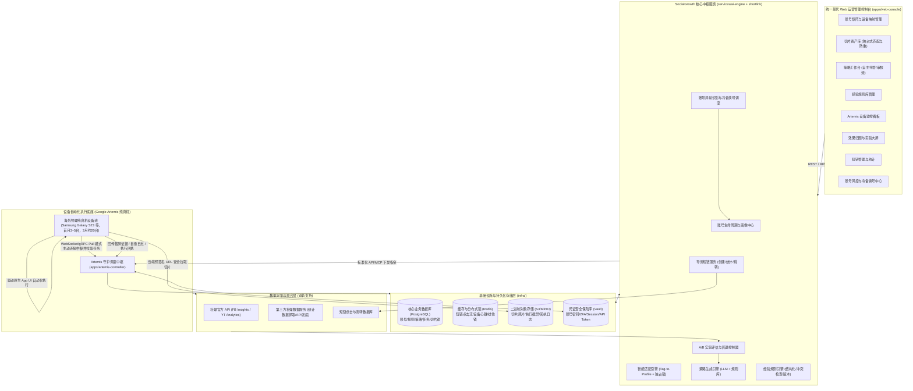
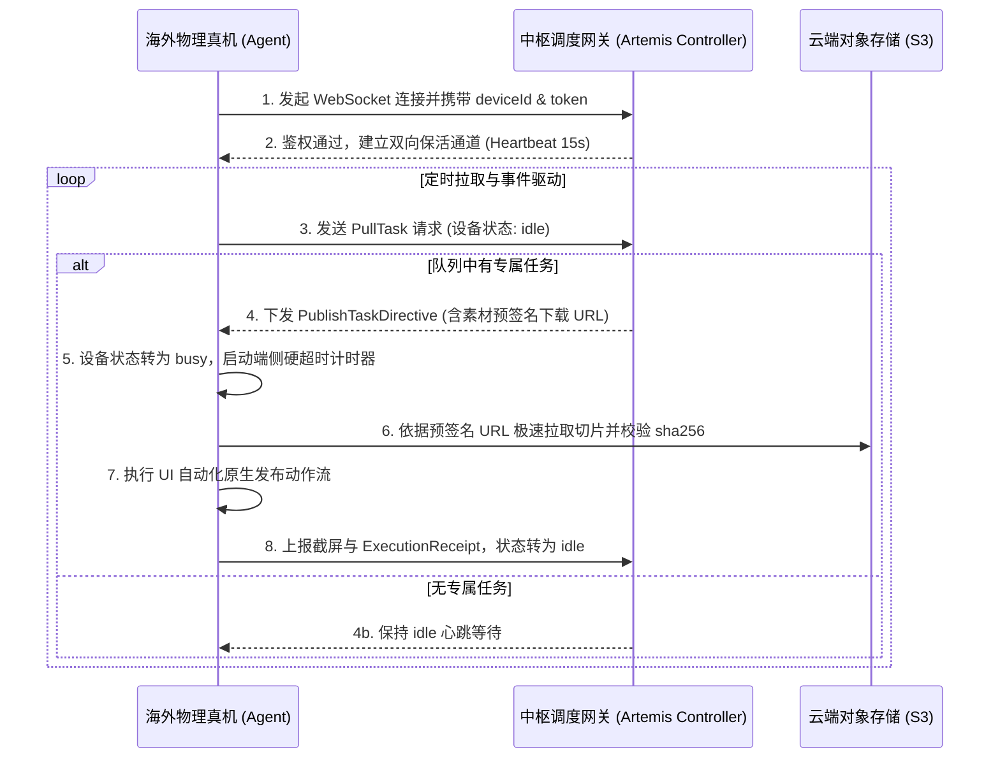

# SocialGrowth 核心交付模块与内容规格规划书

> **2026-09-19 商业目标与产品路线分层（用户已澄清）**：真机/账号数量、商业效果与交付验收目标继续作为商业承诺管理；它们不构成产品设计上限或开发方式、研发启动的限制。产品按最终业务目的与能力依赖分阶段完善，见 [产品能力路线](product-roadmap.md)。商业结果、产品能力完成、实际运营启用分别记录。本轮只修订文档与规划，不开展开发实现。


本文档记录了基于最新业务规划及讨论对齐后，SocialGrowth 系统在**前 3 个月演进周期**中需交付的核心模块、系统架构、业务边界与功能规格。**前期平台聚焦于 Facebook 与 YouTube 双平台**，首月以 3–5 台纯真机启动验证最小闭环，前 3 个月内扩展至约 20 台真机（承载约 40 个账号）；**Instagram 作为后续储备平台，待 FB+YT 运营稳定后再行接入**。

---

## 一、 系统架构与交互拓扑



---

## 二、 平台差异化处理总览 (前期聚焦 FB + YT，INS 稳定后接入)

系统前期集中力量攻透 **Facebook 与 YouTube** 两个平台。所有平台的内容发布**均统一由 Google Artemis 驱动真机上的原生 App 落实 UI 自动化发布，不采用官方发布 API**；数据采集采用“官方 API + 第三方数据服务”双轨兜底。Instagram 保留技术接口与数据规范预留，待双平台稳定后扩展。

| 维度 | Facebook (前期核心) | YouTube (前期核心) | Instagram (待稳定后接入) |
| --- | --- | --- | --- |
| **账号类型** | Page（专业模式） | Brand Account（独立频道） | Professional Account（创作者/商务） |
| **主要内容格式** | Reels（竖版 9:16）、长视频、图文帖 | Shorts（竖版 9:16、≤3min）、长视频 | Reels（竖版 9:16）、Feed 视频帖、Stories |
| **执行底座与发布方式** | **Google Artemis 纯真机 UI 自动化**（FB App 原生操作，不走 API 发布） | **Google Artemis 纯真机 UI 自动化**（YouTube App/Studio 原生操作，不走 API 发布） | 预留 Artemis UI 自动化发布脚本 |
| **数据采集接口** | Page Insights / Video Insights（官方 API 受限时由第三方数据服务兜底） | YouTube Data/Analytics API（官方 API 延迟或受限时由第三方数据服务兜底） | 预留 Instagram Insights API 及第三方抓取接口 |
| **设备与账号绑定关系** | 同一设备同一时期绑定 1 个专属 FB 账号/Page；限制后按模块 5 分类核对，不能默认换号 | 同一设备同一时期绑定 1 个专属 YT 账号/频道；限制后按模块 5 分类核对，不能以换号绕过终止 | 待接入后遵循同平台 1:1 绑定及独立权限核验 |
| **可点击导流入口** | 按实际账号和展示面核验，只有来源可识别的独立入口才支持单条归因 | 频道主页链接作为候选入口；Shorts 描述与评论中链接不可点击，共用入口按频道等可支持范围归因 | 待专项核查，不将 Bio 描述为唯一可用入口 |
| **内容分发约束** | **切片独占分发**：人工确认后单独账号发送，同一切片严禁跨账号分发 | **切片独占分发**：人工确认后单独账号发送，同一切片严禁跨账号分发 | 待接入后同样遵循独占分发原则 |
| **网络与运行环境** | 假设真机设备已在海外物理分散部署，天然具备当地独立网络环境 | 假设真机设备已在海外物理分散部署，天然具备当地独立网络环境 | 假设真机设备已在海外物理分散部署，天然具备当地独立网络环境 |

---

## 三、 核心交付模块与规格

### 模块 1：账号资产与定位管理模块 (Account & Matrix Management)

- **交付目标**：支撑首月 **3–5 台真机对应 6–10 个账号**（FB 与 YT 各 3–5 个），在第 3 个月内平滑扩展至 **约 20 台真机对应约 40 个账号**（FB 20 个 + YT 20 个），建立完整的账号定位画像、设备-账号 1:1 映射与生命周期记录。
- **核心功能**：
  1. **账号矩阵总览**：双平台（前期 FB + YT）、多阶段（冷启动、持续运营、异常处理）账号卡片视图，展示账号绑定的真机设备标识与健康度评分。
  2. **设备-账号专属拓扑（1机1平台1号）**：每台真机物理设备同一时期在 Facebook 与 YouTube 各自**严格只登录并绑定 1 个账号**（单机承载 1 FB + 1 YT），避免错误路由和未授权账号切换；该绑定规则不能证明不存在平台关联或风控风险。
  3. **AI 定位生成与人工校准**：输入业务题材与目标地区，AI 自动生成账号受众画像（地区、语言、年龄、垂直领域标签），支持运营人员人工锁定或修正。
  4. **生命周期流转追踪**：真实记录新账号初始冷启动、受限警告、异常退出与重新达标历史证据。
  5. **备用账号资料**：记录备用账号来源、所有方、授权、适用客户及可用状态；仅在有合法业务用途且资格核实后另行安排，账号封禁不自动触发换号继续运营。设备故障、账号限制与频道终止按模块 5 分别处理。
  6. **定位版本管理**：记录每次定位变更的原因、生效时间和变更前后的定位快照；定位调整需人工确认后生效，AI 不自动改变已确认定位。
  7. **账号来源与客户服务关系（G-02 已确认）**：兼容公司自有账号与客户授权代运营账号，逐账号分别记录所有方、服务客户、授权方、允许动作、适用期间及依据。运营权限不等于所有权，服务客户变更也不自动改变账号归属；资料或权限缺失时列为待核实/待授权，不作为已就绪账号。退出按本模块第 9 项处理。本项是业务关系记录，不改变现有设备绑定规则，也不要求客户门户。
  8. **客户专属与共享例外（G-02a 已确认）**：同一账号同一时期默认服务一个客户；共享须先明确授权、目标冲突及归因边界，再由运营人员人工批准，记录账号、客户范围、适用期间及限制。按账号核对总体频次与资源约束，不按客户重复放大限额；策略与结果保留各自服务关系，无法区分的账号级指标不伪分摊到客户。共享不等于素材或数据跨客户复用授权，涉及主目标变化仍按 G-01a/G-01b 确认与重审。
  9. **客户服务退出（G-02b 已确认）**：正常结束合作时停止该客户的新增运营服务，授权及管理权限允许时保留已发内容。核对未开始安排和进行中/结果未知的发布，停止服务不等于未发布或素材可重新分配；按原账号归属及服务约定处理管理权限和资料交接。接入时约定内容保留依据、链接期限与维护责任、历史资料访问和保留期限；退出时逐项记录结果及未完成事项，不预设永久留存。授权到期、撤回或无操作权限的历史内容另按权利要求和可用权限处理，不承诺无权限时仍能下架。详见[客户退出流程](handoff/2026-09-19-business-flow-proposal.md#36-客户服务退出g-02b-已确认)。

- **平台差异化处理**：

| 处理项 | Facebook (前期核心) | YouTube (前期核心) | Instagram (待稳定后接入) |
| --- | --- | --- | --- |
| 账号创建与类型 | Page 创建，开启专业模式（真机 App 登录对应主账号） | 创建 Brand Account 下的独立频道，真机 App 登录 | 转换为 Professional Account，真机 App 登录 |
| 设备拓扑 | 1 台真机仅登录 1 个 Facebook 账号/Page，不切换账号 | 1 台真机仅登录 1 个 Google 账号/频道，不切换账号 | 1 台真机仅登录 1 个 IG 账号 |
| 功能检查 | 专业面板、变现意向入口、发布工具 | 电话验证状态、高级功能、频道ID/视频验证 | Professional Dashboard、Bio 链接编辑 |
| 验证资源 | 按具体账号挑战、权限和可用功能核验，不承诺无限制 | 同一手机号每年最多验证 2 个频道；[官方说明](https://support.google.com/youtube/answer/171664?hl=en)（2026-09-19复核），不等于已具备所有高级功能 | 登录/接口方式、账号类型及关联条件待专项核查 |

---

### 模块 2：已有切片素材管理与智能匹配模块 (Content & Tag Matching)

- **交付目标**：专注管理甲方已有漫剧成品切片资产，基于多维标签实现与账号定位的独占式匹配分发（前 3 个月不涉及音视频剪辑渲染管线和视频生成，保证内容绝对不重复）。
- **核心功能**：
  1. **切片素材资产库**：统一管理漫剧切片，包含剧目名、分集、时长、原片规格及视频预览。
  2. **多维特征打标**：提取题材类型（甜宠/逆袭/悬疑等）、受众偏好、语言及核心爆点标签。
  3. **标签加权匹配与选片**：直接依据切片题材/受众标签与账号画像加权计算匹配分（Match Score）进行降序排列，先过滤权利、可用性、身份冲突、语言/受众及目的地不适配的素材，再对合格候选排序；无合适素材时返回缺口，不强选最高分。选定后生成文案与排期建议。
  4. **切片独占排他分发机制（Exclusive Distribution Lock）**：
     - **分配与发布分开记录（G-03/G-03a）**：分配经历未分配、临时预占、审批后独占归属；发布结果另外区分尚未提交、进行中/待确认、公开成功、明确失败和结果未知。审批后的归属不是无条件永久锁定，只有符合下项条件时可取消释放；已发布的内容不得跨账号转移，所有语言版本共用这一边界。
     - **取消与释放（G-03a 已确认）**：审核前预占仍可因驳回、剔除或 24 小时未审批而释放，并使旧草案失效；审批后须取消原安排、确认全部版本均未提交且无发布历史、确认旧批准与执行安排均已失效，才可解除归属。保留取消原因、核对依据、确认人及时间；新分配重新核对权利/适配并审核，不能沿用旧批准。暂停、执行超时、账号异常不等于满足释放条件；进行中、已提交或结果未知保持占用并核对。
     - **系统级排他保障**：数据库层施加排他状态与唯一索引约束，彻底杜绝同一切片在矩阵不同账号间重复调用、发布或跨账号搬运。
  5. **素材权利与版本记录**：记录每条切片的内容来源、授权状态、独占绑定账号与发布时间。
  6. **跨语言内容身份（G-03 已确认）**：同一画面片段更换字幕或配音语言仍为同一独占内容，所有版本只归属同一账号；不同平台的不同账号同样受此限制。文件名、封面、编码或速度变化不能产生新分发资格。重复导入与版本须关联同一内容的归属和发布历史；同剧不同片段分别判断，部分重叠按 G-03c 人工确认，批准后取消释放按 G-03a 执行，同账号禁止重发按 G-03b 执行。
  7. **可用库存与适配**：分别呈现文件数、独立内容数、授权合格且未被其他账号占用的可分配内容数，不将语言版本累加为可跨账号分配的库存。身份冲突先核对，语言、受众或权利不适配时不排期；缺货记录缺口，不为填满发布位重复分配。已有语言成品的管理不增加首期翻译、配音或剪辑交付。
  8. **一次发布与防重复（G-03b 已确认）**：同一内容只选一个版本在一个账号发布一次；任一版本已有发布历史后，原账号也不得另发一条，删除原帖、换语言、表现差或缺货均不恢复发布资格。编辑原帖不等于另发一条，仍须符合变更权限；结果未知先核对，确定从未发布的失败恢复另按异常流程。验收分别记录独立成功发布内容、技术重试和编辑次数，意外重复列为异常，不增加合格交付量。
  9. **剧情衔接重叠（G-03c 已确认）**：主体剧情不同且确有少量衔接需要的切片，经人工确认后可作为不同内容分别发布；记录来源片段、重叠范围、必要性、主体差异、确认人及时间，依据不足则待核对且不计可分配库存。不设统一秒数/比例自动放行，例示 10 秒不是阈值；语言变化或主体相同的轻微改剪不能借此获得新身份。通用片头/片尾/标识与剧情画面分开判断，重叠关系不沿间接关联合并整剧。批准仅适用于已审成品及关系，变化后重审，不代替素材授权及发布审核。
  10. **素材准入与供给流程**：接入记录源剧/集数、提供方、使用地区/平台/语言及期限、音乐/配音/图片等相关权利依据、成品版本与剧情关系。核对可播放、必要字幕/音画可理解、片名/集数及引导承诺与目的地一致；只将当前合格成品列为可分配。缺资料列待补充，不适配退回或另提加工需求，撤权暂停受影响安排；匹配分不能覆盖不合格状态。可提前设计加工/生成流程，但不因素材缺货自动新增首期实现承诺。

- **平台差异化处理**：

| 处理项 | Facebook | Instagram | YouTube |
| --- | --- | --- | --- |
| 支持内容格式 | Reels（竖版 9:16 优先）、视频帖 | Reels（竖版 9:16 优先）、Feed 视频帖 | Shorts（竖版 9:16、≤3min） |
| 视频规格适配 | 竖版 9:16 优先；原片切片直接适配 App 上传 | 竖版 9:16 优先；原片切片直接适配 App 上传 | Shorts 竖版 9:16；原片切片直接适配 App 上传 |
| 文案与描述 | 帖文文案，可直接放置短链 | 帖文文案，短链不可点击，文案引导"点击主页 Bio 链接" | 视频标题（100字符）+ 描述；引导"点击频道主页链接" |
| 排期分发规则 | 独占切片，单账号每日分散排期发布（Artemis 真机驱动） | 独占切片，单账号每日分散排期发布（Artemis 真机驱动） | 独占切片，单账号每日分散排期发布，避开通知集中时段 |


---

### 模块 3：策略引擎与单人辅助工作台 (Strategy Engine & Workbench)

- **交付目标**：支持自然语言经验规则导入与结构化管理，结合"策略级自主托管开关"，支持人工审核与已验证、已授权范围内的自动下发；新策略试验按 G-04 先经人工批准。
- **核心功能**：

#### 3.0 运营主目标（2026-09-19 G-01 已确认）

运营主目标按客户或阶段分别明确，系统不预设全项目统一的导流、涨粉或效率排序。策略建议应说明其适用的客户/阶段和主目标，并据此解释内容、节奏和导流安排的取舍；效果评估沿用对应目标，不能用其他指标的增长自动宣称主目标达成。

**目标切换权限（G-01a 已确认）**：AI 可提出主目标切换建议，须经运营人员人工确认后生效。记录适用客户/阶段、原目标、新目标、理由和确认人；自主托管或预设条件满足不自动授予目标切换权限。此项不自动改动既有月度目标数量。

**旧排期处置（G-01b 已确认）**：目标切换时，暂停受影响客户/阶段范围内尚未开始的旧计划，按新目标重新审查、批准后才可执行，不默认等本批全部完成再切换。保留生效时间和受影响计划的重审结果；可复用合适内容，但旧批准不自动适用于新目标。暂停不等于取消计划，不触发素材自动释放。

已完成发布保留原目标与原始事实；已进入执行或结果不明的发布单独核对，不当作尚未开始重新下发，也不因目标切换自动强制终止。未提交取消释放按 G-03a 执行，异常结果核对、已提交后失败及恢复按[流程草案第 3.7 节](handoff/2026-09-19-business-flow-proposal.md#37-异常暂停结果核对与恢复)执行，实验分段和评价按模块 7 的 G-05 规则执行。

#### 3.1 经验规则库管理

  1. **自然语言经验录入**：运营人员以自然语言描述运营方法，AI 自动结构化为可执行规则并交由人员确认，避免遗漏前提或将模糊描述直接下发执行。
  2. **规则元数据管理**：每条规则记录以下属性：
     - 来源与录入时间
     - 适用平台（FB / IG / YT，可多选）
     - 适用账号阶段（冷启动 / 持续运营 / 全部）
     - 适用地区、受众与题材范围
     - 触发条件与操作内容
     - 预期目标与例外情况
     - 规则性质标记：**约束**（必须遵守的内部规则）或**建议**（可调整的经验参考）
     - 验证状态（未验证 / 验证中 / 已验证有效 / 已验证无效）
  3. **规则冲突检查**：新增或修改规则时，自动检查与平台官方规则及已有其他规则的冲突，冲突项由人工判定修订或停用后方可生效，不能以人工批准覆盖外部禁止事项。
  4. **版本追溯与启停控制**：规则支持新增、修改、停用，保留完整版本历史及各版本参与的策略与验证结果。
  5. **空规则场景处理**：首期尚未录入人工经验时，AI 仅引用已核实的平台规则、明确的业务目标和账号定位提出待验证方案，不编造经验依据；生成的策略标记为"无经验依据，待验证"。

#### 3.2 平台规则库

  1. **三级规则分类管理**：分别管理平台官方规则、内部运营规则和待验证策略假设。
  2. **规则核验记录**：每条规则记录来源 URL、核验日期、适用平台与账号类型；AI 根据规则拟定策略，实验效果不能自动推翻平台约束。

#### 3.3 AI 策略生成与排期节奏

  1. **每日批次预生成机制**：按对应项目明确的批次时间与时区进行排期扫描；“凌晨 02:00”只是示例，须按下项已有的时区规则解释，不能直接采用服务器默认时间。结合账号定位与合格切片库，预先生成未来 24 小时的发布排期草案（`draft`），形成运营待办；生成草案不等于批准发布。
  2. **运营频次与时区规则**：使用适用客户/平台已明确批准的内部频次、间隔、成本及有效期规则，不将旧固定条数或冷启动天数视为官方安全保证。目标受众时区与运营值守时区分别记录，排期显示当地时间与实际时刻；跨日、夏令时和时区变更需核对。运营日与滚动窗口分别检查，暂停/过期不集中补发，规则缺失或冲突先待处理；内部经验及来源见[平台规则](platform-rules.md)。
  3. **策略生成要素**：为选定切片针对性拟定发布时段、文案、短链挂载方式及交互评论策略：
     - **Facebook**：按实际账号与展示面核实可点击入口，适用时使用来源可区分的短链；评论需有真实上下文，不把固定置顶或重复引流视为所有账号可用。
     - **Instagram**：文案提示引导主页 Bio 链接；预留互动策略。
     - **YouTube**：Shorts 标题（$\le$ 100 字符）引导主页链接；评论遵守防垃圾内容政策。
  4. **策略版本追溯**：每次重新生成产生新版本标识（`v1`, `v2` 等），记录引用的规则版本与假设，旧草案被替代后不得继续审批/下发，只释放该草案仍持有且满足取消条件的预占；已批准、执行中或其他版本持有的内容按对应规则核对，不因新版本生成自动释放。长期策略版本的有效范围与一次发布任务的进度分别记录。

#### 3.4 运营集中审核工作台与"自主托管"

  1. **单人集中审查流水线**：单人运营人员在约定工作时段打开 Web 工作台集中审查；耗时按内容、试验、异常和复盘的实际工作量记录，不将每日 5~10 分钟作为已验证承诺：
     - **批量通过 (Approve)**：对符合预期的发布策略一键批量通过，状态变更为 `approved`，关联内容及所有语言版本取得该账号独占归属（符合 G-03a 时可取消释放），任务自动进入 Artemis 调度队列；
     - **快速微调 (Edit)**：修改文案、短链或发布时间后核对是否仍在原批准范围内；目标、目的地、内容身份、关键规则或排期条件改变时重新确认，不将保存动作等同批准；
     - **驳回与重生 (Reject / Regenerate)**：不合规草案可输入修改反馈提示词重新生成，或直接驳回并立即释放切片预占锁。
  2. **"自主托管"开关 (Auto-Pilot，G-04 已确认)**：托管范围明确到客户/主目标、账号与平台、已验证策略或规则版本、允许动作、内容与目的地条件、频次/成本限制和有效期。范围内的日常执行可免逐次人工审核，账号成熟不代表所有策略成熟；新策略小批试验先经人工批准，记录假设、版本、账号、发布量、预算、期限、观察及停止条件。批准一批试验不等于已验证有效或可自动扩大，数据评价及推广条件按模块 7 的 G-05 规则执行；异常和超范围事项转人工。
  3. **操作审计日志**：完整保留策略审批、文案调整、驳回原因及托管启停的全部审计日志。
  4. **目标切换重审（G-01b）**：目标切换时，受影响的未开始旧计划退出可执行范围，进入暂停重审；包括原先已批准或已自主托管下发但尚未开始的安排。按新目标重新批准后才可恢复，不能通过托管开关自动跳过本次重审。
  5. **新策略与常规执行边界（G-04）**：在已验证规则和授权参数内选择合格内容、生成文案或排期属于日常执行；未经验证的新假设、关键规则变化或超出已验证适用范围属于待审新策略。疑义先待审；试验关键内容/范围变化、批准过期或停止条件触发时，受影响未开始安排不得继续沿用旧批准。主目标切换和 G-03c 内容重叠仍分别人工确认。非值守时段按 G-04a 执行有效批准范围内的安排。
  6. **非值守执行与恢复（G-04a 已确认）**：有效批准内的发布可在非值守时段继续，需人工处理时暂停受影响及关联安排，确认无关联的安排可继续；不明影响范围先暂停无法排除风险的相关范围。记录值守窗口、时区、责任人与待办，不承诺全天即时响应。人工核对异常解除、发布结果、授权和排期后批准恢复；不自动补发过期任务，挑战/授权过期按当前条件重新处理。

---

### 模块 4：导流短链服务 (Short Link & Attribution Service)

- **交付目标**：自建导流短链服务，完成短链创建、事件统计、跳转处理和来源归因，支撑效果评估闭环。
- **核心功能**：
  1. **短链创建与管理**：
     - 支持批量创建短链，关联来源信息（社媒平台、账号、切片、发布任务、策略版本、验证批次）。
     - 管理导流目的地（甲方提供的平台入口或指定页面），多个来源短链可指向同一目的地，各自保留来源统计。
  2. **服务端智能分流跳转与事件记录**：
     - **受众高效 302 直跳**：真实受众访问短链时，服务端在毫秒级内完成点击流事件写入，并立即响应原生 `HTTP 302 Found` 重定向至目标落地页，记录跳转处理结果；响应跳转不证明浏览器到达、页面加载或零跳出。
     - **预览与访问识别**：按已声明规则区分预览请求、测试访问和其他请求，过滤存在误差，不声称仅凭 User-Agent 精准识别人。预览封面、标题和描述忠实对应目的地，不以屏蔽审核分析或隐藏真实落地内容为目标。
     - **三层数据独立持久化**：原始请求日志（Raw Hits）、规则过滤后的有效点击（Valid Clicks）与跳转结果分别入库，保障归因分析的真实性与可回溯性。
  3. **统计维度**：
     - 按来源平台、来源账号、内容切片、发布任务、时间维度聚合统计。
     - 记录点击来源地域与设备分布。
     - 重复访问保留原始记录，去重口径单独定义，不将过滤后点击宣称为已确认真实人数。
  4. **归因边界**：
     - 短链统计仅证明点击事件发生和跳转处理结果，不证明目标页面成功到达或后续转化。
     - 单条短链可归因到具体发布任务时，按任务维度统计；多条内容共用账号主页链接时，按可识别的来源范围统计，不推定单条内容归因。
  5. **链接故障与历史入口处理**：区分短链服务故障、目的地故障和平台在点击前拦截域名。服务恢复不等于旧帖文入口恢复；平台拦截时先核对原因、整改/申诉及可用权限，不承诺换域名能修复全部历史链接。对新发布与已发入口分别处理，可修改的更新并留记录，不能修改的列明影响并暂停相关新导流。目的地替换须有同客户的授权与内容对应依据，不能误导旧内容受众或自动转给其他客户。
  6. **合作退出后的链接（G-02b 已确认）**：旧短链按接入时约定继续有效或停用，明确有效期与维护责任；仍有效的入口保持约定的客户及目的地范围，不自动转给新客户。记录变更时间、依据和影响的历史内容；多个内容共用主页入口时，处理其共同影响，不推定可以逐帖独立切换。无继续服务约定的链接列为待处理，由运营人员落实继续或停用安排，不默认无限维护。

- **平台差异化处理**：

| 导流入口 | Facebook | Instagram | YouTube |
| --- | --- | --- | --- |
| 可点击位置 | 依账号、帖文/Reels 展示面及实际入口核验，不把可填 URL 等同可点击 | 后续接入前核验 Bio、Stories 及其他具体入口和资格，不作统一保证 | Shorts 描述/评论网址不可点击；频道资料链接可用；长视频外链需对应资格 |
| 短链挂载方式 | 核实入口后选择适用方式，可区分来源时独立短链 | 依真实入口设计引导，不先承诺具体数据 | 按实际频道资料链接引导；长视频依资格选择入口 |
| 归因精度 | 独立且可识别的入口可到帖文；共用入口按其实际粒度 | 共用入口至账号，不强行分配给 Reels | 频道共用入口至频道；独立且可识别的长视频入口按其来源 |

---

### 模块 5：账号异常与风控管理模块 (Account Risk & Anomaly Management)

- **交付目标**：建立账号异常识别、任务暂停、异常通知、冷备账号置换与证据保留机制，确保首月 3~5 台物理真机（6~10 个账号）至第 3 个月约 20 台真机（约 40 个账号）的全部结果（含受限账号）完整可追溯。
- **核心功能**：
  1. **异常识别与分类**：

| 异常类型 | 识别依据 | 系统处理 |
| --- | --- | --- |
| 登录失效或身份验证 | 登录反馈、验证挑战及授权记录 | 暂停相关安排，联系有权限人员处理；验证码或验证通过不自动证明业务可恢复 |
| 暂时发布/操作受限 | 平台明确通知与限制范围 | 按要求等待、整改或申诉，不自动换账号继续受限动作 |
| 内容移除或权利争议 | 平台通知、权利方说明 | 暂停同源风险素材和关联安排，核对已有发布与入口，不能简单换号重发 |
| 推荐/变现资格变化 | 明确资格提示 | 与能否发布分开记录，解释影响范围，按当前规则调整 |
| 频道终止 | 终止通知与主体范围 | 停止受影响业务，按官方允许路径处理；不能通过备用频道绕过终止 |
| 流量异常、原因未知 | 可比口径的数据偏离 | 先核对数据、观察窗、内容与受众，不直接认定已证实限流 |
| 执行异常、设备故障或超时 | 执行回执、设备状态和平台发布证据 | 按 G-04a 暂停关联范围；未知结果先核对，不因设备复位自动重发或换号 |

  2. **异常处置与备用资源安排**：
     - 先判断限制对象、关联范围、权利和平台允许的恢复路径，记录原因及责任人；通知运营不等于自动获得恢复许可。
     - 备用账号仅作为经授权且具备相应用途的独立资产；原账号的处罚、内容历史与客户关系不自动转移或消失。YouTube 终止不得借其他频道绕过，依据见[官方规则记录](platform-rules.md)。
     - 登录环境清理只属于资源处理动作，不证明解除平台关联、处罚或历史事实。用户确认换号也不能替代外部允许条件。
     - 已发内容不重新发布；未提交取消符合 G-03a 才可释放，进行中/已提交/未知状态按 G-04a 核对。资料留存按客户约定处理，不把保留防重事实等同永久保存全部原始数据。
  3. **异常通知**：异常发生时通过工作台待办和消息通知运营人员，通知内容包括受影响设备、账号、任务范围和建议处理方式。
  4. **证据与复盘记录**：
     - 保留每个初始试点账号的完整结果，包括受限和退出的账号，新增或置换账号单独记录，不覆盖原有结果。
     - 持续可用账号数与初始纳入账号数分别统计。
     - 异常被正确记录不自动等于该平台已完成闭环验收。

- **平台差异化处理**：

| 处理项 | Facebook | Instagram | YouTube |
| --- | --- | --- | --- |
| 封禁/限制入口 | Page 质量面板、发布限制通知、变现资格状态 | Professional Dashboard 通知、内容移除通知、账号状态 | 频道违规警示、版权申诉、社区准则警告 |
| 恢复依据 | 按具体限制通知与账号权限核对 | 接入后按具体通知和权限核对 | 按具体通知核对；频道终止不能由换号绕过 |
| 数据异常基线 | 同期同类 Page 的 Reels 播放与互动中位数 | 同期同类 IG 账号的 Reels Reach 与互动中位数 | 同期同频道类型的 Shorts 观看与订阅增量 |
| 特殊限制 | 推荐资格与发布能力分别记录 | 不从 FB 状态推定 IG 权限/处罚相同 | 身份验证、发布限制、推荐和频道终止分别处理，不以单一操作次数直接判定 |

---

### 模块 6：Artemis 纯真机设备自动化执行与调度模块 (Artemis Pure Physical Device Subsystem)

- **交付目标**：以 Google Artemis 作为设备执行底座，承载所有纯 Android 真机（彻底排除模拟器）的任务调度与端到端 UI 自动化执行。
- **核心功能**：
  1. **标准化任务分发与拉取协议**：
     - 海外真机 Agent 通过 WebSocket/gRPC 向 Artemis Controller 建立双向长连接，以 Pull 模式定时拉取任务。
     - **严格 1:1 排他路由**：中枢调度出队匹配时，严格校验 `(platform, boundAccountId)`，设备仅能拉取自己当前唯一绑定的账号任务，彻底杜绝串号派发。
  2. **纯真机设备池端到端自动化执行**：
     - 对接真实 Android 移动设备池（如 Samsung Galaxy S23 等纯真机），假设设备已在海外物理分散部署。
     - 驱动目标原生应用（Facebook App、YouTube App/Studio，Instagram 预留）落实打开应用、导航、粘贴文案、上传切片等真实 UI 动作，不走官方发布 API。
  3. **单机跨平台隔离，同平台专属 1:1 强绑定**：单台物理真机在同一时期在各平台 App 内仅登录 1 个有效账号（单机承载上限 1 FB + 1 YT），绝不在同一 App 内频繁切换多账号，保障设备环境纯净。
  4. **执行证据与自愈回执捕获**：实时收集每一步的截屏证据、动作坐标修正自愈日志（Self-healing Logs）以及 Logcat 运行回执。
  5. **人机协同与自愈机制 (Self-healing & HITL Protocol)**：
     - **常见系统弹窗轻量自愈**：真机自动化脚本内置针对权限弹窗、系统通知、App 评分弹窗的规则检测，执行自动跳过/关闭；
     - **阻断性异常挂起接管**：2FA、身份验证与平台限制分别识别并暂停受影响及关联安排，保留必要证据并通知运营。非值守时进入待办，不要求 10 分钟内接管；挑战过期须重新处理，取得验证码不等于平台限制解除，恢复还需核对发布结果、权限及排期。
     - **执行超时与发布结果分离**：既有 10 分钟是技术执行超时参数，不作为人工响应期限或发布失败判据。超时可触发执行资源处置和告警，但是否已提交/已公开须另核对；结果未知保留内容归属，不重试、不释放。设备复位或资源空闲不等于相关业务自动恢复，只有确认无关联且批准仍有效的安排可继续。

- **平台差异化处理**：

| 执行项 | Facebook | Instagram | YouTube |
| --- | --- | --- | --- |
| 目标应用 | Facebook App 原生 UI 发布流程 | Instagram App 原生 Reels/Feed 发布流程 | YouTube App/Studio 原生 Shorts/视频上传流程 |
| 发布流程差异 | 打开 FB → 进入对应 Page → 上传视频 → 填写文案（含短链）→ 发布 | 打开 IG → 进入创建页 → 上传切片 → 填写 caption（引导 Bio）→ 发布 | 打开 YT → 进入上传 Shorts → 填写标题（引导主页）→ 设为公开 → 发布 |
| 评论操作差异 | 以已登录 Page 身份在发布内容下发布引导评论 | 以已登录 IG 身份在发布内容下发布引导评论 | 以频道身份发布互动评论；遵守防垃圾评论限制 |
| 设备与账号绑定 | **1 机 1 号**：设备唯一绑定 1 个 Page，不切换其他 FB 账号 | **1 机 1 号**：设备唯一绑定 1 个 IG 账号，严禁同机切换多账号 | **1 机 1 号**：设备唯一绑定 1 个频道，不切换其他 Google 账号 |

---

### 模块 7：数据采集与 A/B 策略优化闭环模块 (Attribution & Strategy Loop)

- **交付目标**：打通自有短链数据、社媒官方 API 与第三方社媒数据服务，通过量化 A/B 实验驱动策略的演进与安全回退。
- **核心功能**：
  1. **数据可用性与来源切换**：
     - 官方接口与第三方服务逐指标核验来源、授权、定义、单位、统计对象、观察窗口、刷新延迟及覆盖范围；第三方不保证补齐私有或官方未开放字段。
     - 区分真实零值、尚未到采集时间、延迟、无权限、指标不提供、故障和内容不可访问；不以零填补缺失。展示来源变化和口径版本，复核可比性后才能继续评价，不能静默切换主指标或评分来制造赢家。
     - 2h/12h/24h/72h 可作为早期采集节点，具体计划须覆盖整个获批观察窗口；若评价到 7–14 天，就需有对应后续数据，不能用截至 72h 的证据代表全部时窗。无法取得必需数据时记录试验限制或未完成，不承诺双轨必然完整。
  2. **试验计划与比较条件（G-01/G-04/G-05）**：
     - 新策略试验先人工批准；启动前确定客户/阶段主目标、一个主要假设、主指标及分子/分母、平台、比较单位、基线、候选变化、分组及观察窗、数据来源、完整性/最低证据要求、排除规则、停止与改善判据、预算及适用范围。
     - 主指标及阈值依据对应业务与数据条件确定，缺少这些决策时不启动以胜出/晋级为目标的试验。观察后不临时挑有利指标；目标或来源口径变化时分段并重新核对。
     - 各平台分别比较，核对账号阶段、题材/语言、时长、发布时间和曝光机会；计数的统计范围及年龄一致，累计与增量不混用。独占内容导致组间素材不同，未消除的差异要写入结论；无法满足对照条件的只能报告方向性观察，不能称已证明因果。
     - 频道主页共用入口只能按可支持的频道/时段等单位评价，不能把频道点击分给单条 Shorts；无合理曝光分母时不计算伪 CTR。小样本不因改用评分而消除不确定性。
     - **已替代旧标准**：统一完播/互动/点击加权分、公开播放与互动混合分，以及固定 10%–20%/7–14 天/提升 15% 不再决定通用胜出或验收。历史公式不再作为当前规范；不得在缺主指标时换模型继续宣布原目标改善。
  3. **结论、验收与后续决定（G-05=A）**：
     - **闭环验收**：获批方案、真实执行、必需数据及质量核对、评价和下一步决定完整，才可验收；结论可为限定范围改善、未见改善、恶化或证据不足，不强制选赢家。FB/YT 分别提供案例，不能以一平台代替另一平台。
     - **不足与未完成区分**：必要工作完整但样本/不确定性不支持改善可记证据不足；缺执行、必需采集或评价记录为未完成/无效，不能据此通过闭环。提前停止仅证明相应停止分支，不替代完整实验案例。
     - **推广权限**：闭环通过不等于策略有效、增长目标达成或自动扩大；无改善/证据不足的候选不推广。即使满足预先约定的改善与约束条件，也只形成限定范围的建议，扩大须明确授权，不因固定阈值自动全量晋级。
     - **回退与后续**：风险或停止条件触发时暂停相关安排；保留、调整、重试验或停止由复盘给出理由，新试验按 G-04 批准。回退影响未来决策与待执行安排，不撤销历史曝光、点击或已发内容；未知结果按 G-04a 核对。

- **指标核验清单（不是跨平台/跨来源的通用字段保证）**：

| 指标类别 | 业务核验要求 |
| --- | --- |
| 观看与触达 | 分开记录观看次数、有效观看、触达人数等实际口径；核对平台、接口和日期，不把它们互换 |
| 观看时长与完成 | 平均观看时长、平均观看比例、看完人数占比是不同量；只有来源提供对应定义时才报告所选指标 |
| 互动 | 点赞、评论、分享、收藏逐项核对可用性和口径；某来源可提供不代表另一来源也能取得 |
| 关注变化 | 新增、流失、净变化和期末存量分别定义；不同粒度的数据不得任意分摊 |
| 短链点击 | 按实际入口归因粒度和过滤口径报告，不证明目标页面到达、真实独立人数或订单；与社媒分母不匹配时不计算转化率 |

2026-09-19 官方核查：YouTube `averageViewPercentage` 定义为平均观看比例，不能直接改名为看完人数占比；Analytics 中的分享/订阅等指标也不能被视为公开视频统计接口必有字段。参见 [YouTube Analytics 指标](https://developers.google.com/youtube/analytics/metrics)及 [YouTube 视频资源](https://developers.google.com/youtube/v3/docs/videos)。具体账号权限与供应商覆盖仍须实际核验。

---

## 四、 前 3 个月演进交付路线图

| 周期 | 核心交付成果 | 验收要点 |
| --- | --- | --- |
| **第 1 个月** | **FB 与 YT 双平台真实最小运营闭环跑通** | - 覆盖 **3–5 台纯真机**（Samsung S23 等）承载 FB 与 YT 各 3–5 个初始账号（共 6–10 个账号），两平台分别验收。<br>- 跑通：独占切片匹配 → 策略生成 → 工作台人工确认 → Artemis 真机 App UI 执行 → 短链统计与社媒数据采集（官方/第三方）全流程。<br>- 导流短链服务上线并产生真实点击统计数据。<br>- 账号异常识别、任务自动暂停与冷备置换机制可用。<br>- 经验规则库支持运营人员录入首批经验并参与策略生成。 |
| **第 2 个月** | **稳定运行与设备平滑爬坡** | - 真机规模稳步扩展至 8–10 台（承载 FB 与 YT 共 16–20 个账号），严格维持 1 机 1 平台 1 号绑定。<br>- 对已验证常规账号开启"自主托管开关"，AI 自动决策与自动化真机下发，异常抛出人工告警。<br>- 首批账号异常与风控记录完整保留，验证冷备置换 SOP。<br>- 经验规则库积累首月运营经验，形成可追溯的规则版本。 |
| **第 3 个月** | **约 20 台规模目标下形成可验证的策略优化闭环** | FB/YT 分别提供获批试验、真实执行、必需数据质量核对、比较与复盘记录；按 G-05 允许无改善或证据不足，但缺失必要工作不能通过。另列策略有效性、增长目标及推广授权；验证停止/回退的业务边界。商业扩容按交付约定管理，实际平台接入核验对应能力与授权；产品按 R-02 的独立能力路线推进，不以规模或商业验收限制开发。 |

---

## 五、 验收材料清单

1. **统一 Web 管理控制台**（开箱即用的前端交互界面，具备全部模块导航与操作入口）。
2. **账号矩阵与设备映射记录**（首月 3–5 台至第 3 个月约 20 台真机对应 6–10 个至约 40 个账号的定位画像、生命周期状态与冷备换号证据，预留 INS 扩展槽位）。
3. **经验规则库与策略版本记录**（规则录入、结构化、冲突检查和版本追溯的完整操作记录）。
4. **导流短链服务运行记录**（短链创建、点击统计、跳转处理和来源归因的真实数据）。
5. **Artemis 纯真机自动化执行证据**（包含 Samsung S23 等真实手机在 Facebook 与 YouTube 官方 App 上的 UI 执行录屏与截屏轨迹，无模拟器）。
6. **首月真实运营闭环数据报告**（FB 与 YT 分别提供策略确认、真实执行与数据反馈记录，含短链点击事件与社媒表现 API / 第三方数据服务原始聚合数据）。
7. **账号异常与冷备换号处理报告**（异常识别、任务暂停、冷备新号置换与恢复的完整证据链）。
8. **第 3 个月 A/B 策略版本对照复盘报告及回退演练记录**。

---

## 六、 研发交付与审计整改衔接

针对代码实现层（调度器精确路由、切片独占锁、Watchdog 自愈、2FA 人机接管）与衍生交付物（测算模型、CEO Word 汇报）的详细研发整改任务及当前完成状态，请查阅配套交接目录：
- **[研发交接台账与状态看板 (Handoff Tracker)](handoff/README.md)**
- **[2026-09-18 研发交接与审计整改任务书](handoff/2026-09-18-developer-handoff.md)**

---

## 七、 系统核心工程与技术架构规范（架构师与开发必读）

为彻底消除概念拓扑与工程落地的断层，本章节系统性确立持久化存储、海外通信、素材管道、安全凭证与网络防封五大底层架构标准。

### 7.1 数据存储与实体持久化模型设计

系统数据按读写频次与一致性要求划分为三层存储架构：

```
┌────────────────────────────────────────────────────────────────────────┐
│                        数据持久化分层架构                                │
├─────────────────────────┬────────────────────────┬─────────────────────┤
│   关系型核心库 (PostgreSQL) │  高频缓存与分布式锁 (Redis)  │ 二进制对象存储 (S3/MinIO) │
├─────────────────────────┼────────────────────────┼─────────────────────┤
│ 1. accounts (账号资产)   │ 1. slice:lock:{id} (独占锁)│ 1. bucket-raw-slices│
│ 2. devices (真机映射)    │ 2. device:heartbeat:{id}│    (切片原片与元数据) │
│ 3. slice_metadata (切片) │ 3. shortlink:click:stream│ 2. bucket-evidence  │
│ 4. strategy_versions (策略)│   (点击流实时入队缓冲)    │    (截屏证据与回执日志)│
│ 5. task_directives (任务)│ 4. domain:status (域名池) │                     │
│ 6. audit_rules (经验规则)│                        │                     │
└─────────────────────────┴────────────────────────┴─────────────────────┘
```

#### 核心数据表 Schema 约束
1. **`accounts` (账号表)**：`account_id` (PK), `platform` (ENUM: fb/yt/ins), `account_name`, `profile_type`, `stage` (cold_start/active/suspended), `bound_device_id` (FK), `created_at`, `updated_at`。
2. **`devices` (物理真机表)**：`device_id` (PK), `serial_number`, `model` (如 S23), `status` (idle/busy/offline/error), `ip_address`, `location_tag`, `last_heartbeat_at`。
3. **`slice_metadata` (切片资产表)**：`slice_id` (PK), `drama_id`, `episode_num`, `duration_sec`, `video_s3_key`, `sha256`, `allocation_status` (ENUM: `unallocated`, `assigned_pending`, `assigned_locked`, `published`), `assigned_account_id` (FK), `pre_locked_at`, `locked_at`, `published_at`。
   - **排他索引与锁约束**：建立 `(slice_id, allocation_status)` 联合索引与唯一约束，非 `unallocated` 状态前置排他拦截，杜绝跨账号重复分发。
4. **`strategy_versions` (排期策略表)**：`strategy_version_id` (PK), `account_id` (FK), `slice_id` (FK), `version_tag`, `status` (ENUM: `draft`, `approved`, `rejected`, `archived`), `scheduled_time`, `caption`, `shortlink_url`, `created_at`, `reviewed_at`。
5. **`task_directives` (调度任务表)**：`task_id` (PK), `strategy_version_id` (FK), `device_id` (FK), `account_id` (FK), `platform`, `target_package`, `status` (ENUM: `pending`, `dispatched`, `executing`, `completed`, `failed`, `waiting_2fa`), `retry_count`, `created_at`, `executed_at`, `receipt_s3_key`。
6. **`domain_pool` (跳转域名池表)**：`domain_id` (PK), `domain_name`, `status` (ENUM: `active`, `standby`, `blocked`), `last_probed_at`, `error_message`。
7. **`shortlink_events` (短链点击流事件表)**：`event_id` (PK), `short_code`, `account_id` (FK), `platform`, `raw_ip`, `user_agent`, `referer`, `is_bot` (BOOLEAN), `is_valid` (BOOLEAN), `http_status` (200/302), `created_at`。

---

### 7.2 海外物理真机网络通信拓扑与拉取模型 (Gateway Pull)

针对海外物理真机分布于各局域网私网、云端无法主动穿透 NAT 的现实约束，系统彻底摒弃云端主动 Push 模型，采用 **基于 WebSocket / gRPC 的客户端长连接拉取模型（Client Pull）**：



- **心跳与保活**：真机 Agent 每 15 秒上报一次端侧状态（电量、温度、前台 App、可用空间）。若连续 3 次心跳丢失，中枢自动标记设备 `offline` 并挂起队列任务。
- **排他路由约束**：网关在出队匹配时，必须严格校验 `task.accountId == device.boundAccountId`，严禁借调其他空闲真机。

---

### 7.3 切片素材端到端分发与端侧磁盘 LRU 清理机制

物理手机内部存储资源极其宝贵，系统实施严格的**临时预签名按需拉取 + 瞬时物理清理 + LRU 保底回收策略**：

1. **预签名下发**：云端 S3 为切片生成有效期仅 15 分钟的临时 Download URL，防止切片外链泄漏；
2. **端侧落盘与校验**：真机下载至沙箱临时目录（`/data/local/tmp/slices/`），校验 SHA256 无误后导入系统相册；
3. **临时文件清理与证据保留**：清理应先确认不会破坏进行中操作或待核对证据；超时不能直接视为业务已结束。原有临时文件清理命令仅说明清理动作，不代表已满足清理前提：
   ```bash
   rm -f /data/local/tmp/slices/<slice_id>.mp4
   # 触发 Android 媒体库静默扫描，清除相册缩略图索引
   am broadcast -a android.intent.action.MEDIA_SCANNER_SCAN_FILE -d "file:///data/local/tmp/slices/<slice_id>.mp4"
   ```
4. **存储压力下的业务边界**：保留进行中和结果未知任务的必要证据，按已约定的留存范围处理可清理资料；不能为释放空间清除尚未完成核对且无其他副本的证据。资源不足时暂停受影响安排并留待处理，具体存储手段不属于本轮业务审计决策。

---

### 7.4 账号资产安全凭据托管架构 (Credential Vault)

为防范数十个社媒高价值资产的泄漏，引入企业级凭据保险库管理机制：

1. **密文存储隔离**：账号主密码、辅助邮箱密码、2FA 种子密钥（Secret Key）均采用 AES-256-GCM 加密后存入独立保险库（如 HashiCorp Vault 或云 KMS），数据库主表仅保存凭据引用 ID；
2. **验证方式与授权**：TOTP、短信/邮箱验证码和平台风险挑战分别处理；只有已获授权的常规 TOTP 场景才可按许可自动处理，短信/邮箱或身份挑战交由有权限人员，验证码过期重新核对。凭据管理能力不等于账号操作或业务恢复授权；
3. **Session 租约与脱敏**：真机上登录成功后，禁止在任何回执日志中明文打印 Cookie 或 Auth Token；日志中涉及敏感账号信息的统一进行掩码脱敏（如 `us***@gmail.com`）。

---

### 7.5 导流故障与预览一致性边界

原“换域名后历史帖文全部无感恢复”“零跳失”“阻止分析器抓取真实目的地”的表述已被业务复审替代。此处定义受众与运营应观察到的行为，不指定新的实现方案。

| 情况 | 正常处理与边界 |
| --- | --- |
| 链接预览请求 | 提供与真实目的地一致的片名、封面与描述；不能为审核展示不同去向 |
| 受众访问 | 记录可观察的访问与跳转处理，说明入口/来源；不保证页面到达或零跳出 |
| 短链服务故障 | 恢复服务并检查受影响链接，恢复记录不能替代目标页面可用性核查 |
| 客户目的地故障 | 暂停相关新导流；只有经授权且与原内容一致的目的地才能替换，否则停用或保留不可用状态，不转给无关客户 |
| 平台拦截旧域名 | 请求可能尚未到达本服务；先核对整改/申诉路径，逐项处理可修改的旧入口，无法修改的保留受影响记录，不承诺服务端切换全部修复 |
| 目的地或服务客户变化 | 核对受影响的全部历史入口与共用主页链接，保留生效时间、授权依据及历史版本；退出按 G-02b 处理 |

更多受众路径和责任分工见[业务流程第 3.4 节](handoff/2026-09-19-business-flow-proposal.md#34-受众导流与链接变化)。
