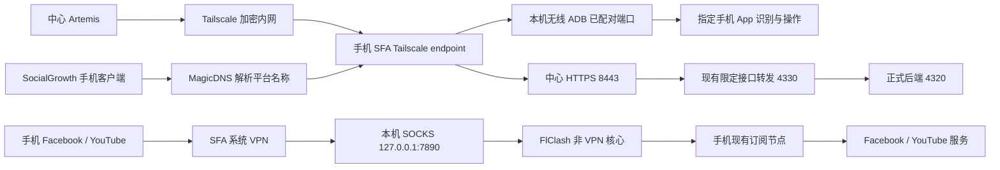

# 手机订阅与 Tailscale 共存验证：2026-10-06 至 10-07

本记录验证当前 Samsung SM-S9110。硬件序列号为 RFCW40MYYCV。验证对象是 `dev` 工作树，基线 HEAD 为 `3040899b368e9feaf91c509ea77319cf0c00841c`；包含未提交改动，不是 main 固定部署版本。环境使用现有 Wi-Fi。Web 为 3100，后端为 4320，正式执行服务为 4318。原业务 operation `0ef94113-c6de-4171-b873-fd0c2bf62b53` 保留 unknown 和设备占用。本轮不登录、不发布、不处理原业务结果。

## 当前方案

由 sing-box for Android（SFA）接管一个系统 VPN。由它的 Tailscale endpoint 提供内网连接。由现有 FlClash 提供本机订阅代理。FlClash 关闭 VPN，仅运行 ProxyService。官方 Tailscale 的 VPN 不同时启动。业务出口使用手机订阅。不使用 Macmini 出口。



SFA 排除 FlClash 包，防止订阅连接返回同一个 VPN。Tailscale 内网目标使用 endpoint。进入 endpoint 的控制连接使用本机直连。业务 DNS 使用订阅代理。公网业务流量使用本机 SOCKS。不要把默认业务路由用于进入手机的 ADB 连接。

FlClash 使用 Global 模式。GLOBAL 选择已有的可用订阅代理，不选 DIRECT 或 REJECT。原 Rule 模式的域名请求虽成功，按 IP 请求却失败。透明 VPN 会使用 IP 目标，因此必须单独检查该路径。切换后，FB 和 YT 的两种请求均返回 200。此结果是网络补充证据，App 的实际内容仍须通过正式 Web 验证。

本轮使用官方稳定版本 SFA 1.14.2 arm64-v8a。安装前核对官方发布的 SHA-256：`4f97d009048a714c14313d582e714b0cd94503333f85bb733aad9aa13b5023c5`。FlClash 为 0.8.99。现有导入配置原样保留。没有复制或转换订阅节点凭据。

SFA 使用独立的 Tailscale 节点状态。该节点与官方客户端原节点不同。不能根据旧节点的已确认状态，认定新节点已获得正式产品准入。恢复官方客户端时也须重新核对节点。不要同时启动两个 VPN 来尝试恢复。

最终候选的公网加密 DNS 为 AliDNS HTTPS，TLS 名称为 `dns.alidns.com`。Tailscale 名称通过 endpoint 的 MagicDNS 解析，使用 `preferred_by` 规则。它用于 Android 客户端的 `.ts.net` HTTPS 平台地址，不能交给公网 DNS。该规则不把公网业务 DNS 交给中心或出口节点。

进入手机的控制流量限于已核对的中心来源、TCP 和本机实测动态端口范围 `32768:60999`。其他入站连接拒绝。中心仍须选用真实无线 ADB 端口并验证硬件身份；允许该范围不等于所有端口都可执行，也不代替 ADB 配对或平台授权。

## 已确认的证据

| 检查 | 当前结果 | 证据边界 |
| --- | --- | --- |
| 导入配置和本机核心 | 通过观察 | trace `3de7225c-1611-4ccd-888f-7d2803a8ff3a` 的实际观察记录显示配置存在、已选中、核心运行、VPN 关闭、端口 7890。维护任务到时停止，不能记作完整任务通过 |
| 手机订阅代理 | 通过 | 经手机 SOCKS 请求 FB、YT，均返回 HTTP 200。电脑只发出检查请求，不提供出口 |
| SFA 配置与安装 | 通过补充检查 | 官方 APK 校验匹配；配置检查通过；真实手机安装成功。安装流程不代表新手机接入验收 |
| 唯一 VPN 与代理核心 | 通过系统观察 | SFA VPNService 和 FlClash ProxyService 在运行。官方 Tailscale 服务未运行 |
| SFA Tailscale 节点 | 通过在线观察 | 控制端查到新节点在线。没有设置 exit node，也未广告出口或子网 |
| 无线调试恢复 | 通过 | trace `f7022fed-f1be-4126-9d01-e6c0166b6cfa` completed；普通设置界面开启无线调试，连接端口 35459。没有重新配对或删除密钥 |
| Tailscale → ADB → Artemis | 通过补充检查 | 2026-10-06 13:09:32 UTC，网络 serial `127.0.0.1:62467` 回读硬件序列号匹配，Artemis 读取真实屏幕；无 USB 回退 |
| 配置重启后的远程连接 | 通过补充检查 | 2026-10-06 13:44:05 UTC，新网络 serial `127.0.0.1:49624` 回读同一硬件并读取真实屏幕。旧转接已关闭，不能继续使用旧 serial |
| Global 模式的 IP 路径 | 通过补充检查 | 手机 SOCKS 按解析后的 IP 访问 FB/YT，TLS 成功，均返回 200。维护 trace `cf4f138f-f69e-48b5-bd5c-40bc686b17e6` 在最终断言阶段到时停止，不记作完整任务通过 |
| 最终配置实际保存与重启 | 通过维护任务 | trace `44b1062d-70ed-4877-81f1-b0234ec07d6f` completed；保存指定无密钥 JSON，并确认正确配置与 Running。普通导出未完成，不声称取得手机导出文件的哈希证据 |
| 订阅后台准备 | 通过维护任务 | trace `e3476dab-b5a7-4c25-aed5-67b44e179d46` completed；核心运行、VPN 关闭、Global 保留、通知允许、后台用电不受限制。长期存活须另行观察 |
| 最终配置后的远程连接 | 通过补充检查 | 2026-10-06 14:32:15 UTC，网络 serial `127.0.0.1:56153` 回读同一硬件并读取真实屏幕；无 USB 回退。前两个转接已关闭 |
| MagicDNS 配置与重启 | 通过维护操作 | Pro trace `4b88e6e8-7b36-4828-a3a2-759b088432c8` 在进入编辑器后停滞并到时停止；范围缩小到当前编辑器后，Artemis Flash trace `b8c554f5-623a-4c12-b957-94cd9a0f8e13` completed，实际保存并重启。此维护不代替独立 Web 验收 |
| MagicDNS 更新后的远程读取 | 通过补充检查 | 2026-10-06 15:25:26 UTC，经仍存活的网络 serial `127.0.0.1:56153` 重新回读硬件身份并读取 Artemis 真实界面。FlClash ProxyService 在 SFA 重启后仍运行 |
| 正式 Web → 远程 Artemis → FB/YT → 回执 | 第八次通过；Android 平台连接单独通过 | 第八轮最终独立检查 passed=5、failed=0、inconclusive=0、unchecked=0。FB 新搜索结果与 YT 实际播放均通过；最终回执 CONNECTIVITY_SETUP_COMPLETED。此前失败记录保留在下文 |

## 正式验证入口

使用 `scripts/verify-product-network-coexistence-playwright.mts`。Playwright 从正式 Web 登录、填写受控检查表单并提交。Artemis 通过已验证的网络 serial 操作真机。任务只检查 SFA、FlClash、FB 刷新后的公开搜索加载和 YT 公开视频播放。最终发布、凭证输入、账号切换、网络改动和本机参与变更均不在范围内。

```sh
SG_PHONE_NETWORK_REMOTE_SDK='<本轮已验证且仍存活的网络 serial>' \
SG_NETWORK_CHECK_KIND=network-coexistence \
SG_PRODUCT_WEB_SCOPE=network-coexistence \
pnpm test:playwright
```

不得复制示例 serial 当作当前连接。先核对端口、硬件身份、真实 Artemis 读取和在途任务。验证脚本要求运行配置与已验证的远程目标相同。它不自动切回 USB，不直接调用业务 API 来创建成功状态。Web 最终回执与原设备占用分别断言。

结果位于 `output/playwright/network-coexistence-20261006/`。原始网络配置、接入密钥、订阅及手机日志保留在私有运行目录。临时下载目录中的接入配置已移除。不要将这些材料提交 Git。

同一脚本支持 `SG_NETWORK_CHECK_KIND=pilot-device-connectivity`。该场景只读取已关联 Android 客户端的当前网络与平台连接状态，通过现有 `VERIFY_CONNECTED_GUIDE_ONLY` 受控目标执行。不登录、不重新关联、不重新配对、不改变参与状态。它与 FB/YT 网络检查分别留存结果。

## 后续运行边界

2026-10-06 14:28:18 UTC，核对新节点在线、同一手机的真实远程硬件证据后，更新已有 pilot 网络配置的节点及地址。设备、供应者、安装、安装代次和关联范围保留。旧配置已私有备份。没有写入正式准入记录或授予正式执行权限。原 App 引导仍使用官方 Tailscale；本轮不把已安装客户端当作零准备新设备流程通过。当前开发会话的受控 ADB 转接维持远程验证连接。它尚未纳入统一启动与自动恢复流程，不能作为正式常驻服务或新设备准入证明。

订阅服务停止时，应保留 SFA 的管理通道。SFA 停止时，管理通道与业务 VPN 都需要恢复。两种情况均不得自动重发 unknown 业务。无线调试端口变更后，中心须使用新的可信端点并重新回读手机身份。长时后台、Wi-Fi 切换、开机和整机重启恢复尚未验证。

## 官方资料

- [Android VpnService](https://developer.android.com/reference/android/net/VpnService)：同一用户空间只允许一个当前 VPN 服务。
- [SFA 客户端](https://sing-box.sagernet.org/clients/android/)：本地配置和 Android TUN 支持。
- [Tailscale endpoint](https://sing-box.sagernet.org/configuration/endpoint/tailscale/)：内置组网、节点状态和出口配置。
- [Tailscale DNS](https://sing-box.sagernet.org/configuration/dns/server/tailscale/)：由指定 endpoint 解析 MagicDNS 名称，并使用优先规则保留公网 DNS 分流。
- [官方 1.14.2 发布](https://github.com/SagerNet/sing-box/releases/tag/v1.14.2)：本轮固定安装版本。
- [固定版本 endpoint 实现](https://github.com/SagerNet/sing-box/blob/v1.14.2/protocol/tailscale/endpoint.go)：进入本机节点的连接转至本机地址并进入路由处理。

描述按短句、单一动作和明确结果整理。此处采用 ASD-STE100 风格，不声称中文文档通过正式 STE 认证或词典覆盖率审计。

## 首次失败后的定位

手机代理按域名访问 FB/YT 返回 200，但按解析后的 IP 访问时 TLS 失败。Cloudflare 和 Google 的加密 DNS 也出现 TLS 失败；AliDNS 返回有效答案。透明代理不能只用域名 SOCKS 请求证明可用。FlClash 切换 Global 模式后，按 IP 请求已通过。

第一次正式 Web job 为 `5360cc0b-8a4f-4100-89d9-f527265c177d`，trace 为 `0e5387e9-8187-42e2-95cf-b0867bfaaee8`。FB 刷新遇到超时，回执为 UNCONFIRMED / NETWORK_TIMEOUT。YT 未执行。

第二次正式 Web job 为 `08dcaafb-4816-4822-8bb8-199b98c1a720`，trace 为 `e8a49d1c-afec-4f07-bf4a-b9e48460c3a0`。SFA、FlClash 和 FB 刷新检查已完成。YT 搜索未完成加载。任务在约 14 分钟时停止，回执为 UNCONFIRMED / INSPECT_DEVICE_EVIDENCE。原设备占用保留。

随后系统检查未查到 FlClash ProxyService，手机 SOCKS 立即关闭连接。SFA VPN 与管理通道仍运行。只读维护 trace `405de13f-04bf-44a3-8c94-ceeed8f75cbf` 留下实际观察：当前手机配置仍为 Cloudflare DNS；SFA 日志有 DNS connection refused。该维护任务到时停止，其记录只作定位证据。此时不能断定唯一根因是节点或省电管理。

后续采用两个独立步骤：先实际保存并启用已测 AliDNS 配置；再恢复 FlClash 非 VPN 核心，核对通知与后台限制。正式验证还须证明代理在 FB/YT 前台时持续可用。不得以桌面配置已修改，推定手机配置已经生效。

这两个维护步骤已 completed，结果见上表。恢复代理后，YT 搜索页返回 200；API 和视频域名的 TLS 请求返回服务端响应。Cloudflare DNS 仍超时，AliDNS HTTPS 返回响应。此类请求仅作定位，不能代替视频播放。

第三次 Web job 为 `ca42fc55-34b1-4cd7-a185-4da1db03105a`，trace 为 `b90cbf17-4b7f-4a70-9fac-046776bbd90e`。Artemis 实际完成两个服务检查、FB 刷新和公开视频播放。SDK 返回 completed，但独立检查为 passed=0、failed=0、inconclusive=4。检查账本记录 `final check error`，异常文本为空。正式 Web 正确保留 UNCONFIRMED / INSPECT_DEVICE_EVIDENCE。不能根据操作记录或完成 JSON 宣称验收通过。

原网络任务使用 final 预设。后续改用 checkpoints，在各页面可见时保存并检查对应的真实证据，保留最后的视频检查。网络验收还要求至少四项独立检查通过，failed=0、inconclusive=0 且 unchecked=0。没有降低成功门槛。补充回归检查验证：四项均 inconclusive、仅一项通过或仍有未检查项时，网络任务必须为 UNCONFIRMED。保留原有会话有效期和执行时限。

第三次验证期间，持续 12 分钟采集 37 次系统服务快照。每次均查到 FlClash ProxyService 和 SFA VPNService，未查到官方 Tailscale VPN。此证据只覆盖本轮前台使用与后台代理，不证明重启或长期无人值守恢复。

第四次 Web job 为 `d38d7262-af5b-4fb8-b61e-4af0ffc8d4a5`，trace 为 `26dd9eff-bff1-457d-8c89-bc91c39be2c6`。它使用实际启用的分流 DNS 配置和检查点预设。最终回执为 UNCONFIRMED / INSPECT_DEVICE_EVIDENCE。FlClash 的一项独立检查通过。SFA 从桌面恢复到服务设置页，执行器反复 Home 后重开，未返回仪表盘；FB/YT 未完成。本轮修正导航描述：只在 SFA 内使用普通 Back 返回仪表盘，不改变设置。第五次 Web job 为 `fea2d73a-505b-4e6d-b9df-8a7fcdb7549b`，trace 为 `93d76917-5b7f-4689-9adf-2f07fc1a320e`。SFA、FlClash 和 YT 播放的检查点 passed；FB 检查在 180 秒后超时，最终审查也超时并生成 inconclusive。SDK completed，但 Web 仍为 UNCONFIRMED。此结果不能记作四项通过。Android 平台连接由独立 Web job `f625ae4f-c670-4dd6-9c02-5930b3455059` 核验。

维护 trace `d5b6ed8d-6ffb-4abc-912c-9c1d869e8c27` 因模型请求体超过本地 786432 字节上限失败。保留失败证据。后续限定为单一剩余 UI 步骤，并在现有允许范围内使用 1572864 字节请求预算；没有绕过手机或发布权限。

Android 首轮 job `f625ae4f-c670-4dd6-9c02-5930b3455059` 被门禁停止：目标 App 检查从 YT 前台开始，系统 Home 也被原包限制拦截。只修正连接诊断的精确 Home 键；设备匹配、活动会话、凭证状态和其他 App 动作限制保留。2 项 Python 门禁回归通过。第二轮 job `ef325707-4473-4218-8abf-b9604bcb99ce` 因远程 ADB offline 未启动。未回退 USB 执行。断开并重新连接该网络别名后，重新回读同一硬件身份成功；无线调试仍为端口 35459。

Android 第三轮 job `b6f92e68-037e-4563-b8e7-10a38284a730`，trace `6c1f855b-8415-4f03-8a30-613807e04012`，独立检查确认实际停在“我的设备”，显示设备读取失败、暂时联系不上平台。未到达“本机准备”，因此不是平台连接通过。手机和中心访问现有 HTTPS 入口都返回 502。Tailscale Serve 8443 的目标仍为本机 4330，但该进程未运行。复用 `pnpm serve:public-phone` 恢复现有受限转发服务后，手机经当前 SFA/Tailscale 路径访问 `/health/live` 返回 200；仍须通过 App 页面复验。未改变 Serve/Funnel 设置、正式准入或业务出口。

恢复入口后的 Android job `ef5f8f30-c33c-41ff-b0b0-643c2c0553cd`，trace `bc8b250f-861b-4fb8-b92b-62b6288e736e`，实际独立检查 passed=1、failed=0、inconclusive=0。最终页面为“本机准备”，显示平台已连接、网络节点已确认、调试配对已配对及检查时间。Web 回执 CONNECTIVITY_SETUP_COMPLETED。初次 Playwright 断言错误地期待控制台接口返回 diagnostics；该接口仅返回选定的任务字段。脚本改为在 Web 实际回执之外，补充只读查询同一 job 的统计，未写数据库或预置结果。通过 Web 查询原任务完成复核，不重跑手机任务。证据位于 `output/playwright/network-coexistence-20261006/pilot-relay-reconciled/`。

现有 HTTPS 手机入口依赖 `pnpm serve:public-phone`（本机 4330），以及正式后端。该进程须保持运行。根启动入口当前不自动启动这层手机转发；若停止它，客户端将再次收到 502。本文不把手动恢复当作无人值守服务恢复通过。

第六轮 Web job `eab4cf37-621f-4b1e-b84b-d23c7cf43018`，trace `679a70b4-6fa5-4028-b6e1-8124af362974`，在模型调用阶段发生明确的 `LLM call timed out after 180 seconds`。未取得 FB/YT 页面检查结果。它是本次执行服务的模型调用阻断，不能计为手机网络失败或成功。下一轮保留相同范围与门槛，仅复验未完成的网络事实。

第七轮 Web job `2cb1e5f2-5dd1-447e-ab10-ab999755bd41`，trace `f41f1300-45a8-43ad-a452-3c1e0a24ab2f`，再次发生同一模型调用 180 秒超时，Web 为 UNCONFIRMED。当前配置模型的列表请求返回 200 且包含该模型；不含手机信息的简短文本请求也返回 200。这只能缩小阻断至本次 Artemis 上下文调用，不能断定整个平台模型服务不可用。未修改模型、供应商或成功门槛。

当前证据结论：当前手机的单一 VPN 共存方案已通过 Web → 远程 Artemis → FB/YT → 最终回执验证，Android 平台连接也单独通过。网络检查不包含账号登录、创建 Page/频道、发布、数据采集和分析。因此不能标记此前要求的整个业务闭环通过，也不满足此前“完成无误后提交 Git”的条件。长期后台、开机、换网、动态端口恢复和零准备新设备仍是未验证项。

第六、七轮采用缩短的描述，尚未写入执行计划即超时。第八轮进行有限对照：恢复第五轮已经实际执行的描述结构，保留 SFA 内 Back 导航和 FB 刷新后公开搜索的要求。配置、权限、检查预设和成功门槛不变。不从该对照推定描述为唯一根因。

收尾前于 2026-10-06 17:00:22 UTC 再次通过网络 serial `127.0.0.1:56153` 回读硬件身份并读取 Artemis 实际界面，无 USB 回退。证据为 `output/playwright/core-chain-20261006/remote-adb-proof-final.json`。

第八轮 Web job `1a1d0b2a-32f6-4b47-8a56-54677831177d`，trace `4bba3058-cf30-40e1-bb8f-890a2aa9012f`，最终通过。首次 FB 检查正确判定空白加载页为 failed；第二次检查因退出结算超时记录为 unchecked。最终独立审查使用步骤 27 的实际界面确认“nasa artemis”搜索已加载 NASA Artemis 认证账号、社团和媒体结果，同时确认 SFA、FlClash 与 YT 播放。最终 5 项均 passed，failed=0、inconclusive=0、unchecked=0。此前失败和未检查记录没有删除。运行时按最终审查及零未检查项作出成功判定；Playwright 在正式 Web 看见成功回执并核对原占用保留。证据为 `output/playwright/network-coexistence-20261006/known-description/web-result.json` 与 `web-network-receipt.png`。

当前开发会话保留执行服务 4318、平台入口转发 4330 与已验证的远程 ADB 转接。原 Web 与后端实例复用。本轮观察、Playwright 和 SDK 查询客户端均已结束；不自动启动手机 worker。当前桥接有短时连接租约，依赖当前进程续约；停止时必须先恢复执行目标配置，不能留下失效的 loopback serial。持续运行不代表已验证开机常驻、换网或授权撤销后的完整恢复。

在最终审查后，实际系统服务再次确认 SFA VPNService、FlClash ProxyService、手机 Tailnet 在线、官方 Tailscale VPN 未运行且中心未使用出口节点。补充证据为 `known-description/final-service-proof.json`。该补充检查不代替已通过的 Web/App 验收。

验收后的测试视频清理：Flash trace `04a19055-5665-4a53-8043-3ae77d54ecda` 在 120 秒预算内未完成并被停止；随后同一 Artemis 引擎的 Pro trace `ba8c339b-5afb-47f9-8900-9f50bf4bb7a1` completed，暂停公开视频并返回桌面。此操作只做清理，不计入网络通过项，不改变 VPN、订阅或业务状态。

视频清理后只读核验：YouTube 媒体状态为 STOPPED(1)，手机位于桌面；SFA VPNService 与 FlClash ProxyService 保持运行。Pro 清理审查 4 项通过，失败、证据不足、未检查项均为 0。手机执行锁已释放，原业务占用保留。原始任务截图和日志设置为私有权限。
