# SocialGrowth 业务功能确认与需求细节对齐规格书 (2026-09-19)

> **2026-09-19 商业目标与产品路线分层（用户已澄清）**：真机/账号数量、商业效果与交付验收目标继续作为商业承诺管理；它们不构成产品设计上限或开发方式、研发启动的限制。产品按最终业务目的与能力依赖分阶段完善，见 [产品能力路线](../product-roadmap.md)。商业结果、产品能力完成、实际运营启用分别记录。本轮只修订文档与规划，不开展开发实现。

> **内容身份与发布更新（G-03/G-03b=A，G-03c=B）**：同一画面片段的所有字幕/配音语言版本视为同一独占内容，只归属同一账号，跨平台不同账号也不例外；文件、封面、编码或速度变化不能产生新跨账号分发资格。库存按独立内容与可分配内容统计，不累加语言成品数量。同剧不同片段不自动合并；不同切片必要的少量剧情衔接经人工确认主体剧情不同并留依据后可以分别发布，不设自动放行的秒数/比例阈值；批准后未提交取消按 G-03a 执行。同一内容只选一个版本发布一次，已有发布历史后原账号也不得另发一条，换语言或删帖不恢复资格；编辑原帖与确定从未发布的恢复另行处理。本轮不开展翻译、配音或剪辑实现，首期商业交付也不自动新增这些承诺；相关产品能力可按独立路线提前规划，详见[确认记录](2026-09-19-business-flow-proposal.md#8-逐项确认与整改记录)。

> **后续业务决策更新（2026-09-19，G-01/G-01a/G-01b）**：用户确认运营主目标按客户或阶段分别明确，系统不设置统一的导流、涨粉或效率排序；AI 建议切换主目标须经运营人员人工确认，自主托管不能替代该确认。切换时暂停受影响范围内尚未开始的旧计划，按新目标重新审查、批准后执行。本文策略生成和效果评估须按对应目标解释，原统一评分不能作为所有项目的通用胜出依据；实验判据按 G-05 的预先定义、数据质量与分层验收规则执行。详见[逐项确认与整改记录](2026-09-19-business-flow-proposal.md#8-逐项确认与整改记录)。

> **对齐日期**：2026-09-19 
> **对齐视角**：产品交付、运营实操、研发实现 
> **核心目标**：跑通端到端真实业务主链路，明确系统功能与异常处理边界，杜绝遗漏与过度设计。

> **账号服务关系更新（G-02/G-02a/G-02b 已确认）**：同时支持自有账号与客户授权代运营账号；逐账号区分所有方、服务客户和授权范围，运营权限不等于账号归属。同一账号同一时期默认服务一个客户；共享须先明确授权、目标冲突与归因边界，再经运营人员人工批准。正常退出停止新增服务，授权及管理权限允许时保留已发内容；旧短链按接入时约定继续有效或停用，不自动转给其他客户。退出须核对待执行及未知结果、权限交接和历史资料；实际归属、权限及具体维护/留存期限仍按各客户事实和约定核验。详见[退出流程](2026-09-19-business-flow-proposal.md#36-客户服务退出g-02b-已确认)。

---

## 一、 核心业务主干与数据底座对齐

### 1.1 统一业务数据源
- **决议内容**：系统采用以 **PostgreSQL 单一核心业务库 + 7 大模块基础表结构** 为系统统一状态源与可信数据底座。
- **主干业务链路**：
  $$\text{切片素材入库打标} \longrightarrow \text{标签加权匹配与策略生成} \longrightarrow \text{运营工作台一键集中审批} \longrightarrow \text{Artemis 真机 Pull 模式原生 UI 发布} \longrightarrow \text{短链 302 分流与点击流汇聚} \longrightarrow \text{双轨社媒数据采集与 A/B 策略评估闭环}$$

---

## 二、 关键功能模块需求细节确认表

| 模块序号 | 业务环节 | 产品交付视角 | 运营实操视角 | 研发工程实现视角 | 核心决议规范 |
|---|---|---|---|---|---|
| **01** | **切片独占归属 (Exclusive Allocation)** | 同一内容及所有语言版本只归属一个账号，只选一个版本发布一次，原账号也不得重发。 | 审批后取消且确认全部版本未提交、无发布历史时可重新分配，避免无效安排持续占用。 | 区分临时预占、独占归属和发布结果；进行中、已提交及结果未知不释放。 | **【G-03/G-03a/G-03b 已确认】**：取消旧安排并使旧批准与执行安排失效，记录核对依据后才释放；新分配重新审核。已有发布历史不得因删帖、退出或换号跨账号复用。G-03c 允许经人工核对的必要少量剧情衔接，主体不同才可各自视为独立内容，不能以轻微改剪绕过一次发布规则。 |
| **02** | **切片与账号匹配** | 为目标选择有权且适合发布的内容。 | 先过滤权利、身份归属、语言与剧情不合格项，再解释匹配排序。 | 无合格库存形成缺口，不用高分替代准入。 | 标签与受众匹配仅在合格集合内使用；变更内容、目标或关键规则后复核审批。 |
| **03** | **策略生成与人机审核流 (Workbench)** | 支持集中审核与已验证、已授权范围内日常自动执行。 | 记录实际审核负荷；账号成熟不等于新策略免审。 | G-04=A：新策略先形成有限试验草案，人工批准后执行；授权明确到规则、账号、动作、内容/目的地、发布量、成本和有效期。 | 常规范围内选片、文案与排期可自动处理；未经验证假设、关键规则或范围变更先人工批准。试验批准不等于有效或扩大许可，G-01/G-03 系列人工边界不变；评价与验收按 G-05 执行。 |
| **04** | **导流入口与短链服务** | 受众从可用入口找到对应内容目的地，解释可观测的导流结果。 | 核验真实入口、客户/剧集/语言映射与目的地授权。 | 点击、跳转响应、落地到达与转化分开；FB 是否可到切片级取决于真实入口，YT 共用入口一般仅支持频道级。 | 预览与真实去向一致；故障区分服务、目的地与平台拦截。更换域名不保证恢复被拦截的旧链接，旧视频及客户退出按既有约定处理。 |
| **05** | **Artemis 端侧执行与异常处置 (Device Execution)** | 纯真机执行并回传必要证据；执行异常与发布结果分别确认。 | G-04a=A：非值守仍执行有效批准内发布，需人工处理时暂停受影响及关联范围，确认无关联的安排可继续。 | 技术超时不等于发布失败或人工响应期限；设备复位不自动恢复业务。 | 暂停后保留待核对证据；结果未知不重复提交或释放。人工核对异常、结果、授权和排期后恢复，过期任务不自动补发；身份验证与平台限制分别处理。 |
| **06** | **账号异常与授权恢复** | 保留资产、事实与执行证据，确定可继续的业务范围。 | 分类登录挑战、临时限制、内容争议、推荐/变现资格、终止、流量待分析及设备故障。 | 暂停受影响及关联范围；身份验证、平台许可与业务恢复分别核查。 | 人工核对后恢复、申诉或退出；备用资源须有独立许可和授权。应用清理不消除平台限制，换号不转移发布历史或释放已发内容，未提交内容按 G-03a 处理。 |
| **07** | **数据可用性与策略评价 (Attribution Loop)** | 支持有来源、有范围的试验与复盘，闭环能力和正向效果分别验收。 | 呈现指标定义、来源变化、缺失原因、可比条件和不确定性，不强制输出赢家。 | G-05=A：必要执行、采集、评价完整时可凭可信复盘验收；无改善/证据不足不等于策略有效或可扩大，缺必需工作则不通过。 | 官方/第三方逐指标核验；切换可见，不静默改主指标。按批准观察窗采集，符合改善条件后也需明确推广授权；回退只影响未来安排，不撤销历史结果。 |

---

## 三、 研发落地三阶段实施路径

依据数据链路的依赖关系，系统开发执行划分为以下三阶段：

```mermaid
flowchart LR
    subgraph Phase1 ["阶段一：数据底座与核心逻辑"]
        P1A["PostgreSQL 核心表落地"]
        P1B["切片排他独占锁机制 (TASK-05)"]
        P1C["标签加权匹配与策略生成"]
    end

    subgraph Phase2 ["阶段二：调度中枢与真机端侧"]
        P2A["Artemis 1:1 精准路由 (TASK-01)"]
        P2B["执行超时与结果核对 (TASK-02)"]
        P2C["真机配置纯化 (TASK-03)"]
        P2D["身份验证与人工恢复核对 (TASK-04)"]
    end

    subgraph Phase3 ["阶段三：外围服务与闭环联调"]
        P3A["短链入口与归因边界 (TASK-07)"]
        P3B["数据可用性与可信评价 (TASK-06)"]
        P3C["Web 控制台全流程联调"]
    end

    Phase1 --> Phase2 --> Phase3
```

- **阶段一（核心中枢与数据底座）**：
  1. 落地 PostgreSQL Schema（涵盖 accounts, devices, slices, tasks, rules, strategies, clicks）。
  2. 落实切片独占归属与发布结果分别记录；取消释放遵循 G-03a，不能用“审批永久绑定”的旧表述覆盖已确认例外。
  3. 先核对权利、身份、归属与适配，在合格内容内排序；策略预生成关联客户/阶段目标，无合格库存返回缺口，生成不等于批准。
- **阶段二（调度中枢与真机执行）**：
  1. 重构 Artemis 调度器，执行 `(platform, boundAccountId)` 精准匹配派发，杜绝串号。
  2. 按 G-04a 区分技术执行超时、人工等待与平台发布结果；资源处置不自动恢复业务，未知结果先核对。
  3. 彻底清除代码中残留的 emulator 模拟器配置，纯化物理真机。
  4. 落地身份验证与人工接管协议；验证通过后仍核对平台限制、发布结果、授权和排期。备用账号须有独立许可，不把封禁直接转成换号任务；历史 `waiting_2fa` 示例不能涵盖全部业务状态。
- **阶段三（外围服务与全流程联调）**：
  1. 升级短链服务：FB 按实际入口与可识别来源决定归因粒度，YT 共用主页入口按频道等可支持范围统计，不能把频道点击分给单条 Shorts。按相同粒度定义实验单位，无法支持单条主指标时先重设并批准试验；预览与真实目的地一致。
  2. 按 G-05 核验官方/第三方指标来源与缺失原因，形成可信评价；不以公开互动评分替代缺失主指标，不强制输出胜者。
  3. Web 控制台打通真实数据库，跑通从切片导入、每日审批、任务派发、执行回执、到数据报表的端到端全业务流程。

## 当前产品路线与旧实施条目的关系

上文技术选项和 TASK 拆分保留为既有交接背景，不代表已实现，也不是完整产品发展顺序。以[产品能力路线](../product-roadmap.md)组织跨模块流程；商业规模和月度效果不作为开发后续能力的开工条件。运行时提示词、具体类型与代码在后续实现中核对，本轮仅修订文档。
