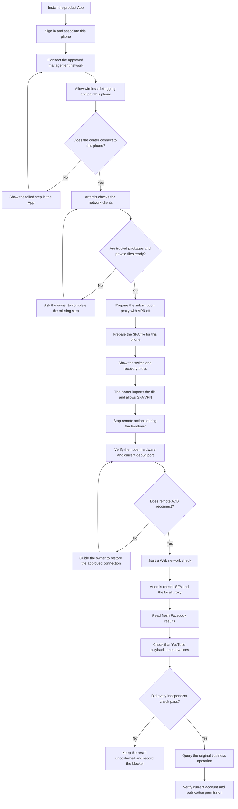

# 手机网络准备与恢复

2026-10-07，依据 R-160、R-162、R-163 和 R-164。当前手机实测见[网络记录](../engineering/delivery/records/phone-network-coexistence-20261006.md)。本流程用于正式产品；不要复制试验手机的节点、密钥、IP 或端口。

## 运行方式

SFA 是唯一活动 VPN。它内置 Tailscale endpoint，提供中心管理连接。FlClash 只运行本地订阅代理，VPN 关闭；业务流量经本地 SOCKS 服务进入手机订阅。官方 Tailscale 可用于首次管理接入，完成 SFA 切换后不得自动恢复其 VPN。不使用 Macmini 或其他出口节点。

Android 每个用户只能有一个活动 VPN，切换会停止原 VPN，见[Android VPN 文档](https://developer.android.com/develop/connectivity/vpn)。endpoint 的持久状态与首次凭据分开处理，见[sing-box Tailscale endpoint](https://sing-box.sagernet.org/configuration/endpoint/tailscale/)。已有节点使用保存状态，恢复时不重新登记。

## 操作节点

| 节点 | 负责人及处理 | 完成事实／停止条件 |
| --- | --- | --- |
| 本机关联 | App 引导用户安装、登录、确认关联 | 平台确认；仅安装成功不能继续 |
| 初次管理接入 | App 引导安装官方 Tailscale、使用平台私有接入信息、允许系统 VPN | 平台确认本机节点；不要求注册 Tailscale 账号 |
| 初次 ADB 配对 | App 引导无线调试、通知内提交配对码 | 中心实际配对及连接；之前 Artemis 不能代操作 |
| `inspect_network_clients` | Artemis 观察指定手机 | 包版本、核心状态、当前 VPN；不读取秘密 |
| `prepare_subscription_proxy` | 安装与配置范围内由 Artemis 准备 | 可信包、私有导入、FlClash VPN 关闭、Global 及可用节点、本地核心与端口；缺少来源／私有交付／授权则交用户 |
| 本机 SFA 配置 | 运营准备并私有交付 | 本机 endpoint、中心限定调试访问、管理 DNS、业务代理分流；不可硬编码另一手机配置 |
| `activate_network_coexistence` | 人工交接，App 引导导入本机文件、允许 SFA VPN | 可能中断原远程会话；先准备恢复说明，再切换 |
| 中心重新核对 | 验证新节点与原物理手机、当前端口和原配对，再连接 | App 显示当前平台连接及检查时间；VPN 图标不足以证明连接 |
| `verify_network_coexistence` | 实际 Web 发起，Artemis 经远程连接核对 | SFA 运行、FlClash 核心运行且 VPN 关闭、FB 新响应、YT 播放时间推进；每项独立检查 |
| 进入业务 | 查询原操作，核对设备、账号及发布身份 | 未知结果先核清；联网不恢复发布或扩大权限 |

库位于 `product/contracts/src/execution-library.ts`，executor 使用 `networkPreparationInstructions`，正式 Web 共存检查已调用该库。其他准备定义已登记，但尚无通用网络安装／私有配置下发消费者，不能把登记当作自动派发完成。缺失步骤由 App 第 4 步和运营协助处理；不另建执行系统。

## 断线恢复

1. 停止当前手机动作。保留原 operation、trace、回执和未知状态。
2. 用户查看 App 的检查时间。确认 SFA 已启动、FlClash 核心运行且 VPN 关闭。不要给模型读取配置秘密。
3. 中心核对节点、端口和原配对。有效配对只重连，不重新配对。
4. 切换失败时，按运营说明恢复原可用管理配置。不要同时开启两个 VPN，不删除账号、节点或配置。
5. 重连后分别核对管理连接与 FB／YT。核清原业务结果及当前许可，再继续。

App 检测到 SFA 安装后不发送官方 Tailscale 自动恢复广播。尚无自动启动 SFA 接口，停止的 SFA 由用户按指引恢复。安装状态只决定指引与防抢占，不代表运行或准入。

## 流程图

采用主动句、短句和明确停止条件，以 ASD-STE100 简明写作原则的约 80% 风格要求为目标；未完成标准词典审计，不宣称认证符合。

Samsung 共存及远程连接已通过，不外推为另一台零准备手机、重新安装、重启、断网恢复或公开发布通过。新手机须保留 Web、App、Artemis 与人工交接实测。
