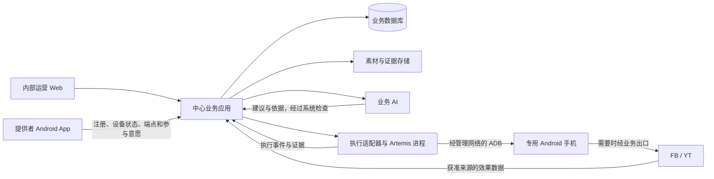

# 首期技术设计

日期：2026-09-27。版本：0.1，设计建议。依据需求 R-001 至 R-133；用户已同意先完成设计、证据盘点和验证步骤，实机资源暂未确认。本文给出可进入实现评审的方案，不表示已实施或已通过实测；新增技术选择属于本轮设计建议。需求变更仍以[需求基线](current-requirements-summary.md)和确认记录为准。

## 1. 首期部署与职责

建议采用中心业务应用、独立执行进程、Android 接入 App 三个运行部分。业务应用内部按职责组织代码，共用权威业务数据；不按每个业务名词拆微服务。执行进程与业务应用隔离，避免手机任务长时间运行或异常退出拖住运营入口。

Android App 与官方 Tailscale 安装在同一手机上。Artemis 和 ADB 主机运行在中心或中心侧执行节点，不要求现场放电脑，也不要求手机运行 Python。图中效果数据箭头表示业务来源，具体由官方接口、授权第三方或手机任务获取，不假定平台主动推送。

| 部分 | 首期建议 | 取舍与验证条件 |
| --- | --- | --- |
| 中心业务应用 | TypeScript 的模块化单体；Web、API 和后台作业共用业务规则，后台作业可独立进程运行 | 延续团队可读的语言，不继承 Demo 的领域模型或审批流程；Web 框架在实现开始前确定，无须为本轮设计迁移现有页面 |
| 权威数据 | PostgreSQL，普通关系表保存当前事实、配置版本和必要历史；任务派发使用事务及持久待办记录 | 首期不引入额外消息集群。数据库队列可作为初始方案，但必须实测争用、积压及恢复；不是仅因更换数据库就保证正确 |
| 素材与证据 | 文件字节与业务表分开保存，数据库记录对象标识、哈希、用途、权限和引用 | 局部原型可用受控文件目录；正式部署评估对象存储。对象存储厂商、区域和保留期限尚未确定 |
| 手机执行 | 选定版本的 Google Artemis，加受控适配器及必要动作拦截扩展 | 必须包含本地补丁的可复现版本；原子动作的停止与权限检查是准入条件，不能只靠任务提示词 |
| Android App | Kotlin 原生客户端；界面、持久参与意愿、连接状态及发现上报分开 | 直接对接 Android 权限和本地发现；官方 Tailscale 负责 VPN。后台、开机和授权恢复依机型实测，不承诺常驻 |
| 业务 AI | 在中心调用模型，输入已确认事实与批准范围，输出有限结构的建议及依据 | 模型提供方和具体型号待样本验证，不建设预设策略库、自动视频识别或通用 Agent 编排平台 |

PostgreSQL 的行锁及 `SKIP LOCKED` 可服务队列消费者，但官方明确其不适合通用一致性查询；唯一约束及部分唯一索引可表达部分排他要求。由此提出数据库队列与约束方案，具体事务仍需设计和验证。[队列取锁说明](https://www.postgresql.org/docs/current/sql-select.html)、[唯一约束说明](https://www.postgresql.org/docs/current/ddl-constraints.html)。

Android 官方建议将持久状态与短生命周期界面组件分开，并明确进程可能被系统销毁。本方案据此将提供者暂停/退出意愿持久化，不只保存在页面或内存中。[Android 架构指导](https://developer.android.com/topic/architecture)。

## 2. 业务代码边界与数据归属

以下是同一业务应用中的职责边界，不是独立服务清单，也不要求一行对应一张表。

| 职责 | 权威记录 | 主要约束 |
| --- | --- | --- |
| 项目与批准范围 | 项目、阶段目标、内容/账号/频率边界、周期配置及生效版本 | AI 只能引用有效批准版本；账号资格分别判断，阶段切换不能改写当前周期要求 |
| 资源与接入 | 提供者、设备、网络节点关联、平台登录身份、Page/频道、当前分配及承接历史 | 每身份一台当前手机、每手机同期一项目、同手机同平台一个身份；网络地址不是设备主键 |
| 素材与安排 | 人工确认的内容身份、版本/语言关系、来源、连载依赖、候选资格、任务及安排修订 | 文件哈希不代替内容身份；语言、重导入或更正不能增加平台名额；普通复盘不替换已开始任务 |
| 执行与人工协作 | 尝试、执行控制权、暂停原因、人工待办、接管会话、执行事件及证据 | 所有手机界面操作竞争同一控制权；请求、执行确认、业务结果分开保存 |
| 发布与反馈 | 平台实际发布事实、来源指标快照、链接点击、观察窗口、复盘依据及后续安排 | 引擎完成不等于发布成功；累计快照不相加；来源不足不推断内容归因 |
| 基础分佣 | 账号承接期间、实际到账收入、适用比例版本、佣金及实际处理记录 | 按产生期间归属，到账且核清后计算；不由设备数量或任务数重复计佣，不内置付款渠道 |

关键写入在短事务内检查并更新：资源当前分配、内容平台名额、任务当前修订、设备控制权、当前暂停/授权状态。单纯在页面校验或先查询再无条件写入均不足以防并发冲突。项目专用及跨表关系由事务中的检查和数据库约束共同保障，不试图用一个唯一索引代替全部规则。

任务派发记录与任务变更在同一事务落库，再由执行进程领取；外部调用不占用长数据库事务。回执按来源事件标识去重，迟到事件归入原尝试，不能覆盖新分配或解除新暂停。需要保留历史的事实做增补或更正，不要求全系统事件溯源。

## 3. 任务契约与发布事实

业务 AI 产生建议，中心检查后生成可执行任务；执行器只接受中心生成的契约。先固定含义，字段名称及 API 路径可在实现时细化。

| 契约组 | 必需信息 |
| --- | --- |
| 对应关系 | 任务、尝试、安排修订、项目、设备、平台发布身份、素材及语言版本；分配版本和批准版本 |
| 本次范围 | 操作类型、目标 App、允许的业务动作、发布有效窗口、单轮恢复预算、预期结果；不得用任意 shell 或自然语言扩大权限 |
| 文件与内容 | 对象引用、字节哈希、媒体形式、人工确认事实和已生成发布信息；访问令牌不进入模型文本 |
| 控制上下文 | 当前执行持有者、控制代次、许可用途及失效条件；检查参与意愿、暂停原因和授权状态 |
| 返回事实 | 事件标识、原任务/尝试、实际设备及身份、发生/接收时间、引擎状态、提交事实、平台核验证据、需人工事项 |

允许的任务类型只覆盖首期发布、必要初始化、核验/采集和已确认撤下等范围。凭据作为受控引用使用，模型不能读取密码明文。契约通过格式检查不等于其内容已获批准；中心重新检查身份、素材、窗口及当前状态。

执行进度与平台发布结果必须分开。例如进程异常退出时，执行可记中断，平台结果仍可能为待核实；Artemis 返回 `completed` 时，平台结果也可能是尚未提交。

| 发布事实 | 允许的后续处理 |
| --- | --- |
| 尚未提交，有可核对的准备状态 | 按当前批准及有效窗口继续；暂停、过期、更正或撤回优先处理 |
| 可能已提交或提交结果未知 | 保留名额和原任务关联，仅进行核验；不能因超时、重连或换机直接重发 |
| 已核验发布成功 | 固化实际平台内容及证据，转效果回收；不再为该任务创建发布 |
| 有证据确认未发布 | 核清原尝试后，在仍有效的范围和恢复额度内决定继续或转人工；不能自动重置预算 |

进入可能产生发布的动作前，先持久记录本次提交意图和尝试。意图已记录但响应丢失时，宁可保留待核实，也不能推断未点击。数据库去重只能约束本系统，无法保证外部平台“恰好一次”；通过唯一业务任务、动作许可、未知结果核验共同避免盲目重复。

## 4. 控制权、暂停与恢复

设备健康、提供者参与意愿、项目/账号暂停原因和任务结果分别保存，避免把所有条件压成一个 `online` 或 `paused` 字段。可执行是这些事实共同满足的结果，解除其中一个阻断不清空其他阻断。

中心为每台手机分配一个当前控制持有者及递增代次。执行 AI、手机端采集和远程人工接管经过相同仲裁；控制代次变化使旧持有者的下一次动作失效。租约到期本身不证明旧进程已停，必须由实际动作路径拒绝旧代次，才允许交接。仅改变数据库锁或 Tailscale 绑定不构成设备隔离。

建议在实际手机动作前检查当前许可，并覆盖截图/屏幕文字读取；权限服务不可达时停止新动作。暂停与动作同时发生时，保留已经在途的动作及未决结果，不能声称撤回已到达平台的操作。延迟和最大在途范围在实测前设判据；单靠向模型注入“请停止”不满足这项要求。

| 情况 | 允许的手机操作 | 日常任务恢复条件 |
| --- | --- | --- |
| 项目暂停发布 | 停止未提交发布，按既有安排核验已提交结果及采集；仍受设备授权和互斥限制 | 运营恢复项目后检查原任务，其他阻断必须同时解除 |
| 提供者暂停手机 | 当前操作尽快停在可确认节点，此后不以采集或核验为由继续操作手机 | 提供者请求恢复后进入有限核验范围，检查通过才恢复日常任务 |
| 恢复核验中 | 有效授权内的连接、身份、现场和未决结果检查；不允许新发布或无关业务动作 | 核验通过、原分配有效、其他暂停未阻断；失败转既有人工流程 |
| 人工接管 | 先确认 AI 停止；人工获得独占控制，其他自动手机操作等待 | 人工交还并复核当前事实；浏览器断开不自动交还 |
| 永久退出 | 停止新派发与当前业务操作；后续核实、迁移及清理仍需有效授权和连接 | 不能普通恢复；重新加入走新的接入与授权流程 |

提供者 App 的暂停/退出意愿先本地持久化，再带设备标识及单调递增版本上报。陈旧的“运行中”心跳不能覆盖新暂停。App 无法通知中心或中心无法确认停止时，界面区分请求已记录、中心已接受、执行端已停止，不以网络图标代替事实。

需要补验手机本地意愿如何进入动作许可：优先验证执行器在动作前取得 App 的有效参与确认，或等价的有时效控制机制；单独依赖中心的旧心跳不足以证明本地暂停已生效。不预设普通 App 能关闭系统 ADB。暂停生效前仍可能在途的动作如实记录，不能把有限时效方案宣称为立即停止。

### Artemis 适配的先决检查

当前本地扩展存在动作拦截入口，但屏幕读取在取得会话后有提前放行分支；不能直接覆盖 R-133 的手机暂停语义。现有 `stop` 路径也不能仅凭返回 `cancelled` 推定全部操作已停止。具体代码及历史边界见[证据盘点](verification-readiness.md#现有实现的复用判断)。

实施前固定 Artemis 提交及补丁，逐条验证：不带有效许可不能启动；所有控制/读取路径都受范围约束；断连停止后续动作；停止确认与平台结果分离；恢复核验可以运行且不能发布；未知工具或替代 ADB 路径不能绕过适配器。若当前扩展无法满足，先补适配能力，不修改已确认暂停语义来迁就 Demo。

## 5. 手机接入与两种网络用途

1. 提供者凭邀请通过可达的接入入口注册，获得本人设备关联；入口不依赖尚未完成的 tailnet 准入，避免首次接入循环依赖。建议受认证的 HTTPS 接入入口与内部管理接口分别授权。
2. 按选定网络身份方案完成官方 Tailscale 接入；网络节点、提供者、实体手机分别关联。客户端不持有公司网络管理权限或可复用全网密钥。
3. 用户在系统允许的流程内开启无线调试并授权；中心实际 ADB 主机的密钥必须配对，手机 App 自己配对不代替中心授权。
4. App 本地发现并识别本机当前端点，认证上报；中心验证节点归属、地址范围、端口和连接身份，不根据未经核对的任意 IP/端口发起连接。地址变化更新端点，不新增设备。
5. 运营确认项目及账号分配，AI 完成初始化和身份核验，才接日常任务。Tailscale、ADB、业务就绪三个状态分别展示。

优先验证 Tailscale 承载管理连接，必要的 FB/YT 公网流量经选定 Exit Node；不要求所有地区手机统一使用同一业务出口。Exit Node 的官方能力不能代替目标网络验证，管理与上网仍共享部分基础设施。[Exit Node 官方说明](https://tailscale.com/docs/features/exit-nodes)。

NSD 仅作为本地发现输入，不能直接把发现结果当成“本机可信 ADB”；后台服务还受到 Android 启动限制。端点发现、首次中心配对、Wi-Fi 恢复和开机后必要人工授权分别验证。[Android NSD](https://developer.android.com/develop/connectivity/wifi/use-nsd)、[后台前台服务限制](https://developer.android.com/develop/background-work/services/fgs/restrictions-bg-start)。

手机 App 的第一版只需完成受邀接入、本人多设备状态、必要协助、暂停/恢复/退出和基础分佣展示，以及端点和恢复协同。网络引擎内嵌、手机端业务 AI、跨地点 mDNS 中继和现场网关不进入本方案。

## 6. 素材、证据与敏感输入

素材入库按人工内容身份与文件版本组织；分批上传各自检查，文件未完整不能成为候选。中心将指定对象传到指定手机，校验字节完整性并确认平台可选取；先利用既有 ADB 文件传送作为局部验证候选，不把当前只处理 MP4 的实现外推成图文支持。

SHA-256 证明字节对应，不证明画面内容正确、不同语言是否同内容或权利来源真实。手机已准备旧版本时，任务仍须核对当前批准版本；已知更正/撤回不能因文件还在手机上而继续发布。

账号凭据使用受控保存及按需填入通道，模型仅请求获准动作。敏感界面在截图、屏幕文字或工具返回进入模型前处理；若无法可靠保护，转人工完成该环节，不能先发送原图再对最终报告脱敏。原有凭据通道仅作实现参考，需验证其覆盖范围。

证据保存任务/尝试、来源、时间、对象哈希及访问范围，普通日志记录必要事件和原因，不保存模型内部思维过程。控制台证据读取受身份校验；提供者只取得本人已确认的基础视图，不能靠前端隐藏按钮实现隔离。备份恢复后先核对暂停、撤权、分配和未决任务，不直接重播历史队列。保留期限、备份频率及部署密钥管理在部署前落实，不在本轮编造数值。

## 7. 业务 AI 与反馈的最小实现

业务 AI 读取当前目标和批准版本、人工素材信息、可用账号和手机、历史执行事实及带口径的反馈。输出建议关联原始事实、任务修订和局限；系统验证后才成为安排。模型不可直接写发布成功、清空暂停、调高预算或变更分佣。

每次复盘使用明确的数据截止及周期配置。结果只需表达维持、范围内调整、证据不足或需运营确认，并关联后续任务；无需预先定义通用策略库和复杂评分体系。模型调用失败时保留未形成有效建议的事实，不用模板或旧建议冒充本轮决策；既有有效任务继续受当前授权和执行条件约束。

数据采集记录来源、原始粒度、指标、区间、截止与采集时间；内容级与账号级分开。链接服务需要真实跳转和请求过滤路径，当前空壳工厂函数不证明已存在这项服务。AI 只能在足够可比的证据上判断，数据延迟不自动触发全局发布暂停。

周期起止保存实际时刻、业务时区与配置版本，区间采用左闭右开以避免边界重复计数。运行中改间隔/时区从当前结束时刻接续；日历间隔的夏令时解释在配置实现时明确展示并验证，不把平台日统计任意换算为小时值。正式开通阶段切换读取已批准目标及资格证据，不改写当前周期最低要求。

## 8. 实现与复用顺序

建议先保留当前 Demo，独立形成符合新契约的最小纵向流程，再依据证据迁移可复用部件。暂不整体删除、重写或搬迁历史数据，也不把现有多服务目录作为新部署边界。

| 顺序 | 可交付结果 | 进入后续的条件 |
| --- | --- | --- |
| 1. 版本与接口边界 | 固定 Artemis 本地版本/扩展清单，任务契约、控制权与暂停模式可审查 | 已识别的读取/停止缺口有可测方案，原验证证据能定位 |
| 2. 网络与接入原型 | 在允许的手机和真实网络上完成中心连接、必要业务上网、配对与端点变化 | 正常和故障路径有真实证据；失败先定位，不同时建设多套 VPN 方案 |
| 3. 首条新流程 | 真实入口组织人工素材、批准范围、任务、手机执行、证据及异常协作 | 先验证准备及控制，再按明确发布范围完成真实发布；不能取消 Demo 保护冒充实现 |
| 4. 反馈与下一轮 | 真实效果和点击进入复盘，形成并执行下一轮有效安排 | 输出理由能对应实际数据及后续结果，缺失正确处理 |
| 5. 首期全覆盖 | 两平台各形式、短剧依赖、资源交接、基本分佣及目标规模 | 按既定验收场景和事先明确的判据通过，不用少量演示替代 |

实现依赖版本、Web 框架、模型提供方、邮件服务、部署区域和容量在对应工作开始前确定。本轮不为这些可逆实现选择新增需求编号或独立 ADR，也不将本设计建议写成用户已经指定的技术栈。具体证据与首轮操作顺序见[验证准备](verification-readiness.md)。
