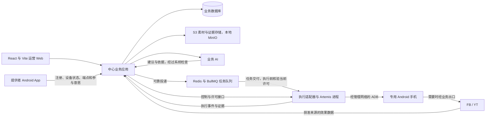

# 首期技术设计

更新：2026-09-29。版本：0.2，开发实施基线。依据需求 R-001 至 R-156 及已接受的 ADR-0001～0011；主要技术方向已确认，具体组件、依赖版本、数据与接口及部署参数随对应模块落实。本文支撑分批实现，不表示正式工程已搭建或真实业务验收通过。需求变更仍以[需求基线](current-requirements-summary.md)和确认记录为准。

历史说明：2026-09-27 的 0.1 为设计建议，资源当时按未确认处理。2026-09-28 按 R-134～R-141 补充管理与执行入口、扫码关联、手机号验证、自助协助、本机暂停及人工找回，并收敛首期范围；原一次性邀请后由 R-152 修订。后续架构确认及局部实测见下文，不沿用早期“全部选型待定／尚无实机证据”的状态。

2026-09-28 实施对齐：用户已确认[建立正式实现主线、按需复用 Demo](adr/0001-separate-product-implementation-from-demo.md)、[业务后端按模块集中组织、手机执行独立运行](adr/0002-modular-business-backend-independent-execution.md)、[正式中心数据库从首批开发采用 PostgreSQL](adr/0003-postgresql-for-central-business-data.md)、[中心业务后端采用 TypeScript 与 Node.js](adr/0004-typescript-node-central-backend.md)、[Android 客户端采用 Kotlin 原生方案](adr/0005-kotlin-native-android-client.md)、[手机任务派发采用独立队列](adr/0006-independent-task-dispatch-queue.md)、[队列采用 Redis＋BullMQ](adr/0007-redis-bullmq-task-queue.md)、[文件采用可配置 S3、本地使用 MinIO](adr/0008-configurable-s3-storage-local-minio.md)、[中心业务后端采用 NestJS](adr/0009-nestjs-central-business-backend.md)、[Web 采用 React＋TypeScript＋Vite](adr/0010-react-typescript-vite-operations-web.md)及[正式实现与 Demo 同仓库分目录维护](adr/0011-product-and-demo-in-one-repository.md)。建设方式、运行职责边界、中心数据库、后端语言运行时与框架、Web 技术方向、Android 原生技术方向、独立队列组件和文件存储方向已定；Android UI 框架及支持版本、Web 配套组件、HTTP 底层适配器、具体存储环境及物理部署等尚未确认选型继续标为建议。

2026-09-29 邀请规则更新：按 R-152，同一邀请码／链接支持多人注册，次数上限及有效期可配置，不预绑定手机号、不增加注册审批；替代原逐人一次性邀请，具体事务边界见 §5。

## 1. 首期部署与职责

按 [ADR-0002](adr/0002-modular-business-backend-independent-execution.md) 确认采用中心业务应用、独立执行进程、Android App 三个运行部分。业务应用内部按职责组织代码，维护统一业务状态与规则；首期不按各业务模块拆独立部署的服务。执行进程可独立重启，通过任务与回执接口衔接中心；如果同机部署，仍须处理资源竞争，进程分离不等于完全故障隔离。

Android App 与官方 Tailscale 安装在同一专用执行手机上。按 2026-09-28 新确认的 R-134，同一个 App 也支持在日常手机上仅管理本人设备，登录不自动接入执行；该入口不因登录而要求执行用途的组网或调试授权，接入入口的实际可达性仍须验证。Artemis 和 ADB 主机运行在中心或中心侧执行节点，不要求现场放电脑，也不要求手机运行 Python。图中效果数据箭头表示业务来源，具体由官方接口、授权第三方或手机任务获取，不假定平台主动推送。

| 部分 | 首期建议 | 取舍与验证条件 |
| --- | --- | --- |
| Web 运营端 | 按 ADR-0010 采用 React＋TypeScript＋Vite，浏览器渲染并调用 NestJS 接口 | 路由、数据请求及 UI 组件随实现落实；后端独立校验权限与业务约束，静态托管及接口访问配置另行确定 |
| 中心业务应用 | 模块化单体已确认；后端 TypeScript＋Node.js 已按 ADR-0004 确认，NestJS 已按 ADR-0009 确认，Web 入口、API 和后台作业共用中心业务规则，后台作业进程划分待落实 | 不继承 Demo 的领域模型或审批流程；HTTP 底层适配器及数据访问组件在对应实现开始前落实；Artemis 保持独立 Python 引擎，无须为本轮设计迁移现有页面 |
| 权威数据 | PostgreSQL 已按 ADR-0003 确认，从首批开发用于正式中心业务；普通关系表与事务设计随模型落实 | 数据库版本、数据访问组件、部署及备份恢复待落实；任务事实及待投递记录与独立队列可靠衔接，具体事务与恢复需验证 |
| 任务派发 | 独立任务队列按 ADR-0006 确认，Redis＋BullMQ 按 ADR-0007 确认；执行适配层消费任务后调用 Artemis | PostgreSQL 保持业务事实权威；版本、Redis 持久化与内存策略及可靠投递机制待落实。须处理重复消息与故障恢复；队列锁不能代替设备控制权，自动重试不能绕过未决发布核验或恢复预算 |
| 素材与证据 | 按 ADR-0008 采用可配置 S3，本地开发使用 MinIO；数据库记录对象标识、哈希、用途、权限和引用 | endpoint、region、bucket、凭据来源及寻址方式按环境配置；所用能力分别验证，具体环境、版本、保留期限及备份恢复待落实 |
| 手机执行 | 选定版本的 Google Artemis，加受控适配器及必要动作拦截扩展 | 必须包含本地补丁的可复现版本；原子动作的停止与权限检查是准入条件，不能只靠任务提示词 |
| Android App | Kotlin 原生方案已按 ADR-0005 确认；界面、持久参与意愿、连接状态及发现上报分开 | 直接对接 Android 权限和本地发现；官方 Tailscale 负责 VPN。UI 框架、最低系统版本及后台策略待落实；后台、开机和授权恢复依机型实测，不承诺常驻 |
| 业务 AI | 在中心调用模型，输入已确认事实与批准范围，输出有限结构的建议及依据 | 模型提供方和具体型号待样本验证，不建设预设策略库、自动视频识别或通用 Agent 编排平台 |

早期数据库派发队列建议已由 ADR-0006 的独立队列方向替代。PostgreSQL 仍承担业务事务与约束，唯一约束及部分唯一索引可表达部分排他要求，具体跨表规则仍须事务检查与测试。[唯一约束说明](https://www.postgresql.org/docs/current/ddl-constraints.html)。

Android 官方建议将持久状态与短生命周期界面组件分开，并明确进程可能被系统销毁。本方案据此将提供者暂停/退出意愿持久化，不只保存在页面或内存中。[Android 架构指导](https://developer.android.com/topic/architecture)。

## 2. 业务代码边界与数据归属

首批最小流程与数据／接口职责见[首批业务闭环](first-delivery-flow.md)。按 R-156，辅助功能随主线采用必要实现，不建设通用账号、审批或交接平台。

2026-09-29 按 R-153，运营入口采用系统独立账号，按实际人员关联操作记录，首期运营同权。运营账号、提供者管理身份及设备本机身份的权限分别校验，提供者邀请或本机凭证不能获得运营访问。当前无既有 SSO 可复用；按 R-154 使用账号＋密码登录，密码采用适合密码存储的单向哈希并落实限流与凭据保护，不使用明文或可还原密码作持久凭据。R-155 已确认受控部署初始化首个账号，后续有效运营通过页面开通／停用其他运营账号。停用后后端拒绝目标的新登录和旧会话访问，保留原身份及历史审计。身份契约须防止并发重复开通、旧请求覆盖新停用及因最后一个有效账号被停用而失去正常管理入口；初始化凭据交付、恢复和会话细节随实现落实。按 R-156 简化：停用只撤销运营访问，不自动暂停／恢复项目或设备、不自动改写负责人及联系人，未完事项保留全局待办供其他同权运营代办，确需调整负责人使用现有编辑操作。无需实现独立交接流程。

以下是同一业务应用中的职责边界，不是独立服务清单，也不要求一行对应一张表。

| 职责 | 权威记录 | 主要约束 |
| --- | --- | --- |
| 项目与批准范围 | 项目、阶段目标、内容/账号/频率边界、周期配置及生效版本 | AI 只能引用有效批准版本；账号资格分别判断，阶段切换不能改写当前周期要求 |
| 资源与接入 | 提供者、设备、网络节点关联、平台登录身份、Page/频道、当前分配及承接历史 | 每身份一台当前手机、每手机同期一项目、同手机同平台一个身份；网络地址不是设备主键 |
| 素材与安排 | 人工确认的内容身份、版本/语言关系、来源、连载依赖、候选资格、任务及安排修订 | 文件哈希不代替内容身份；语言、重导入或更正不能增加平台名额；普通复盘不替换已开始任务 |
| 执行与人工协作 | 尝试、执行控制权、暂停原因、人工待办、接管会话、执行事件及证据 | 所有手机界面操作竞争同一控制权；请求、执行确认、业务结果分开保存 |
| 发布与反馈 | 平台实际发布事实、来源指标快照、链接点击、观察窗口、复盘依据及后续安排 | 引擎完成不等于发布成功；累计快照不相加；来源不足不推断内容归因 |
| 基础分佣 | 账号承接期间、实际到账收入、适用比例版本、佣金及实际处理记录 | 按产生期间归属，到账且核清后计算；不由设备数量或任务数重复计佣，不内置付款渠道 |

分佣建模按 R-144 区分承接期间与设备连接／控制状态：暂停、掉线及恢复事件不能自动截断、重建承接期间或按在线时长拆减收入。该规则不改变执行许可检查。R-145 确认首次承接起点为已分配账号完成初始化及真实发布身份核验、手机具备执行条件的时点；需逐账号保留依据及生效时间，不以分配时间、首次任务时间或另一账号就绪替代。R-146 确认永久退出以系统受理并停止新派发的时点结束对应承接，需保留原受理依据及终点，并与实际停止确认、登录清理分别记录；查询重试不能重置终点，未确认送达不能记作生效，其他设备承接不受影响。跨终点无法可靠拆分的收入保留待核对；R-147 确认无人承接期间的广告收益保留为公司收入，不计提供者分佣；保留已核实的空档期间与收入依据，区分“确认无人承接”和“承接资料缺失”，不能把未知归属默认判为公司收入。跨承接与空档期间无法可靠拆分时待核对，不整段归公司；到账时间及后续绑定不改写空档归属。

关键写入在短事务内检查并更新：资源当前分配、内容平台名额、任务当前修订、设备控制权、当前暂停/授权状态。单纯在页面校验或先查询再无条件写入均不足以防并发冲突。项目专用及跨表关系由事务中的检查和数据库约束共同保障，不试图用一个唯一索引代替全部规则。

任务待投递记录与任务变更在同一 PostgreSQL 事务落库，再可靠转交 Redis＋BullMQ，由执行适配层消费后调用 Artemis；具体转交机制待落实。转交响应丢失可能产生重复投递，消费者须结合当前业务事实去重和校验许可；队列消息及完成状态不能覆盖中心权威记录。外部调用不占用长数据库事务。回执按来源事件标识去重，迟到事件归入原尝试，不能覆盖新分配或解除新暂停。需要保留历史的事实做增补或更正，不要求全系统事件溯源。

## 3. 任务契约与发布事实

业务 AI 产生建议，中心检查后生成可执行任务；执行器只接受中心生成的契约。先固定含义，字段名称及 API 路径可在实现时细化。

| 契约组 | 必需信息 |
| --- | --- |
| 对应关系 | 任务、尝试、安排修订、项目、设备、平台发布身份、素材及语言版本；分配版本和批准版本 |
| 本次范围 | 操作类型、目标 App、允许的业务动作、发布有效窗口、单轮恢复预算、预期结果；不得用任意 shell 或自然语言扩大权限 |
| 文件与内容 | 对象引用、字节哈希、媒体形式、人工确认事实和已生成发布信息；访问令牌不进入模型文本 |
| 控制上下文 | 当前执行持有者、控制代次、许可用途及失效条件；检查参与意愿、暂停原因和授权状态 |
| 返回事实 | 事件标识、原任务/尝试、实际设备及身份、发生/接收时间、引擎状态、提交事实、平台核验证据、需人工事项 |

允许的任务类型只覆盖首期发布、必要初始化、核验/采集和已确认撤下等范围。凭据作为受控引用使用，模型不能读取密码明文。契约通过格式检查不等于其内容已获批准；中心重新检查身份、素材、窗口及当前状态。

执行进度与平台发布结果必须分开。例如进程异常退出时，执行可记中断，平台结果仍可能为待核实；Artemis 返回 `completed` 时，平台结果也可能是尚未提交。

| 发布事实 | 允许的后续处理 |
| --- | --- |
| 尚未提交，有可核对的准备状态 | 按当前批准及有效窗口继续；暂停、过期、更正或撤回优先处理 |
| 可能已提交或提交结果未知 | 保留名额和原任务关联，仅进行核验；不能因超时、重连或换机直接重发 |
| 已核验发布成功 | 固化实际平台内容及证据，转效果回收；不再为该任务创建发布 |
| 有证据确认未发布 | 核清原尝试后，在仍有效的范围和恢复额度内决定继续或转人工；不能自动重置预算 |

进入可能产生发布的动作前，先持久记录本次提交意图和尝试。意图已记录但响应丢失时，宁可保留待核实，也不能推断未点击。数据库去重只能约束本系统，无法保证外部平台“恰好一次”；通过唯一业务任务、动作许可、未知结果核验共同避免盲目重复。

## 4. 控制权、暂停与恢复

设备健康、提供者参与意愿、项目/账号暂停原因和任务结果分别保存，避免把所有条件压成一个 `online` 或 `paused` 字段。可执行是这些事实共同满足的结果，解除其中一个阻断不清空其他阻断。

中心为每台手机分配一个当前控制持有者及递增代次。执行 AI、手机端采集和远程人工接管经过相同仲裁；控制代次变化使旧持有者的下一次动作失效。租约到期本身不证明旧进程已停，必须由实际动作路径拒绝旧代次，才允许交接。仅改变数据库锁或 Tailscale 绑定不构成设备隔离。

建议在实际手机动作前检查当前许可，并覆盖截图/屏幕文字读取；权限服务不可达时停止新动作。暂停与动作同时发生时，保留已经在途的动作及未决结果，不能声称撤回已到达平台的操作。延迟和最大在途范围在实测前设判据；单靠向模型注入“请停止”不满足这项要求。

| 情况 | 允许的手机操作 | 日常任务恢复条件 |
| --- | --- | --- |
| 项目暂停发布 | 停止未提交发布，按既有安排核验已提交结果及采集；仍受设备授权和互斥限制 | 运营恢复项目后检查原任务，其他阻断必须同时解除 |
| 提供者暂停手机 | 当前操作尽快停在可确认节点，此后不以采集或核验为由继续操作手机 | 提供者请求恢复后进入有限核验范围，检查通过才恢复日常任务 |
| 恢复核验中 | 有效授权内的连接、身份、现场和未决结果检查；不允许新发布或无关业务动作 | 核验通过、原分配有效、其他暂停未阻断；失败转既有人工流程 |
| 人工接管 | 先确认 AI 停止；人工获得独占控制，其他自动手机操作等待 | 人工交还并复核当前事实；浏览器断开不自动交还 |
| 永久退出 | 停止新派发与当前业务操作；后续核实、迁移及清理仍需有效授权和连接 | 不能普通恢复；重新加入走新的接入与授权流程 |

提供者 App 的控制意愿先在发起端可靠记录，再提交中心；本地记录不代表目标执行手机收到请求或实际停止。陈旧的“运行中”心跳不能覆盖新暂停。App 无法通知中心或中心无法确认停止时，界面区分请求已记录、中心已接受、执行端已停止，不以网络图标代替事实。

### 首期接入与控制契约草案（2026-09-28）

以下是沿用 R-133～R-139 的最小实现建议，尚未编码，不新增业务接口产品或锁定传输框架。中心负责每台设备的统一控制次序；各安装实例的本地序号仅用于自身待发送记录，不能跨实例比较或凭手机时间戳决定谁覆盖谁。

| 交互 | 必需信息与实际校验 | 返回与副作用边界 |
| --- | --- | --- |
| 设备关联确认 | 管理身份、目标关联会话、同一次确认的请求标识；中心校验本人、会话有效性及现有归属 | 返回原设备关系及实际接入进展；不复制管理登录到执行手机，不产生业务就绪 |
| 本机端点上报 | 关联设备身份、当前网络节点、本机端点及配对／连接用途、来源内的报告次序 | 中心核对归属、允许地址与实际手机身份后才采用；发现、上报受理和连接通过分开。旧端点过时不新增设备或解除控制阻断 |
| 暂停／请求恢复／永久退出 | 同一次动作的请求标识、发起身份及来源、目标设备、动作；恢复另携所见中心控制版本 | 服务端授权并记录结果，同一请求重试返回同一结果；本机身份只可暂停自身，不能借请求字段声称管理身份 |
| 控制受理与查询 | 中心控制版本、请求受理事实、停派事实、实际停止证明、恢复核验或清理结果及确认时间 | 每个事实可单独未知；返回页面和刷新只查同一记录，不重发另一动作。拒绝和未送达不能显示已受理 |
| 实际动作许可与确认 | 当前设备、执行持有者及代次、用途（日常／恢复必要核验／获准清理）、本次任务与动作范围 | 在真实操作与读取之前校验；停止确认还需在途调用和控制交还证据。日志写 cancelled、进程信号发送或租约过期均不足以单独证明手机停止 |

恢复使用所见控制版本作冲突检查；期间出现新暂停、退出或撤权就拒绝旧恢复结果生效，要求读取最新事实。重复暂停可以保持同一停用意愿，但必须返回该请求的真实受理与停止状态；不得因设备忙碌而直接丢弃暂停意愿。永久退出后普通恢复不再可用。

执行手机保存的未确认暂停在重连时先同步；中心不得仅凭旧心跳放开动作。恢复还须取得执行端新鲜的控制状态确认，排除尚未对齐的本机停用意愿。离线期间是否能及时阻止下一次动作，取决于动作许可路径及其时效，必须实测；本草案不承诺消除已在途动作，也不把任何固定秒数写为已达指标。

### 与既有 Demo 的适配边界

当前 `holdDevice` 在 running／checking 时拒绝接管，可参考其独占保护，但不能当作提供者暂停实现。提供者暂停应先受理并停止新派发，再停止实际执行，最后确认交还；不能让用户必须等待任务完成才表达停用。

读取许可须覆盖 Artemis 工具、人工协助直接 ADB 截图，以及运行时状态补图与手动刷新路径。普通查询只读既有状态或证据；产生新截图就是手机操作，不能借“刷新”绕过提供者暂停。项目暂停仍允许既定范围的采集，恢复核验允许必要读取，不能用一个全局禁读开关替代用途校验。具体代码事实见[控制能力增量复核](verification-readiness.md#首期控制能力增量复核2026-09-28)。

实现与验证以四个交错场景收口：动作进行中请求暂停；本机离线暂停后重连；恢复核验中又收到暂停；永久退出后到达旧恢复回执。每项同时核对请求结果、实际新动作是否被阻止、在途事实与其他设备是否受误影响。重启、读取路径及身份隔离仍按原 V-04～V-07 验证，不为这些场景建设新的业务模块。

需要补验手机本地意愿如何进入动作许可：优先验证执行器在动作前取得 App 的有效参与确认，或等价的有时效控制机制；单独依赖中心的旧心跳不足以证明本地暂停已生效。不预设普通 App 能关闭系统 ADB。暂停生效前仍可能在途的动作如实记录，不能把有限时效方案宣称为立即停止。

### Artemis 适配的先决检查

当前本地扩展存在动作拦截入口，但屏幕读取在取得会话后有提前放行分支；不能直接覆盖 R-133 的手机暂停语义。现有 `stop` 路径也不能仅凭返回 `cancelled` 推定全部操作已停止。具体代码及历史边界见[证据盘点](verification-readiness.md#现有实现的复用判断)。

执行适配模块实施时固定 Artemis 提交及补丁，在该模块交付前逐条验证：不带有效许可不能启动；所有控制/读取路径都受范围约束；断连停止后续动作；停止确认与平台结果分离；恢复核验可以运行且不能发布；未知工具或替代 ADB 路径不能绕过适配器。若当前扩展无法满足，先补适配能力，不修改已确认暂停语义来迁就 Demo；这些是对应模块的交付条件，不是首批身份与关联开发的全局前置。

2026-09-28 复核原关键文件指纹未变，上述读取和停止缺口仍在。首期优先补齐统一许可及停止确认，保留已有 MCP 适配、任务关联和有效证据；不以更换引擎解决控制语义问题。当前只形成适配契约，未修改 Demo 或嵌套 Artemis 工作区。

## 5. 手机接入与两种网络用途

1. 提供者凭邀请通过可达的接入入口注册，建立提供者身份；入口不依赖尚未完成的 tailnet 准入，避免首次接入循环依赖。建议受认证的 HTTPS 接入入口与内部管理接口分别授权。
   身份验证按 R-136 采用手机号＋短信验证码；邀请按 R-152 使用可多人注册的邀请码／链接，共用可配置的次数上限与有效期，不预绑定号码、不增加注册审批。最终注册在同一事务中核对有效性及剩余名额、建立唯一提供者并记录名额消费，防止最后一个名额超用；重复请求或响应丢失返回原结果，已有身份登录不消耗名额或改写邀请来源。邀请与成功注册提供者为一对多关系，来源及创建运营逐人记录，验证码核验结果须绑定本次用途及号码。邀请失效只阻止新的注册；发送通路、短信服务、支持范围及认证参数待落实，管理会话与设备侧身份分开。
   按 2026-09-28 新确认的 R-135，设备关联由执行手机展示关联码、已登录的管理手机扫码确认完成；用户注册与设备关联分开。关联会话不依赖目标手机已经入网或已获调试授权，关联凭证也不自动授予完整管理登录权限。会话过期、单次消费、重复请求及已有归属冲突按[App 规格草案](android-app-alignment.md)继续设计与验证。
2. 按 R-148／R-151，受邀资格及设备归属核实后先建立仅到独立核验服务的受限连接，实际网络节点关联核验通过后自动正式准入官方 Tailscale，异常才交运营；正常接入不逐台人工审批。网络节点、提供者、实体手机分别关联，不能凭自报名或地址认领；客户端不持有公司网络管理权限或可复用全网密钥。入网结果不代替 ADB 授权及运营首次资源分配，重试和重连不解除既有暂停或退出。
3. 按 R-149，用户在执行手机开启系统无线调试配对页面，在已登录管理手机的对应设备页输入配对码，经专用通路交实际中心完成配对。每台设备独立会话并可并发推进，同一设备防重复及竞争；中心实际 ADB 主机的密钥必须配对，手机 App 自己配对不代替中心授权。
4. App 本地发现并识别本机当前端点，认证上报；中心验证节点归属、地址范围、端口和连接身份，不根据未经核对的任意 IP/端口发起连接。地址变化更新端点，不新增设备。
5. 运营确认项目及账号分配，AI 完成初始化和身份核验，才接日常任务。Tailscale、ADB、业务就绪三个状态分别展示。

R-139 允许已关联设备身份发起本机暂停，不要求完整管理会话；服务端仍须校验请求属于该实体设备，不接受仅改设备编号就控制另一台。设备身份的允许操作不包括恢复、永久退出、全部设备或分佣读取，不能只靠隐藏按钮隔离。恢复和退出由已登录管理手机发起。

建议本机暂停使用可重试的同一请求标识并持久保存未确认意愿；本机记录、中心受理、中心停派和执行侧实际停止分别记证据。中心不可达时不把本地保存当作停止证明；重连后必须先对齐未确认控制事实，旧任务许可与更早的恢复结果不能覆盖暂停。需专门验证 App 被回收／设备重启时记录保留、实际执行路径的停用与恢复顺序、已发生现场操作后的状态核对；这是一项待实现验证的约束，不宣称已有 Demo 具备离线强停能力。

优先验证 Tailscale 承载管理连接，必要的 FB/YT 公网流量经选定 Exit Node；不要求所有地区手机统一使用同一业务出口。Exit Node 的官方能力不能代替目标网络验证，管理与上网仍共享部分基础设施。[Exit Node 官方说明](https://tailscale.com/docs/features/exit-nodes)。

NSD 仅作为本地发现输入，不能直接把发现结果当成“本机可信 ADB”；后台服务还受到 Android 启动限制。端点发现、首次中心配对、Wi-Fi 恢复和开机后必要人工授权分别验证。[Android NSD](https://developer.android.com/develop/connectivity/wifi/use-nsd)、[后台前台服务限制](https://developer.android.com/develop/background-work/services/fgs/restrictions-bg-start)。

手机 App 的第一版只需完成受邀接入、本人多设备状态、必要协助、暂停/恢复/退出和基础分佣展示，以及端点和恢复协同。网络引擎内嵌、手机端业务 AI、跨地点 mDNS 中继和现场网关不进入本方案。

R-140 账号找回保留原提供者标识，只在人工核验本人、新号码验证均通过后更改登录号码；设备归属、承接期间及控制事实不随号码改变。受理、核验和变更须留实际操作者与结果；新号码冲突不能合并身份。按 R-141 暂不建设完整找回工单和 App 内进度系统，受控办理方式及旧管理会话处置在实际提供该能力前集中落实。

R-142 将管理登录与设备执行生命周期明确分开：退出相应管理登录不得撤销设备凭证、清空暂停或终止／重建业务任务。接口拒绝已失效管理访问，清理其可访问缓存；已受理控制请求按原记录继续，结果未知的重新登录后查询同一请求。会话过期或找回后的旧会话处置仍由身份方案落实，不把设备许可依附于某个管理页面是否在线。

R-143：分配前接入事项可没有项目／发布任务，但须关联提供者、设备及问题，进入已有全局待办。保存邀请运营这一初始联系人、初始责任人和实际处理人；本人视图只返回允许披露的进展。项目分配不抹去原接入事项，新项目业务事项沿用项目负责人路由。

接入细化见[Tailscale 与 ADB 接入实施草案](device-connectivity-implementation.md)：补充持久对象、接口、精确端口策略、并发和候选参数。该草案发现“待批准节点无法经内网完成前置证明”的顺序依赖，用户已按 R-151 确认先开放仅用于核验的受限连接，核验通过后再正式准入。下文准入指正式权限，前置核验连接须按实施草案单独记录和隔离。

### Tailscale 自动准入的实施收敛（2026-09-28）

R-148／R-151 已确认自动正式准入及先行受限核验连接，以下为落实建议，尚未形成已部署配置：接入会话先经不依赖 tailnet 准入的受认证入口建立；将预期设备与待核对网络节点分开记录；受邀资格和归属核实后仅开放独立核验服务，节点绑定核验通过后才批准正式限定访问。可采用 Tailscale 设备批准 API，不能因支持预批准密钥就跳过业务绑定核验。网络提供方回调须校验来源，重复或迟到结果应关联原接入记录，并再次检查资格、归属和退出事实。

核验失败转 R-143 待办；响应丢失先查询原节点及批准结果，不反复创建节点或签发替代凭据。网络批准结果、实际可达及业务就绪分开保存。具体网络身份、凭据签发与节点可信绑定方法仍待落实；在证明绑定可靠前，不把自动批准视为已具备能力。需覆盖未入网也可提交接入材料、错误节点不被批准、重复回调不重复接入、退出后迟到批准不恢复访问。

### 首次配对与多机并发契约（2026-09-28）

R-149 已确定交互及并发要求。以下为实现建议：以稳定设备标识作为单机互斥范围，不使用全局配对锁、共享输入槽或“最近发现设备”作为目标。不同设备会话独立推进；执行端可设置有界并发队列保护资源，但排队、凭据过期和当前处理状态必须如实显示，配对窗口过期时重新获取本机有效会话，不能把旧码无限排队重试。

| 交互 | 最小关联与约束 | 结果及冲突处理 |
| --- | --- | --- |
| 建立／接续配对会话 | 已登录且有权管理该设备的身份、稳定设备标识、请求标识；中心绑定网络节点、实际 ADB 执行身份及会话代次 | 同一设备至多一个当前有效会话；另一入口接续状态或返回冲突，不能默默替换；不同设备互不阻塞 |
| 登记本机配对端点 | 已关联执行端身份、节点、配对用途、端点版本及对应会话；发现候选需核对本机 | 配对端口与连接端口分开；同网其他设备、地址越界及过时端点拒绝，不对全部发现端点遍历尝试配对码 |
| 提交配对码 | 会话标识、所见代次、对应端点版本、幂等请求标识及敏感码；再次验证管理权限和目标状态 | 输入只交给绑定的中心配对尝试，不按码或端口猜目标；同请求重复不重复执行，结果未知先核对原尝试；错误或失效码只影响该会话 |
| 接收结果／重开／失效 | 结果绑定设备、会话、尝试、端点版本及实际中心身份 | 更新前比较当前代次与归属／退出事实；旧结果保留在原尝试，不把新会话写成功；重开先使旧会话失效并停止其未完成尝试，不能并行争用同一手机 |

中心配对作业各自使用明确的目标地址和端口、独立输入及输出归属，不依赖全局当前 ADB 目标。实际信任的中心密钥需与后续执行路径一致并稳定管理；不为并发试验全局重启 ADB server、清空主机密钥或批量撤销其他手机的信任。配对成功后核实实际连接的手机与预期绑定一致，再更新该设备连接事实；发现目标不一致时阻断并留异常，不继续业务操作。

配对码仅短时用于本次尝试，避免落入 URL、命令参数日志、遥测、普通队列载荷及持久业务记录；终止或过期后清除，进程重启后缺少有效凭据则重新引导，不从日志恢复。非敏感会话及结果可持久查询，敏感输入控件防截取与后台快照，具体会话期限按系统配对窗口和目标机型验证确定。系统配对窗口、服务端会话有效期与请求超时分别处理，不承诺一组固定秒数适用于所有手机。

会话取消、超时或退出不证明系统调试信任已撤销；迟到配对可能已在手机产生授权，应单独保留待核实的授权事实并按有效权限处理，不能只丢弃回执就记作无副作用。手机原暂停／退出不因配对通过而解除。正常连接端口变化沿用有效信任重新连接，无需新配对码；重新配对仅用于实际需要重新取得授权的情形。

首轮至少覆盖三台同一提供者手机与另一提供者手机交错配对：乱序完成、同端口数字但不同节点、同机两入口、重复提交、错误码、配对端点变化、超时后迟到成功及退出中配对回执。验证每项状态只落到所属设备；吞吐、并发上限及等待时间作为待测配置记录，不把场景通过外推为 20–50 台同时通过。

### ADB 端点上报、重连与提醒契约（2026-09-28）

R-150 已确认正常变化只更新记录、恢复失败或需人工时提醒。以下为首期实现草案，与 R-148 自动准入、R-149 独立配对会话一起交付；字段和协议为工程设计，不冒充新增用户确认。

**上报与查询**：建议执行端通过受认证 HTTPS 接口 `PUT /device-self/adb-endpoint` 上报本机完整端点快照，服务端从设备凭据推导设备身份，不接受请求体任意指定他人设备。管理端通过本人设备详情查询，运营按既有权限查询；传输确认与连接确认分开。首次接入材料入口不依赖尚未取得的 tailnet 准入。

| 信息 | 含义及校验 |
| --- | --- |
| reportId、sourceEpoch、sequence | 同次上报的幂等标识、中心认可的设备来源代次、代次内递增序号；重启不能仅把序号归零覆盖新状态，换代需核对设备及原状态，旧代报告拒绝 |
| networkNodeId、networkRevision | 已核实的网络节点及关联版本；不能凭自报名称、IP 或端口重新认领设备 |
| endpoints[]：purpose、status、address、port | 完整快照分别包含配对和连接两类用途及其存在／已消失／无法确认状态，不能用一类端口覆盖另一类；有端点时校验地址范围和端口。配对端点须额外关联有效 pairingSessionId，不携带配对码 |
| observedAt、reason | 本地观察时间和触发原因仅供追溯，不用手机时间决定覆盖次序；中心另记 receivedAt |
| 回执 | reportId、受理／重复／过时／冲突／拒绝、当前 endpointRevision、中心接收时间与连接核验状态；受理不表示可达或业务就绪 |

触发包括首次可信发现、端口或服务变化、服务消失、Wi-Fi／节点变化以及 App 或管理连接恢复后的重新发现。端点未变的存活确认更新新鲜度，不重复触发连接作业或人工提醒；发现失败不得重放旧缓存为最新成功。上报未确认时重试同一 reportId；响应丢失可查询受理结果。离线期间合并待上报的最新快照，保留必要非敏感事件记录；重连后重新发现当前事实，不按旧事件逐条连接过时端点。

中心先校验身份、来源代次与版本，再接受快照并使旧连接核验过时。每台设备同一时间只运行一个当前连接核验作业，不同设备可并行；作业绑定 endpointRevision 与控制版本，结束前再次检查，旧端点的成功回执不能覆盖新端点。配对端口和连接端口独立，普通端口上报不能开启新配对或传递配对码。旧端点停止用于新动作，在途结果继续追踪，不能以断开连接代替已停止证明。

默认网络重试采用有界退避与抖动，避免多机重连同时冲击中心；超时、重试上限、存活周期和新鲜度阈值作为独立配置，在联调前给出候选值并记录测量依据。身份／授权问题不做无限重试；报文重传不重复计算为一次业务恢复。涉及任务的一轮恢复仍受 R-075 的累计 2 次／5 分钟初始限额约束，端口换代、进程重启或错误类型变化不重置预算；无在途任务的连接维护不照搬任务限额。实际一次恢复的起止与累计规则仍需在执行契约中落实。

仅在控制许可允许时发起 ADB 核验及后续动作。已暂停设备可更新被动收到的连接资料，但不能借端点变化主动读屏、执行测试操作或恢复业务；恢复必要检查须有本人恢复请求及有效许可。永久退出只保留获准的后续核实／清理路径，端点心跳不能恢复参与。正常重连后核对原任务，未知发布结果不能重新提交。

**状态与人工事项**：分别记录发现、上报受理、连接核验、恢复及业务就绪，不压成单个在线灯。正常处理只更新记录；已明确需人工或有界恢复失败时，按 R-150 进入原有待办和提醒流程。项目故障按项目负责人路由，分配前按 R-143；同项目同次故障依据明确关联键复用待办，端点 revision 变化不自动创建新故障。不同设备、项目及任务分别保留影响和结果，不按时间接近或相同错误文案误合并。

待办写入与提醒发送分别留持久结果，发送重试复用原提醒标识，避免重复首次提醒；失败保持待办可见并记录待发送／失败，不自动关闭故障。提供者端仅展示必要协助，通知渠道仍按已有范围待落实。人工介入后的恢复沿用提交处理及复核流程，连接恢复不直接把待办或所有任务批量标为完成。

验收覆盖多机乱序上报、重复及旧代报告、响应丢失、服务消失、完全离线、重启后端口变化、退避并发、暂停／退出中收到新端点、正常恢复不提醒、需重新授权进入协助、同故障去重与通知发送失败。需由实际 App 产生端点变化并观察中心及页面结果，不能用手工改库或预置连接成功替代。

## 6. 素材、证据与敏感输入

文件存储按 [ADR-0008](adr/0008-configurable-s3-storage-local-minio.md) 使用 S3，本地开发使用 MinIO，共用存储适配层。endpoint、region、bucket、凭据来源与寻址方式由受控环境配置提供；不增加提供者端存储设置页，凭据不进入仓库、队列或客户端。数据库保存可定位原存储位置的对象引用，不以临时签名 URL 作为文件主标识；配置切换不自动搬迁或重解释既有对象。正式与本地环境隔离，所用上传、下载、完整性校验、访问隔离及按需采用的分片／签名链接能力分别验证；本地通过不能替代正式环境验证。SDK 支持 endpoint、region 与寻址参数，MinIO 提供 S3 兼容接口，但不能据此假定所有扩展特性一致。[AWS SDK 配置](https://docs.aws.amazon.com/sdk-for-javascript/v3/developer-guide/migrate-client-constructors.html)、[MinIO 项目说明](https://github.com/minio/minio)。

素材入库按人工内容身份与文件版本组织；分批上传各自检查，文件未完整不能成为候选。中心将指定对象传到指定手机，校验字节完整性并确认平台可选取；先利用既有 ADB 文件传送作为局部验证候选，不把当前只处理 MP4 的实现外推成图文支持。

SHA-256 证明字节对应，不证明画面内容正确、不同语言是否同内容或权利来源真实。手机已准备旧版本时，任务仍须核对当前批准版本；已知更正/撤回不能因文件还在手机上而继续发布。

账号凭据使用受控保存及按需填入通道，模型仅请求获准动作。敏感界面在截图、屏幕文字或工具返回进入模型前处理；若无法可靠保护，转人工完成该环节，不能先发送原图再对最终报告脱敏。原有凭据通道仅作实现参考，需验证其覆盖范围。

证据保存任务/尝试、来源、时间、对象哈希及访问范围，普通日志记录必要事件和原因，不保存模型内部思维过程。控制台证据读取受身份校验；提供者只取得本人已确认的基础视图，不能靠前端隐藏按钮实现隔离。备份恢复后先核对暂停、撤权、分配和未决任务，不直接重播历史队列。保留期限、备份频率及部署密钥管理在部署前落实，不在本轮编造数值。

## 7. 业务 AI 与反馈的最小实现

业务 AI 读取当前目标和批准版本、人工素材信息、可用账号和手机、历史执行事实及带口径的反馈。输出建议关联原始事实、任务修订和局限；系统验证后才成为安排。模型不可直接写发布成功、清空暂停、调高预算或变更分佣。

每次复盘使用明确的数据截止及周期配置。结果只需表达维持、范围内调整、证据不足或需运营确认，并关联后续任务；无需预先定义通用策略库和复杂评分体系。模型调用失败时保留未形成有效建议的事实，不用模板或旧建议冒充本轮决策；既有有效任务继续受当前授权和执行条件约束。

数据采集记录来源、原始粒度、指标、区间、截止与采集时间；内容级与账号级分开。链接服务需要真实跳转和请求过滤路径，当前空壳工厂函数不证明已存在这项服务。AI 只能在足够可比的证据上判断，数据延迟不自动触发全局发布暂停。

周期起止保存实际时刻、业务时区与配置版本，区间采用左闭右开以避免边界重复计数。运行中改间隔/时区从当前结束时刻接续；日历间隔的夏令时解释在配置实现时明确展示并验证，不把平台日统计任意换算为小时值。正式开通阶段切换读取已批准目标及资格证据，不改写当前周期最低要求。

## 8. 实现与复用顺序

2026-09-29 首批顺序已确认：先交付运营邀请、提供者登录、逐台关联设备及两端状态可见，任务与判据见[首批交付安排](next-stage-plan.md#首批身份与设备归属交付2026-09-29)。本节后续媒体流程顺序作为后续交付参考；身份关联成立不等于已入网、已配对或具备手机执行条件。

按 [ADR-0011](adr/0011-product-and-demo-in-one-repository.md)，正式实现继续使用当前仓库，采用独立目录。以下为结合当前布局提出的工程草案，目录名属于可调整的实施细节，尚未创建目录或修改构建配置：

| 拟定位置 | 职责与边界 |
| --- | --- |
| `product/web/` | React＋TypeScript＋Vite 运营端 |
| `product/backend/` | NestJS 中心业务模块、数据库迁移及可靠投递逻辑；后台作业入口随需要划分 |
| `product/executor/` | 正式执行适配层，消费任务并通过明确接口调用 Artemis；复用部分需保留来源及验证依据 |
| `product/android/` | Kotlin Android 客户端及独立 Gradle 构建配置 |
| `product/contracts/` | 跨端 API／消息格式与版本契约，按需生成各语言类型；不以共享类型替代运行时校验，也不向前端开放后端内部数据模型 |
| `product/deploy/` | 正式实现的环境配置示例与部署说明；本地 PostgreSQL、Redis、MinIO 的启动配置在实现时落实，真实凭据不入库 |

现有 `apps/`、`services/`、`prototypes/`、`integrations/` 及历史证据保留原位；共享文档继续放在 `docs/`，避免维护两套需求基线。正式 TypeScript 包在实现时以明确路径加入根 pnpm workspace，沿用唯一锁文件，不另建嵌套 pnpm 工作区；Kotlin 与 Python 保持各自构建边界。新旧启动入口、数据库／队列命名空间及对象存储环境明确区分，正式入口不自动启动 Demo 消费者。目录布局不等于物理部署划分，也不自动启动常驻服务。

已按 [ADR-0001](adr/0001-separate-product-implementation-from-demo.md) 确认保留当前 Demo，建立符合已确认需求的正式实现主线，独立形成新契约及最小纵向流程，再按证据复用适合的部件。具体历史数据迁移尚未确定，不把现有多服务目录作为新部署边界；下表为实施建议，端点上报与重连闭环按最新推进安排在开发中验证。

| 顺序 | 可交付结果 | 进入后续的条件 |
| --- | --- | --- |
| 1. 版本与接口边界 | 固定 Artemis 本地版本/扩展清单，任务契约、控制权与暂停模式可审查 | 已识别的读取/停止缺口有可测方案，原验证证据能定位 |
| 2. 网络与接入原型 | 在允许的手机和真实网络上完成中心连接、必要业务上网、配对与端点变化 | 正常和故障路径有真实证据；失败先定位，不同时建设多套 VPN 方案 |
| 3. 首条新流程 | 真实入口组织人工素材、批准范围、任务、手机执行、证据及异常协作 | 先验证准备及控制，再按明确发布范围完成真实发布；不能取消 Demo 保护冒充实现 |
| 4. 反馈与下一轮 | 真实效果和点击进入复盘，形成并执行下一轮有效安排 | 输出理由能对应实际数据及后续结果，缺失正确处理 |
| 5. 首期全覆盖 | 两平台各形式、短剧依赖、资源交接、基本分佣及目标规模 | 按既定验收场景和事先明确的判据通过，不用少量演示替代 |

实现依赖版本、Web 配套组件、模型提供方、邮件服务、部署区域和容量在对应工作开始前确定。本轮不为这些可逆实现选择新增需求编号或独立 ADR，也不将本设计建议写成用户已经指定的技术栈。具体证据与首轮操作顺序见[验证准备](verification-readiness.md)。
