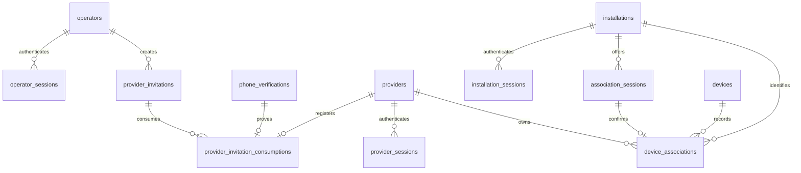

# 首批身份与设备权威模型

更新：2026-09-29。该模型只覆盖 WP-01/CT-01～04 的首批身份、邀请、安装、设备、关联和请求记录；任务、项目、队列、媒体、收入等后续域不提前建表。

## 权威边界

- PostgreSQL 是上述事实的唯一权威写入存储。Redis、客户端缓存、二维码内容和 IP/端口不是权威身份或归属来源。
- 运营、提供者和安装身份分别签发会话；`principal_id`、`providerId`、`installationId` 或 `deviceId` 等请求字段不能替代服务端认证上下文。
- 邀请和关联码只保存摘要。会话令牌和安装凭据也只保存摘要；审计 `facts` 禁止写入令牌、验证码、邀请原码或手机号全文。
- 迁移不包含通用开发账号或业务 fixture。首个运营账号只能由部署初始化命令幂等创建，属于 WP-02；不得开放公众初始化入口。

## 事务与竞争边界

### 邀请注册

同一事务按以下顺序执行：

1. 以 `(operation, principal, idempotency_key)` 插入或锁定请求记录；同键不同请求摘要返回 `IDEMPOTENCY_KEY_REUSED`。注册尚未产生 provider 身份时，以已核验的 `phoneVerificationId` 作为 `registration` 作用域主体，不接受客户端自报 provider ID。
2. 以 `FOR UPDATE` 锁定邀请和手机号验证记录，按数据库 `transaction_timestamp()` 复核撤销、过期、剩余额度、用途、号码与验证消费状态。
3. 插入 `providers`，由手机号唯一约束裁决同号码竞争；插入邀请消费记录并将 `consumed_uses` 加一，更新验证消费时间。
4. 保存响应和审计后提交。任何一步失败全部回滚；响应丢失时同键读取已保存结果，不重复扣额。

应用实现必须用条件更新（`consumed_uses < max_uses`）或已锁定行更新；“先查询剩余名额再另行写入”不合格。

### 扫码关联

同一事务锁定幂等请求、关联会话和安装行，核对会话未消费、未失效、未过期、安装代次与 `expectedInstallationId`。随后创建或确认设备、插入唯一当前关联、标记会话消费并保存原响应。部分唯一索引阻止同一设备或安装同时存在两个当前归属；异主冲突不得自动覆盖。

二维码扫描只得到待确认信息；在提供者明确确认前不写归属。同一安装创建新会话时，先在同一事务中将旧的未消费会话写入 `invalidated_at`，再插入新会话；旧会话迟到时由已消费/已失效状态、安装代次和当前唯一关联共同拒绝。

## 迁移与兼容

- 当前契约版本为 `2026-09-29.identity-v1`；不支持的版本在业务写入前返回 `CONTRACT_VERSION_UNSUPPORTED`。
- 增加可选字段属于兼容变更；删除/改义字段、收紧有效值或更换身份语义是不兼容变更，需新版本、消费方确认和前向迁移方案。
- `0001_identity_and_device.sql` 是前向迁移。正式升级、旧客户端兼容、回退/前向修复和真实 PostgreSQL 恢复仍需 WP-27 与 AC-53 验证，不能由本地 schema 检查替代。
